# 최종보고서 내용

<aside>
💡

**최종산출물: 데이터북**

**중간산출물: hwp 파일 보고서(~12/31 수)**

Task 1. 12/19까지의 내용을 데이터북 양식으로 정리

Task 2. 정리된 내용을 hwp 파일로 옮기고 박세린 학생에게 정리 요청 (~12/24 수, 12/30까지 받기)

Task 3. 정리된 내용을 데이터북 형식 파일로 옮기고 마무리 (~1/XX?)

</aside>

[notion_export_test.docx](report_assets/notion_export_test.docx)

**그림, 표 규칙**

그림, 표 위에 캡션 사용하지 않고 작성

[그림 XX] 제목 vs [그림 XX. 제목] vs [그림 XX: 제목] 

hwp는 사업계획서를 쓸 때는 그림에만 번호를 매기고 표에는 번호를 매기지 않았습니다. 이 양식을 준용한 위 hwp 파일에서는 그림 번호가 자동으로 매겨지고, 그림을 표가 감싸고 있기 때문에(테두리 꾸밈용) 표에 번호를 매기면 그림 번호와 뒤섞입니다. 그래서 hwp 파일에는 그림에만 번호를 매기도록 가이드를 주는 것이 좋겠습니다.

데이터북 기준: 그림, 표 콰르토에서 자동으로 매길 수 있는 어떤 방법이든 일관되게만

**인용규칙**

“Kim & Lee (2025)에 의하면…”

저자3인 이상~~(Kim, Kim, & Lee, 2027)~~인 경우 et al. 사용
→ “집에 가고 싶다고 한다(Kim et al. 2027).”

복수 문헌 인용시 연도순-알파벳순 나열
→ “집에 매우 가고 싶다고 한다(Abraham 2019; Zitt et al. 2019; Lee & Kim, 2026; Kim, 2027).”

한국어 문헌 인용시 한국어 문헌부터
→ “집에 매우매우 가고 싶다고 한다(이정우 외, 2023; 김영진 외, 2026; Abraham 2019; Zitt et al. 2019; Lee & Kim, 2026; Kim, 2027).”

**참고문헌(순서 상관없이 APA 스타일로 여기에 나열. 마지막에 sorting 후 hwp에 복사-붙여넣기 예정)**

Zitt, M., Lelu, A., Cadot, M., & Cabanac, G. (2019). Bibliometric delineation of scientific fields. In *Springer handbook of science and technology indicators* (pp. 25-68). Cham: Springer International Publishing.

Singh, A., D’Arcy, M., Cohan, A., Downey, D., & Feldman, S. (2023). Scirepeval: A multi-format benchmark for scientific document representations. In *Proceedings of the 2023 Conference on Empirical Methods in Natural Language Processing* (pp. 5548-5566).

이준영·박진서. 2019. “학술논문 데이터로 바라 본 글로벌 과학기술연구 수준의 거시적 변동.” Data Insight 7. KISTI 미래기술분석센터. [https://kisti.re.kr/post/data-insight](https://kisti.re.kr/post/data-insight).

Ba, Z., & Liang, Z. (2021). A novel approach to measuring science-technology linkage: From the perspective of knowledge network coupling. *Journal of Informetrics*, *15*(3), 101167.

Guo, H., Weingart, S., & Börner, K. (2011). Mixed-indicators model for identifying emerging research areas. *Scientometrics*, *89*(1), 421-435.

Ba, J., & Liang, Z. (2021). A novel approach to measuring science-technology linkage: From the perspective of knowledge network coupling. *Journal of Informetrics, 15*(3), 101167. 

Bureau International des Poids et Mesures. (2025). *CIPM Strategy 2030+*. Retrieved December 24, 2025, from [https://www.bipm.org/documents/20126/272555766/CIPM-Strategy-2030+/204e43af-e59b-696c-3466-5c4301fce05d](https://www.bipm.org/documents/20126/272555766/CIPM-Strategy-2030+/204e43af-e59b-696c-3466-5c4301fce05d)
Bureau International des Poids et Mesures. (n.d.). *KCDB - Key Comparison Database*. Retrieved December 24, 2025, from [https://www.bipm.org/kcdb/](https://www.bipm.org/kcdb/)

Bornmann, L., Leydesdorff, L., & Wang, J. (2013). Which percentile-based approach should be preferred for calculating normalized citation impact values? An empirical comparison of five approaches including a newly developed citation-rank approach (P100). *Journal of Informetrics, 7*(4), 933–944. 

Bryan, K. A., Ozcan, Y., & Sampat, B. (2020). In-text patent citations: A user’s guide. *Research Policy, 49*(4), 103946. 

Chen, C. (2012). Predictive effects of structural variation on citation counts. *Journal of the American Society for Information Science and Technology, 63*(3), 431–449. 

Guo, H., Weingart, S., & Börner, K. (2011). Mixed-indicators model for identifying emerging research areas. *Scientometrics, 89*(1), 421–435.

Hammarfelt, B. (2021). Linking science to technology: The “patent paper citation” and the rise of patentometrics in the 1980s. *Journal of Documentation, 77*(6), 1413–1429. 

Hicks, D., Wouters, P., Waltman, L., de Rijcke, S., & Rafols, I. (2015). The Leiden manifesto for research metrics. *Nature, 520*(7548), 429.

Hsiao, T.-K., & Torvik, V. I. (2020). Technology footprints in scientific discovery: Citation contexts of paper-to-patent citations. *Proceedings of the Association for Information Science and Technology, 57*(1), e337. 

Jefferson, O. A., Jaffe, A., Ashton, D., Warren, B., Koellhofer, D., Dulleck, U., Ballagh, A., et al. (2018). Mapping the global influence of published research on industry and innovation. *Nature Biotechnology, 36*(1), 31–39. 

Knaus, J., & Palzenberger, M. (2018). *PARMA. A full text search based method for matching non-patent literature citations with scientific reference databases: A pilot study*. 

Kuan, C.-H., Chen, D.-Z., & Huang, M.-H. (2020). The overlooked citations: Investigating the impact of ignoring citations to published patent applications. *Journal of Informetrics, 14*(1), 100997. 

Li, R., Chambers, T., Ding, Y., Zhang, G., & Meng, L. (2014). Patent citation analysis: Calculating science linkage based on citing motivation. *Journal of the Association for Information Science and Technology, 65*(5), 1007–1017. 

Mane, K. K., & Börner, K. (2004). Mapping topics and topic bursts in PNAS. *Proceedings of the National Academy of Sciences, 101*(Suppl. 1), 5287–5290.

Marx, M., & Fuegi, A. (2020). Reliance on science: Worldwide front-page patent citations to scientific articles. *Strategic Management Journal, 41*(9), 1572–1594.

Marx, M., & Fuegi, A. (2022). Reliance on science by inventors: Hybrid extraction of in-text patent-to-article citations. *Journal of Economics & Management Strategy, 31*(2), 369–392. 

Porter, A. L., & Cunningham, S. W. (2005). *Tech mining: Exploiting new technologies for competitive advantage*. Wiley.

Porter, A. L., Garner, J., Carley, S. F., & Newman, N. C. (2018). Emergence scoring to identify frontier R&D topics and key players. *Technological Forecasting and Social Change*. 

Waltman, L., & Schreiber, M. (2013). On the calculation of percentile-based bibliometric indicators. *Journal of the American Society for Information Science and Technology, 64*(2), 372–379. 

Waltman, L., & van Eck, N. J. (2019). Field-normalized citation impact indicators and the choice of an appropriate counting method. In W. Glänzel, H. F. Moed, U. Schmoch, & M. Thelwall (Eds.), *Springer handbook of science and technology indicators*. Springer.

**어휘집**

표준과학 연구 영역

표준과학 연구 분야

표준과학 연구 영역 핵심 문헌 집합 (14만건)

표준과학 연구 영역 확장 문헌 집합 (14만건 + 임베딩 + BC CC = 111만 건에서 초록및타이틀 존재해서 클러스터링 가능한 문헌 109만건만 남긴 것)

= 표준과학 연구 영역 문헌 집합

인용 주제(Citation Topics) 마이크로(micro)-레벨 클러스터(2,478개)

인용 주제(Citation Topics) 메소(meso)-레벨 클러스터(326개)

 

**hwp 파일로 붙여넣기 할 때의 목차 양식**

**1)= 제3장 제1절**

**1-1) = 제3장 제1절 1.**

**1-1-1) = 제3장 제1절 1. 가.**

**1-1-1-1) = 제3장 제1절 1. 가. (1)**

**LWJ, YJK 박사님께 드리는 KDG 유언**

이 페이지에서 제가 작성해야하는 부분은 모두 작성하였습니다. 아래 작업을 부탁드립니다.

1. LWJ, YJK 박사님께서 각자 맡으신 부분을 모두 작성하신 다음에는 위 참고문헌 목록을 완성해주세요(제가 넣어야하는 것은 다 넣었습니다)
2. 아래 내용에서 불필요한 내용(페이지, 작업 흔적, 파일 등)은 삭제해주세요.
3. 2.의 작업이 완료되면 이 페이지를 docx 파일로 변환해주세요.
4. 박세린 학생에게는 아래 hwp 파일의 제3장 내용에 docx 파일의 내용을 채워놓도록 요청할 것입니다. 연구책임자님과 함께 hwp 파일의 나머지 장의 내용을 한번 검토해주세요. 

[붙임1. 최종보고서_251224_3am.hwp](report_assets/%EB%B6%99%EC%9E%841._%EC%B5%9C%EC%A2%85%EB%B3%B4%EA%B3%A0%EC%84%9C_251224_3am.hwp)

1. 사업계획서를 쓸 때는 그림에만 번호를 매기고 표에는 번호를 매기지 않았습니다. 이 양식을 준용한 위 hwp 파일에서는 그림 번호가 자동으로 매겨지고, 그림을 표가 감싸고 있기 때문에(테두리 꾸밈용) 표에 번호를 매기면 그림 번호와 뒤섞입니다. 그래서 hwp 파일에는 그림에만 번호를 매기도록 가이드를 주는 것이 좋겠습니다. 
2. hwp파일과 docx파일 검토를 마치시면 docx파일을 업로드해주시고 제게 연락 주세요. 박세린 학생에게 요청하겠습니다. 
3. 박세린 학생이 12/30 화요일 결과물을 회신
4. **행정양식 → 연구보고서 발간 및 제출신청서**
5. **원외발송 → 전자파일을 공문 발송(및 별도의 메일링 to KRISS 정책실)** 

***아래 내용부터는 보고서 및 데이터북에 들어갈 내용만 포함***

---

# 1) 표준과학 연구 영역 분석을 위한 문헌 집합 및 표준과학 연구지형도 구축

## **1-1) 글로벌 표준과학 연구 영역 모니터링을 위한 Web of Science 기반 분석용 문헌 데이터 구축**

특정 연구 분야에 대한 계량서지학 연구에서 과학적 영역의 범위를 설정하는 일은 분석에 앞서 선행되어야 할 가장 기초적인 과제이다. 그러나 다학제성과 다양성이 높거나 빠르게 발전하며 새로운 세부 분야의 발생 및 융합이 일어나는 등 불안정성이 높은 연구 분야에서는 범위 설정이 단순하지 않다(Zitt et al., 2019). 

한편, 표준과학 연구 분야는 분야 간의 융합 및 확산성이 높은 다학제성(multidisciplinarity)을 갖는 것으로 파악된다. 표준과학 연구 분야는 물리학, 화학, 생물학, 공학, 환경과학 등 여러 학문 분야를 포괄하고 있으며, 각 산업에서의 주요 문제를 해결하기 위한 도구로서 성능 지표 개발, 측정 및 시험 방법, 프로토콜, 데이터 표준, 기준 물질 등을 창출하는 데 기여하고 있다(NIST, Definition of Measurement Science).

이러한 표준과학 영역의 특성은 해당 영역에 대응하는 데이터 구축 작업을 어렵게 만들기 때문에, 본 연구에서는 분석용 표준과학 연구 논문을 식별하기 위해 아래 2가지 전략을 결합하였다.

(1)  표준과학 연구 영역 **핵심 문헌 집합** 구축

① 표준과학 전문 연구기관(BIPM 정회원국의 대표 표준과학 연구기관) 목록을 활용하여 해당 기관들이 발간한 산출 문헌 및 ② 표준과학 연구 전문 저널의 논문 추출 후 ①과 ②의 합집합을 표준과학 연구 영역 핵심 문헌 집합으로 간주

(2) 표준과학 연구 영역 핵심 문헌 집합 확장 및 **최종 문헌 집합** 구축

③ 표준과학 전문 연구기관에서 발간한 논문이 아니면서 표준과학연구 전문 저널에 수록된 논문도 아니지만, 위 ①, ②에서 얻은 핵심 문헌 집합과 유사한 내용을 다루는 문헌들을 추가로 표준과학연구 문헌 집합에 포함하기 위해 텍스트 임베딩 기법 및 전후방 인용 관계에 기반하여 핵심 문헌 집합을 확장

상술한 2가지 전략은 KISTI에서 라이선스를 보유 중인 Web of Science(WoS) XML Raw Data에서 추출한 전체 논문 정보(2025년 26주차)에 대하여 적용하되, 그 활용 범위는 WoS의 3대 에디션 SCIE, SSCI, AHCI 저널 논문 중 문헌유형이 연구논문(Article)인 경우에 한정하였으며 (철회논문 제외), 게재연도 기준 2000년-2024년(총 25개년)에 속하는 문헌 총 35,649,109건에 대해 적용하였다.

### 1-1-1) 표준과학 연구 영역 핵심 문헌 집합 구축

우선 BIPM 정회원국의 대표 표준과학 연구기관을 표준과학연구 전문 연구기관으로 간주하고, 아래 프로세스를 통해 BIPM 정회원국 및 소속 연구기관 목록을 활용하여 문헌 추출을 위한 표준과학연구 전문 연구기관 목록 생성하기로 한다.

BIPM 정회원국 및 소속 연구기관 목록은 BIPM 공식 홈페이지에서 추출하였으며 2025년 6월 30일자 정보를 활용하였다. 
(각주: [**https://www.bipm.org/en/cipm-mra/participation](https://www.bipm.org/en/cipm-mra/participation), [https://www.bipm.org/en/member-states](https://www.bipm.org/en/member-states))**

각 국가별 NMI(National Measurement Institute)를 우선시하되, 표준연과의 협의를 통해 영국, 독일, 러시아 3개 국가에 대해서는 DI(Designated Institutes) 중 일부를 전문 연구기관 목록에 포함하였다. 또한 사전 전처리 작업을 통해 NMI의 WoS 데이터 상 정규화된 기관명(pref_name)이 없으며 (즉, 논문이 충분치 않은) 정부기관에 가까운 국가를 파악한 뒤, 그 중 대표 DI가 논문이 많은 우크라이나와 벨라루스 2개 국가에 대해선 대표 DI를 포함하였다.  그 결과 총 64개 BIPM 정회원국의 62개 NMI와 5개 DI(영국, 독일, 러시아, 우크라이나, 벨라루스)로 이루어진 BIPM 정회원국 대표 연구기관 67개의 목록을 생성할 수 있었다.

**[표 XX: BIPM 정회원국의 대표 표준과학 연구기관 목록]**

| 국가명(WoS 기준) | 기관명(BIPM 기준) | NMI 여부 |
| --- | --- | --- |
| Singapore | National Metrology Centre, Agency for Science, Technology and Research [NMC A*STAR] | Y |
| Lithuania | State Research Institute, Center for Physical Sciences and Technology [FTMC] | Y |
| Poland | Central Office of Measures [GUM] | Y |
| Iraq | Central Organization for Standardization and Quality Control [COSQC] | Y |
| Spain | Centro Español de Metrología [CEM] | Y |
| Mexico | Centro Nacional de Metrología [CENAM] | Y |
| India | CSIR National Physical Laboratory of India [NPLI] | Y |
| Czechia | Czech Metrology Institute [CMI] | Y |
| Denmark | Danish Fundamental Metrology A/S [DFM] | Y |
| Serbia | Directorate of Measures and Precious Metals [DMDM] | Y |
| Austria | Bundesamt für Eich- und Vermessungswesen [BEV] | Y |
| Greece | Hellenic Institute of Metrology [EIM] | Y |
| Iran (Islamic Republic of) | Iran National Standards Organization [INSO] | Y |
| Colombia | Instituto Nacional de Metrología de Colombia [INM Colombia] | Y |
| Brazil | Instituto Nacional de Metrologia, Qualidade e Tecnologia [INMETRO] | Y |
| Argentina | Instituto Nacional de Tecnología Industrial [INTI] | Y |
| Portugal | Instituto Português da Qualidade [IPQ] | Y |
| Italy | Istituto Nazionale di Ricerca Metrologica [INRIM] | Y |
| Kazakhstan | Republican State Enterprise "Kazakhstan Institute of Standardization and Metrology" [RSE "KazStandard"] | Y |
| Kenya | Kenya Bureau of Standards [KEBS] | Y |
| Korea (Republic of) | Korea Research Institute of Standards and Science [KRISS] | Y |
| France | Laboratoire National de Métrologie et d'Essais [LNE] | Y |
| Uruguay | Laboratorio Tecnológico del Uruguay [LATU] | Y |
| New Zealand | Measurement Standards Laboratory of New Zealand [MSL] | Y |
| Belgium | SPF Economie, DG Qualité et Sécurité [SMD] | Y |
| Egypt | National Institute of Standards [NIS] | Y |
| Romania | National Institute of Metrology/Institutul National de Metrologie [INM] | Y |
| China | National Institute of Metrology [NIM] | Y |
| Thailand | National Institute of Metrology (Thailand) [NIMT] | Y |
| United States of America | National Institute of Standards and Technology [NIST] | Y |
| Australia | National Measurement Institute, Australia [NMIA] | Y |
| Japan | National Metrology Institute of Japan, AIST [NMIJ/AIST] | Y |
| Malaysia | National Metrology Institute of Malaysia [NMIM] | Y |
| South Africa | National Metrology Institute of South Africa [NMISA] | Y |
| Türkiye | National Metrology Institute of Türkiye/TÜBITAK Ulusal Metroloji Enstitüsü [UME] | Y |
| Pakistan | National Metrology Institute of Pakistan [NMIP] | Y |
| United Kingdom | National Physical Laboratory [NPL] | Y |
| Israel | National Physical Laboratory of Israel [INPL] | Y |
| Canada | National Research Council of Canada [NRC] | Y |
| Norway | Norwegian Metrology Service/Justervesenet [JV] | Y |
| Ireland | NSAI National Metrology Laboratory [NSAI NML] | Y |
| Germany | Physikalisch-Technische Bundesanstalt [PTB] | Y |
| Sweden | RISE Research Institutes of Sweden AB [RISE] | Y |
| Russian Federation | Federal Agency on Technical Regulating and Metrology [Rosstandart] | Y |
| Saudi Arabia | Saudi Standards, Metrology and Quality Organization/National Measurement and Calibration Center [SASO-NMCC] | Y |
| Slovakia | Slovak Institute of Metrology/Slovenský Metrologický Ústav [SMU] | Y |
| Switzerland | Federal Institute of Metrology METAS [METAS] | Y |
| Netherlands | VSL Dutch Metrology Institute [VSL] | Y |
| Bulgaria | Bulgarian Institute of Metrology [BIM] | Y |
| Chile | Instituto Nacional de Normalización [INN] | Y |
| Costa Rica | Laboratorio Costarricense de Metrología [LACOMET] | Y |
| Croatia | State Office for Metrology [DZM] | Y |
| Ecuador | Servicio Ecuatoriano de Normalización [INEN] | Y |
| Estonia | Central Office of Metrology [AS METROSERT] | Y |
| Finland | VTT Technical Research Centre of Finland Ltd, Centre for Metrology / Mittatekniikan keskus [MIKES] | Y |
| Hungary | Government Office of the Capital City Budapest [BFKH] | Y |
| Indonesia | Directorate for National Measurement Standards of Mechanics, Radiation, and Biology and Directorate for National Measurement Standards of Thermoelectric and Chemistry, National Standardization Agency of Indonesia [SNSU-BSN] | Y |
| Montenegro | Bureau of Metrology [BMM] | Y |
| Morocco | Laboratoire Public d’Essais et d’Études, Laboratoire National de Métrologie [LPEE/LNM] | Y |
| Slovenia | Metrology Institute of the Republic of Slovenia, Ministry of the Economy, Tourism and Sport [MIRS] | Y |
| Tunisia | Agence Nationale de Métrologie, Ministère du Commerce et de l'Artisanat [ANM] | Y |
| United Arab Emirates | Emirates Metrology Institute [EMI] | Y |
| Germany | Federal Institute for Materials Research and Testing/Bundesanstalt für Materialforschung und -prüfung [BAM] |  |
| United Kingdom | LGC Ltd. [LGC] |  |
| Ukraine | National Scientific Centre "Institute of Metrology" [NSC IM] |  |
| Russian Federation | D.I. Mendeleyev Institute for Metrology, Rosstandart [VNIIM] |  |
| Belarus | Belarussian State Institute for Metrology [BelGIM] |  |

이어 BIPM 정회원국 대표 연구기관 67개의 목록을 바탕으로 BIPM 정회원국의 대표 표준과학 연구기관 논문 데이터 집합(①)을 구축하는 작업을 수행하였다. 

우선 WoS 데이터 상 정규화된 기관명(pref_name)이 존재하는 표준과학 전문 연구기관에 대해서는 기관과 문헌 고유번호(uid)를 전처리 없이 매칭하여 활용한다. 

이 때, 정규화된 기관명(pref_name)이 존재하지만 종합연구소 성격이 강한 캐나다의 NMI인 National Research Council Canada(NRC)의 경우 연구의 범위가 너무 넓으므로 표준과학과 직접적으로 연관된 하위 3개 기관(METRO, INMS, MSS) 정보를 활용하였다. 하위 3개 기관의 논문으로 NRC가 산출한 문헌으로 한정하기 위해 우선 NRC 공식 홈페이지의 Publications 검색 페이지에서 NRC의 표준과학 전문 3개 기관 affiliation에 해당하는 자료를 각각 추출하여 논문 목록을 확보 후 분석에 필요한 핵심 식별자만 남기기 위해 각 레코드에서 DOI와 논문 제목만 유지하고, 중복 레코드를 제거하였다. 그 다음으로 구축된 산하 3개 기관 논문 목록 및 정보를 활용하여 WoS 데이터베이스의 DOI 정보(doi 및 xref_doi)와 논문 제목(title)과 매칭하여 고유 식별자(uid)를 확보하였다. 매칭 이후에는 기관 소속의 국가 식별 정확도를 높이기 위해, 매칭된 uid 중 country 값이 “canada”인 레코드만 유지하였다. 전 과정에서 문자열 비교는 대소문자 구분 없이 수행하였다. 

이와 같이 수행한 WoS 매칭 결과에는 정규화된 기관명(pref_name)가 누락되거나 다양한 표기로 입력된 사례가 포함될 수 있으므로, 추가적으로 기관 식별 규칙을 적용하였다. 구체적으로 정규화된 기관명(pref_name)이 “National Research Council Canada”인 경우는 그대로 유지하고, 정규화된 기관명(pref_name)이 NULL인 경우에는 org_name에 “nrc”, “nat”, “res”, “meas”, “metrol”, “stand”, “inms”, “mss” 중 하나라도 포함되는 레코드만 남긴 뒤, 최종적으로 육안 검토를 통해 오탐을 제거하였다. 마지막으로 육안 검토 과정에서 정규화된 기관명(pref_name)이 NULL인 상태로 남아 있던 문헌의 기관명 표기 중에서도 NRC 및 표준·계측 관련 조직을 의미하는 변형 표기가 확인되었으므로(예: “Measurement Canada”, “Measurement Sci & Stand”, “Metrol Res Ctr”, “NATL RES COUNCIL CANADA”, “Natl Res Cou Cil Canada”, “NRC Metrol” 등) 이러한 변형 표기를 포함하는 레코드를 반영하여 중복을 재정리하였다.

 WoS 데이터 상 정규화된 기관명(pref_name)이 존재하지 않는 표준과학 전문 연구기관에 대해서도 추가 전처리 작업을 수행하였다. 앞선 과정에서 기관과 매칭되지 않은 문헌에 한정하여 문헌고유번호(uid), 기관명(org_name_raw), 기관국가명(org_country), 기관도시명(org_city), 기관주소(addr_full)로 구성된 데이터를 구축 후 규칙 기반으로 문헌과 기관을 매칭하는 과정을 거쳤다. 육안 검토에 앞서 진행한 선별 작업의 규칙은 다음과 같다:
(1) 문헌의 기관국가명(org_country)이 BIPM 정회원국 대표 연구기관의 소속 국가(country)와 반드시 일치해야 할 것, (2) 기관명(org_name_raw)에 BIPM 정회원국 대표 연구기관 기관명의 약어(예: KRISS)가 포함되거나, BIPM 정회원국 대표 연구기관 기관명의 핵심 키워드(예: Standard Science)가 모두 포함될 것, (3) 문헌기관명(org_name_raw)에 네거티브 키워드(예: Hospital, University)가 나타나지 않을 것. 

규칙 기반 선별을 통해 걸러진 문헌들에 대해서는 기관명(org_name_raw), 기관국가명(org_country), 기관도시명(org_city), 기관주소(addr_full)를 종합적으로 확인하여 최종적으로 육안 검토를 수행하였으며 기존 기관 및 문헌 전처리 단계에서 확보되지 않았던 문헌고유번호(uid) 기준 문헌을 1,277건 추가 확보하였다.

 상기 절차를 적용하였음에도, 67개 BIPM 정회원국의 표준과학연구 전문 연구기관 중 아래 7개 기관에 대해서는 WoS 상에서 해당 기관의 논문을 확인하지 못하였다. 그 결과 프로세스를 통해 58개 BIPM 정회원국의 대표 표준과학 연구기관 60개의 논문 데이터 집합(①)을 구축할 수 있었다. 

**[표 XX: BIPM 정회원국의 대표 표준과학 연구기관 목록 중 논문을 식별하지 못한 기관 목록]**

| 국가명(WoS 기준) | 기관명(BIPM 기준) |
| --- | --- |
| Tunisia | Agence Nationale de Métrologie, Ministère du Commerce et de l'Artisanat [ANM] |
| Chile | Instituto Nacional de Normalización [INN] |
| Costa Rica | Laboratorio Costarricense de Metrología [LACOMET] |
| Ecuador | Servicio Ecuatoriano de Normalización [INEN] |
| Hungary | Government Office of the Capital City Budapest [BFKH] |
| Iraq | Central Organization for Standardization and Quality Control [COSQC] |
| United Arab Emirates | Emirates Metrology Institute [EMI] |

[2. BIPM_inst_uid.xlsx](report_assets/2._BIPM_inst_uid.xlsx)

이어 표준과학연구에 특화된 전문 저널들의 목록 정리 및 해당 저널의 모든 문헌 수집을 위해 표준연과의 협의 및 표준연 연구그룹의 검토를 거쳐 아래 표의 저널 9종을 선별하였으며, 해당 저널들에 수록된 문헌을 표준과학 연구 전문 저널의 논문(②)으로 간주하여 추출하였다.

**[표 XX: 표준과학 연구 전문 저널 목록]**

FLOW  MEASUREMENT AND INSTRUMENTATION

IEEE TRANSACTIONS ON  INSTRUMENTATION AND MEASUREMENT

JOURNAL OF INSTRUMENTATION

JOURNAL OF PHYSICAL AND  CHEMICAL REFERENCE DATA

MAPAN-JOURNAL OF METROLOGY  SOCIETY OF INDIA

MEASUREMENT SCIENCE AND  TECHNOLOGY

MEASUREMENT

METROLOGIA

RADIATION MEASUREMENTS

이와 같은 과정을 통해 표준과학연구 전문 벤치마킹 연구기관의 논문(①)과 표준과학연구 전문 저널의 논문(②)의 합집합에 대해 중복 제거 후 최종적으로 143,346건의 핵심 문헌 집합을 구축할 수 있었다. 이 핵심 문헌 집합들은 WoS의 3대 에디션 SCIE, SSCI, AHCI 저널의 연구논문(Article) 중 철회되지 않았으며 게재연도가 2000년-2024년 사이인 문헌이어야한다는 조건을 모두 충족한다. 

### 1-1-2) 표준과학 연구 영역 핵심 문헌 집합 기반 확장 문헌 집합 구축

표준과학 연구 영역 핵심 문헌 집합(①U②)에서 얻은 문헌들과 유사한 내용을 다루는 문헌들(③)을 추가로 표준과학연구 문헌 집합에 포함하기 위해 텍스트 임베딩 기법 및 전후방 인용 관계에 기반하여 핵심 문헌 집합을 확장하는 작업을 추가로 진행하였다.

우선 Allen AI의 과학기술 문헌 특화 임베딩 모델인 SPECTER2(Singh et al. 2023)를 활용하여 WoS 전체 문헌을 임베딩하고, 표준과학 연구 영역 핵심 문헌 집합(①U②)과 텍스트적으로 유사한 문헌을 탐색·매칭하여 논문을 추가 포집하는 전략을 채택하였다. 이 전략을 수행하기 위해 2023년 8월 기준의 allenai/specter2 모델을 사용하였으며, 유사도 산출은 임베딩 벡터 간 코사인 유사도를 활용하였다. 

이 때 임베딩 벡터 간 코사인 유사도의 임계치는 임베딩 모델, 토크나이징 방식, 문헌 제목 및 초록 처리 방식에 따라 유사도 스케일이 달라질 수 있다는 점을 고려하여, 표본 논문 5편에 대해 유사도 구간 별 후보 논문을 수집한 뒤 육안 검토를 통해 “표분 논문의 저자라면 선행연구 리뷰에 포함할 것인가”라는 기준에서 수용 가능한 수준으로 판단하여 0.92로 결정하였다.

단, 임베딩 기반 확장 시 과포집 방지 및 우연성 완화 장치를 도입하여 총 842,344편의 논문을 추가 포집하였다. 구체적으로는 주제별 상한을 부여하여 WoS 글로벌 연구지형도 분류단위인 인용 주제(Citation Topics) 마이크로(micro)-레벨 클러스터(2,478개)에 대해 표준과학 연구 영역 핵심 문헌 집합과 유사도 기준을 만족하는 문헌만을 수집하되 해당 인용 주제 클러스터에서 최초 포함된 표준과학 연구 영역 핵심 문헌 수 대비 최대 30배 이내로 확장 문헌 수를 제한하여 과포집을 방지하였다. 

※ 인용주제(Citation Topic) 클러스터: Web of Science(WoS)에서 논문의 인용 관계를 기반으로 자동 군집화하여 생성한 연구 주제 그룹을 의미하며 Citation Topic의 분야 이해도 향상 목적으로 대규모 언어모델을 활용하여 토픽의 이름, 정의, 요약 등의 정보를 생성할 수 있다.

또한 표준과학 연구 영역 핵심 문헌 집합에서 최소 3건 이상의 문헌과 코사인 유사도 0.92 이상으로 매칭되는 문헌만 최종 포함하여 단일 혹은 극소수의 핵심 문헌과의 유사성이 우연에 의해 발생할 가능성을 줄이고, 핵심 문헌 집합에서 표준과학 연구와 거리가 있는 문헌이 유사도 기반 확장에 유입시키는 노이즈를 완화하고자 하였다.

임베딩 기반 확장과 별도로, 핵심 문헌 집합(①U②)의 전후방 인용관계를 활용하여 핵심 데이터셋 확장을 추가로 수행하였으며, 구체적으로는 핵심 문헌 집합에서 연도별 HCP(피인용 상위 5%) 문헌을 추출한 뒤 다음 두 경로로 확장 후보를 탐색하였다. 참고문헌 중첩도(Bibliographic Coupling, BC) 기반 코사인 유사도 0.3 이상이면서, 중첩 참고문헌이 3편 이상인 문헌을 탐색하여 187,617편을 포집하였다. 추가로 동시 인용(Co-Citation, CC)을 고려하기 위해 연도별 고피인용 문헌(Highly Cited Papers, HCP) 집합 중 3편 이상을 동시 인용하는 문헌을 탐색하여 47,262편을 추가로 포집하였다. 

그 결과 상술한 텍스트 임베딩 기법 및 전후방 인용 관계에 기반한 핵심 문헌 집합 확장을 통해 총 1,129,091편의 문헌 집합(①U②U③)을 구축할 수 있었다. 단, 이어지는 표준과학 연구 영역 문헌 집합의 클러스터링 및 연구지형도 구축에서는 각 논문의 초록 및 논문제목 메타데이터가 요구된다. 이에 최종적으로 해당 메타데이터가 존재하는 문헌으로 한정한 1,099,738건의 문헌을 표준과학 연구 영역 확장 문헌 집합(이하 표준과학 연구 영역 문헌 집합)으로 정의하였다.

## **1-2)** 표준과학 연구 영역 문헌 집합 **클러스터링 및 표준연구 분야의 연구지형도 구축**

여기서는 표준과학 연구 영역 (확장) 문헌 집합에 대한 클러스터링 및 표준연구 분야의 연구지형도 구축 작업을 수행하고자 한다.

### **1-2-1) 글로벌 연구지형도에서의 표준과학 연구 분야**

우선 표준연구 영역에 대한 연구지형도 도출에 앞서 전체 과학기술 및 인문사회 영역을 포괄하는 전체 ‘글로벌 연구지형도’를 구성하고, 앞서 식별한 분석용 표준연구 논문 데이터 집합을 글로벌 연구지형도에 ‘겹치기(overlay)’ 매핑함으로써 표준과학 연구 영역이 전체 학문분야에서 차지하는 ‘분포’를 확인하고자 한다.

WoS의 인용 주제(Citation Topics) 메소(meso)-레벨 클러스터(326개)를 개별 연구영역(노드, node)으로 간주하였다. 클러스터 쌍의 연결(엣지, edge)은 하나의 클러스터 내 문헌들의 지식기반 분포가 다른 클러스터 내 문헌들의 지식기반 분포와 유사할수록 두터워진다. 지식기반의 분포는 참고문헌들이 각기 속한 메소(meso)-레벨 클러스터의 빈도수 벡터를 이용한 코사인 유사도로 측정하였다.

아래 그림에서는 문헌의 수(노드 크기)와 표준과학연구 연구 영역 논문 문헌의 비율을 나타내고 있다(노드 색상; 적색에 가까울수록 높으며 청색에 가까울수록 낮음). 이와 같은 글로벌 연구지형도는 VOSviewer를 통해 인터랙티브 지도화하였으며 온라인에 게시되어 있다([https://app.vosviewer.com/?json=https%3A%2F%2Fdrive.google.com%2Fuc%3Fid%3D14b6CQcJ0OS6wdA1qolCdLLLKi1tHYIR3](https://app.vosviewer.com/?json=https%3A%2F%2Fdrive.google.com%2Fuc%3Fid%3D14b6CQcJ0OS6wdA1qolCdLLLKi1tHYIR3)).

| 지표명 | 정의 | 해석 |
| --- | --- | --- |
| ct meso N docs (Size) | 각 메소-레벨 클러스터의 고유 문헌 수(중복 제거 기준) | 해당 메소-레벨 클러스터에 포함된 문헌 규모 |
| std sci paper ratio in ct meso (Color) | 각 메소-레벨 클러스터에 포함된 전체 문헌 중 표준과학 연구 영역 문헌이 차지하는 비율 | 해당 메소-레벨 클러스터가 표준과학 영역에 얼마나 가까운가 |
| share of ct meso over std sci (Color) | 표준과학 연구 영역 전체 문헌 중 해당 각 메소-레벨 클러스터에 속한 문헌이 차지하는 비율 | 표준과학 전체에서 해당 메소-레벨 클러스터의 비중이 얼마나 높은가 |
| share of ct meso in ‘기관명’ portfolio (Color) | 특정 기관의 전체 문헌 중 해당 메소-레벨 클러스터에 속한 문헌이 차지하는 비율 | 해당 메소-레벨 클러스터가 각 기관의 연구 포트폴리오에서 차지하는 비중이 얼마나 높은가 |

[그림 15] Web of Science 분류 기준으로 구성한 글로벌 연구지형도 (2020~2024년)

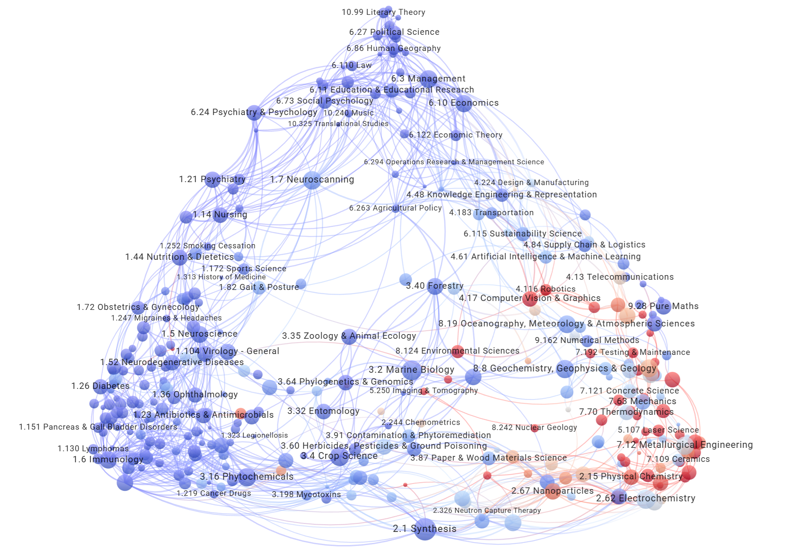

### **1-2-2) 표준과학 연구 분야 문헌 집합 클러스터링**

글로벌 분류는 비교·벤치마킹에 유리하지만, 표준과학 연구 영역 내부의 세부 주제 구조와 변화(연구전선의 미세한 분화·융합)를 충분히 설명하기에는 한계가 있다. 이에 본 연구는 표준과학 연구 영역 최종 문헌 집합(109만건)만을 대상으로 인용 기반 클러스터링을 수행하여, 표준과학 연구 분야의 내부 구조를 반영한 연구지형도를 별도로 구축하였다. 본 절에서는 그 절차를 (1) 입력 네트워크 구성, (2) 하이브리드 relatedness 채택 근거, (3) Leiden 기반 클러스터링과 후처리, (4) 산출물 구성의 순서로 정리한다.

(1) 입력 데이터(문헌 네트워크) 정의

표준과학 연구 영역 최종 문헌 집합의 각 문헌을 노드(node)로 두고, 문헌 쌍(pair)의 인용 기반 연결/유사도를 엣지(edge)로 정의하였다. 엣지 가중치(weight)는 직접 인용(Direct Citation; DC), 서지결합(Bibliographic Coupling; BC), 동시인용(Co‑Citation; CC)에서 얻어지는 세 가지 인용 신호를 통합한 relatedness로 구성하였다. 이는 직접 연결(DC)뿐 아니라 공통 참고문헌을 통한 연결(BC), 함께 인용되는 경향(CC)을 동시에 반영하여 단일 신호의 편향을 완화하려는 목적을 갖는다.

(2) DC·BC·CC 통합 사용의 학술적 배경

인용 기반 relatedness(DC, BC, CC)의 상대적 타당도는 대규모 비교 연구를 통해 축적되어 왔으며, 평가 기준에 따라 우열이 달라질 수 있음을 보여준다. 동시에 여러 연구는 각 신호가 포착하는 정보가 서로 다르므로 상호보완적(complementary)이며, 결합이 유리할 수 있음을 시사한다(Boyack & Klavans, 2010; Klavans & Boyack, 2017; Waltman et al. 2020; Boyack & Klavans, 2020; Kleminski et al. 2022). 예컨대 Boyack & Klavans (2010)는 BC가 특정 조건에서 높은 정확도를 보일 수 있음을 보고했고, Waltman & Van Eck (2012)은 DC 단독 기반 방법론의 투명성과 계산 효율성을 강조하면서도 다른 신호와의 결합 가능성을 인정하였다. 이러한 논의를 바탕으로 본 연구는 텍스트 유사도 계산의 추가 비용을 최소화하면서도 인용 기반 정보의 포착 범위를 넓히기 위해, DC·BC·CC를 통합한 하이브리드 relatedness를 사용하였다. relatedness를 계산할 때는, 각각의 지표를 타겟 노드마다 모든 연결된 노드의 총 합으로 비율을 계산하듯 정규화를 한 뒤, 두 값중 최대값을 택하고 뒤에 0~1 사이로 최종 정규화 하는 과정을 거친다.  

※ 하이브리드 relatedness의 구체적인 정규화/스케일링 및 결합 산식은 데이터북에서 더욱 자세히 기술한다.

(3) Leiden 기반 클러스터링 파이프라인(정제–탐지–후처리)

클러스터링은 하이브리드 인용 네트워크를 구축한 뒤, 연결성이 낮은 고립 노드/극소 컴포넌트가 결과를 불안정하게 만들 수 있다는 점을 고려하여 연결성이 높은 거대 컴포넌트를 중심으로 분석 대상을 정제한다. 다음으로 Leiden 알고리즘을 적용해 네트워크 커뮤니티 구조를 탐지하며(Traag et al. 2019), 군집의 세분성을 조절하는 해상도(γ)를 분석 목적(세분화 수준과 해석 가능성의 균형)에 맞추어 설정한다. 또한 재현 가능한 결과를 위해 난수 시드(seed)를 관리하고, 필요 시 해상도와 시드를 함께 변화시키며 NMI(Normalized Mutual Information) 등 일치도 지표로 민감도를 점검할 수 있다. 마지막으로 지나치게 작은 군집은 해석 가능성이 낮고 후속 분석(예: 대표 키워드)의 불안정을 초래할 수 있으므로, 군집 간 연결 가중치 합이 가장 큰 인접 군집으로 병합하는 후처리를 수행하였다.

[그림 16] 레이덴 클러스터링 설명, 논문 발췌 (Traag et al. 2019)

(4) 산출물: macro–meso–micro 3수준 연구주제 클러스터(8–46–195)

상기 절차를 통해 표준과학 연구 영역 최종 문헌 집합을 인용 기반 연구주제 단위로 분할하였다. 최종 연구지형도는 마크로 수준 8개, 메조 수준 46개, 마이크로 수준 195개의 계층 구조로 정리되며, 이후의 후속 분석(측정 그룹 매핑, 키워드 추출, 시계열 분석)에서는 주로 마이크로 수준 연구주제 클러스터를 기본 분석 단위로 활용하였다. 

[그림 17] 3수준 연구주제 클러스터의 계층구조

마이크로 클러스터에서 최소 클러스터 문헌 수는 2,000건으로, 이러한 병합과정을 거치지 않으면 너무 자잘한 미세클러스터가 빈번히 등장하여 분석단위의 상대적 크기를 맞추기 어려운 한계점이 존재하였다. 이러한 병합 이전 클러스터 수는 1,662개 였으며, 병합 이후 195로 줄어들었다.

[그림 18] 병합과정 전후 클러스터 크기 분포

※ Leiden 알고리즘에 대한 상세 설명이나, 세부 파라미터 등 방법론에 대한 세부 내용은 별도 제공되는 데이터북에 보다 상세히 기술되어 있다.

### **1-2-3) 표준과학 연구 분야에 대한 KRISS 측정 그룹 4대 영역 매핑**

표준과학 연구지형도는 연구주제의 구조를 보여주지만, 정책·기관 관점의 해석을 위해서는 이를 조직 축으로 재표현하는 단계가 필요하다. 이에 본 연구에서는 KRISS의 측정 그룹 조직이 4대 영역(물리측정·화학소재측정·바이오의료측정·양자기술)로 구분 가능하다는 점에 착안하여, 앞서 도출된 각 연구주제 클러스터를 4대 영역 중 하나의 영역에 매핑하는 후처리 절차를 수행한다. 

[그림 19] 한국표준과학연구원 조직도 상 측정본부와 그룹

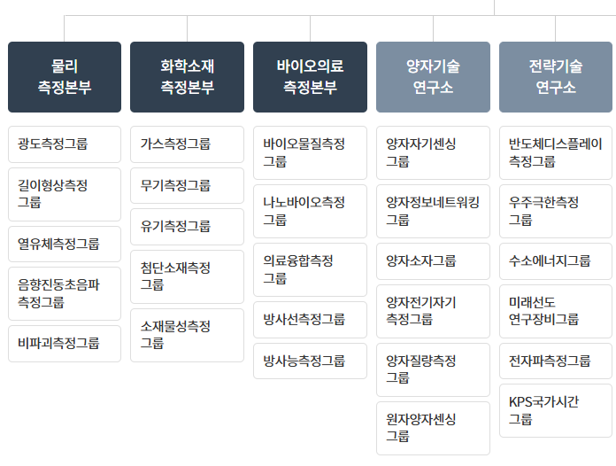

(1) 목적과 적용 범위

본 단계는 연구주제 클러스터를 KRISS 조직 구성 기반 4대 연구 영역으로 요약하기 위한 후처리이다. 핵심 목적은 연구주제 클러스터에 복수의 측정 그룹이 연계될 수 있는 상황에서, 보고·벤치마킹·포트폴리오 분석에 필요한 해석 단위를 4대 본부 축으로 정규화하는 데 있다. 이때 클러스터 라벨과 클러스터 요약 정보, 그리고 후술하는 대표 키워드(제3장 제1절 2. 라.)를 함께 활용하면 주제 해석의 일관성을 높일 수 있다.

(2) 그룹 단위 정칙 매핑(룰 기반)

여기에서는 측정 그룹을 “물리측정본부(물) / 화학소재측정본부(화) / 바이오의료측정본부(생) / 양자기술연구소(양)” 4개 축으로 재분류하는 정칙(rule‑based) 매핑을 적용한다. 규칙은 조직의 기능과 연구대상(측정량, 소재, 생체, 양자 소자 등)을 대응시키는 방향으로 구성되며, 이를 통해 연구주제별로 연계된 측정 그룹을 4대 그룹으로 집계할 수 있다. 이 과정을 수행하는데 있어, KRISS의 기관설명을 참고하였으며, 3대본부에 속하지 않는 전략기술연구소 등에 대해서는 재 그룹화를 수행하였다.

(3) 클러스터 단위 보정(혼합 클러스터 처리)

연구주제 클러스터는 다수의 그룹이 섞인 경우가 있어, (2)의 정칙 매핑만 적용하면 한 클러스터가 복수 본부로 분산될 수 있다. 이를 보정하기 위해 본 단계에서는 복수 축이 혼재한 클러스터를 대상으로 주제 특성(클러스터 라벨·대표 키워드·연계 그룹 조합)을 종합적으로 검토해 “대표 본부”를 1개로 재지정한다. 대표 본부 재지정은 일관된 해석 단위를 제공한다는 점에서 유용하나, 복합 주제의 성격을 단일 축으로 축약한다는 한계도 갖기 때문에, 주의해서 해석하여야 한다. 특히 측정 과학에서는 측정원리의 학문적 배경과 측정 기술이 사용되는 분야가 이질적일 수 있음을 조심하여야 한다.

(4) 산출물과 활용

최종 산출물은 (i) 연구주제 클러스터×측정 그룹 관계를 행 단위로 확장한 표와 (ii) 대표 본부가 조정된 클러스터 요약표로 구성한다. 이를 통해 복수 그룹이 부여된 클러스터의 해석을 지원하고, 혼합 클러스터 처리로 인해 대표 본부가 변경된 사례를 별도로 추적 가능하도록 한다.

### **1-2-4) 클러스터 기반 키워드 추출 및 시계열 분석**

연구지형도의 해석 가능성을 높이기 위해, 본 연구는 각 연구주제 클러스터를 대표하는 키워드를 도출하고 시간 변화(추세)를 시계열로 산출하였다. 본 절에서는 (1) 입력 정보와 전처리, (2) c‑TF‑IDF 기반 키워드 스코어링, (3) 보강 절차, (4) 핵심 지표와 시계열 정의의 순서로 정리한다.

(1) 입력 정보와 전처리

키워드 추출의 기본 입력은 각 문서의 제목과 초록, 그리고 출판연도이다. 각 문서는 앞 단계에서 도출된 표준과학 연구 분야 연구주제 클러스터(미시 수준 195개)에 할당되며, 키워드 추출은 “클러스터가 대표하는 용어를 상위로 선별하는 문제”로 정의된다. 저자 키워드가 존재하는 경우, 이를 텍스트 입력에 결합하여 초록 기반 토큰과 동일한 흐름으로 집계·스코어링할 수 있으며, 제목은 핵심 개념을 농축하는 경향이 있다는 점을 고려해 기여도를 상대적으로 높이는 가중화를 적용할 수 있다.

(2) 기본 알고리즘: c‑TF‑IDF(Class‑based TF‑IDF)

본 연구는 문서 단위 TF‑IDF가 아니라, **클러스터(=class) 단위로 문서‑용어 행렬을 집계한 뒤** TF‑IDF를 계산하는 c‑TF‑IDF를 사용한다(Grootendorst, 2022). 클러스터 \(c\)에서 용어 \(j\)의 총 등장 횟수를 \(f_{c,j}\)라 하면, 다음과 같이 정의할 수 있다.
\[
tf_{c,j} = \frac{f_{c,j}}{\sum_k f_{c,k}}, \qquad
idf_j = \log\frac{1+K}{1+df_j} + 1, \qquad
score^{ctfidf}*{c,j} = tf*{c,j}\cdot idf_j
\]
여기서 \(df_j\)는 “해당 용어가 등장한 클러스터 수”로 정의된다. c‑TF‑IDF는 문서 단위의 희소한 관측을 클러스터 단위로 집계함으로써, “클러스터를 대표하면서도 다른 클러스터와 구분되는” 용어를 상위로 끌어올리는 데 적합하다.

(3) 대규모 과학문헌을 위한 절차적 보강

대규모 과학문헌에서 일반어의 상위권 점유, 유사 구문의 중복, 표기 변형·약어에 의한 결과 오염을 완화하기 위해, (i) 배치 처리와 희소 집계를 통한 확장성 확보, (ii) 토큰 빈도와 문서 커버리지 기반의 신뢰도 필터, (iii) LLR(Log‑Likelihood Ratio)을 활용한 변별력 강화(Dunning, 1993), (iv) unigram–n‑gram 병행과 약한 구문 제거, (v) 서브프레이즈 제거 및 Jaccard‑MMR을 통한 중복 억제(Carbonell & Goldstein, 1998), (vi) LLM을 활용한 약어처리, 단복수 결합, 유의어 결합 등의 표준형(캐노니컬) 정규화와 재스코어링을 결합하여 키워드 결과의 일관성을 높였다.

(4) 핵심 지표 정의와 시계열 해석

키워드 분석에서 ‘빈도(frequency)’는 “문서 수”가 아니라, 클러스터 내 **총 토큰 등장 횟수**를 의미한다. 즉, 하나의 문서에서 같은 용어가 여러 번 등장하면 그만큼 누적된다. 반면 ‘문서 커버리지(doc coverage)’는 해당 용어가 **1회 이상 등장한 문서의 개수**로 정의되며, “한 문서당 1회”로 카운트되는 대표성 지표로 해석할 수 있다.

키워드 시계열은 출판연도별 관측치를 정규화 하기 위해 해당년도의 각 클러스터별 문서 수로 나누어 정규화한 값을 사용하였다. 연도 \(y\)에서 클러스터 \(c\)의 문서 수를 분모로 두고, “해당 연도에 용어 \(t\)가 1회 이상 등장한 문서 수(문서 커버리지)”를 분자로 둔다.

*\[
keyword{c,y}(t)=\\frac{doc\\coverage{c,y}(t)}{docs*{c,y}}
\]

이렇게 추출된 키워드 시계열은 같은 키워드다 하더라도, 서로 다른 클러스터에서는 분모와 분자가 모두 다름에 유의하여야 한다.

(5) 실행 규모

표준과학 연구 영역 최종 문헌 집합(109만건)과 미시 수준 연구주제 클러스터 195개를 대상으로 키워드 추출과 시계열 산출을 수행한다. 대규모 코퍼스에서 토큰 사전은 수십만~수백만 규모로 확장될 수 있으며, 희소 집계 기준 총 토큰(집계) 규모는 수억 단위로 증가할 수 있다. 다만 최종 산출물은 클러스터별 상위 \(N\)개 키워드를 선택하는 방식으로 요약되므로, 결과 행 수는 대체로 “클러스터 수 × \(N\)”에 비례한다. 우리는 최종 정규화된 c-TF-IDF와 LLR의 각 지표를 정규화 하여 더한 최종 스코어가 양의 값 (>0)으로 나타난 키워드를 최종적으로 선택한 뒤 시계열을 다시 추출하였다.

---

**참고문헌(APA 양식; 정렬은 최종 편집 단계에서 수행)**

Boyack, K. W., & Klavans, R. (2010). Co-citation analysis, bibliographic coupling, and direct citation: Which citation approach represents the research front most accurately? *Journal of the American Society for Information Science and Technology, 61*(12), 2389–2404.

Boyack, K. W., & Klavans, R. (2020). A comparison of large-scale science models based on textual, direct citation and hybrid relatedness. *Quantitative Science Studies, 1*(4), 1570–1585.

Carbonell, J., & Goldstein, J. (1998). The use of MMR, diversity-based reranking for reordering documents and producing summaries. In *Proceedings of the 21st Annual International ACM SIGIR Conference on Research and Development in Information Retrieval (SIGIR ‘98).* [https://doi.org/10.1145/290941.291025](https://doi.org/10.1145/290941.291025)

Dunning, T. (1993). Accurate methods for the statistics of surprise and coincidence. *Computational Linguistics, 19*(1), 61–74.

Grootendorst, M. (2022). *BERTopic: Neural topic modeling with a class-based TF-IDF procedure.* arXiv. [https://arxiv.org/abs/2203.05794](https://arxiv.org/abs/2203.05794)

Klavans, R., & Boyack, K. W. (2017). Which type of citation analysis generates the most accurate taxonomy of scientific and technical knowledge? *Journal of the Association for Information Science and Technology, 68*(4), 984–998.

Kleminski, R., Kazienko, P., & Kajdanowicz, T. (2022). Analysis of direct citation, co-citation and bibliographic coupling in scientific topic identification. *Journal of Information Science, 48*(3), 349–373.

Singh, A., D’Arcy, M., Cohan, A., Downey, D., & Feldman, S. (2023). Scirepeval: A multi-format benchmark for scientific document representations. In *Proceedings of the 2023 Conference on Empirical Methods in Natural Language Processing* (pp. 5548–5566).

Traag, V. A., Waltman, L., & Van Eck, N. J. (2019). From Louvain to Leiden: Guaranteeing well-connected communities. *Scientific Reports, 9*, 5233. [https://doi.org/10.1038/s41598-019-41695-z](https://doi.org/10.1038/s41598-019-41695-z)

Waltman, L., Boyack, K. W., Colavizza, G., & Van Eck, N. J. (2020). A principled methodology for comparing relatedness measures for clustering publications. *Quantitative Science Studies, 1*(2), 691–713.

Waltman, L., & Van Eck, N. J. (2012). A new methodology for constructing a publication-level classification system of science. *Journal of the American Society for Information Science and Technology, 63*(12), 2378–2392. [https://doi.org/10.1002/asi.22748](https://doi.org/10.1002/asi.22748)

Zitt, M., Lelu, A., Cadot, M., & Cabanac, G. (2019). Bibliometric delineation of scientific fields. In *Springer handbook of science and technology indicators* (pp. 25–68). Springer International Publishing.

### **1-2-5) 표준과학 연구지형도 시각화**

지금까지 도출한 표준과학 연구 분야 문헌 집합에 대한 클러스터링을 기반으로한 연구지형도를 기반 맵(base-map)으로 하였다. 이 때 클러스터별 4대 영역 매핑 결과는 물론, 개별 클러스터의 성장성, 파급력, 기술진보 기여도 등 과학계량학 기반 유망성 지표와 주요 벤치마킹 연구기관의 세부 연구영역별 역량과 특화도 등 이어지는 주요 기관별 포트폴리오 분석 및 유망연구영역 선정에서 상세히 다룰 지표들을 겹치기 맵(Overlay map) 기법을 이용하여 시각화하였다.

글로벌 연구지형도와 마찬가지로 앞서 수행한 표준과학 연구 분야 문헌 클러스터링의 마이크로(micro)-레벨 클러스터(195개)를 개별 연구영역(노드, node)으로 간주하였다. 클러스터 쌍의 연결(엣지, edge)은 하나의 클러스터 내 문헌들의 지식기반 분포가 다른 클러스터 내 문헌들의 지식기반 분포와 유사할수록 두터워진다. 지식기반의 분포는 참고문헌들이 각기 속한 WoS 인용주제 메소(meso)-레벨 클러스터의 빈도수 벡터를 이용한 코사인 유사도로 측정하였다.

[그림 20] 표준과학 연구영역 클러스터링 기준으로 구성한 표준과학 연구지형도 (2020~2024년)

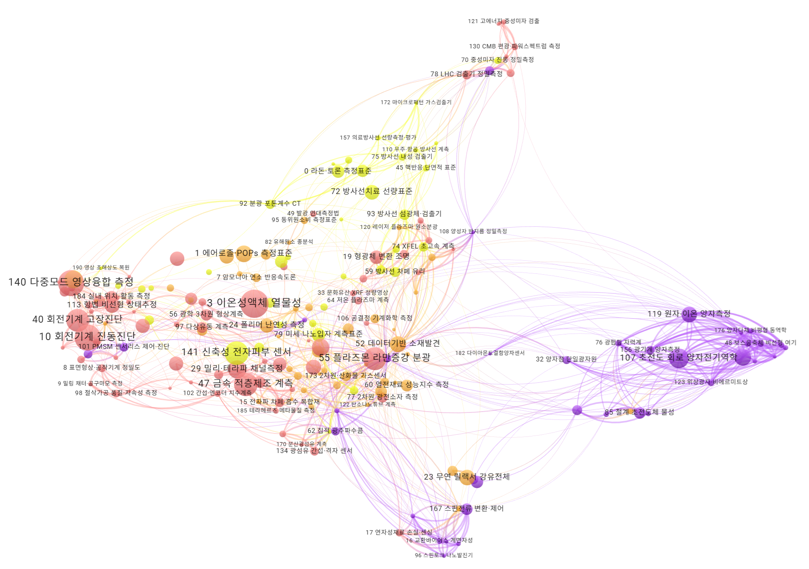

위 그림에 나타나는 표준과학 연구지형도 예시에서 노드의 크기는 클러스터 별 문헌수에 비례하며, 노드의 색상은 각 클러스터가 4대 영역 중 어디에 속하는지(자주색은 물리측정, 주황색은 화학소재측정, 노란색은 바이오의료측정, 보라색은 양자기술영역)를 나타낸다. 이와 같은 표준과학 연구지형도는 VOSviewer를 통해 인터랙티브 지도화하였으며 온라인에 게시되어 있다([https://app.vosviewer.com/?json=https%3A%2F%2Fdrive.google.com%2Fuc%3Fid%3D14b6CQcJ0OS6wdA1qolCdLLLKi1tHYIR3](https://app.vosviewer.com/?json=https%3A%2F%2Fdrive.google.com%2Fuc%3Fid%3D1Lcm9LnGJYKEK0jgJB1WcwDol5gcdbd9r)).

VOSViewer상에서 활용할 수 있는 세부지표는 아래와 같으며, 각 세부지표에 대한 자세한 정의 및 측정 방밥은 이어지는 절에서 다루기로 한다.

[표 XX]

| 지표명 | 정의 | 해석 |
| --- | --- | --- |
| Cluster micro N docs (Size) | 각 마이크로-레벨 클러스터의 고유 문헌 수 | 해당 마이크로-레벨 클러스터에 포함된 문헌 규모 |
| Growth percentile (Size) | 성장성 관련 세부지표(딥러닝 성장확률·emergence·recency·CAGR)를 PCA로 통합한 뒤, 전체 클러스터 대비 상대적 위치를 퍼센타일(0–100)로 나타낸 값 | 해당 클러스터의 성장성이 전체 클러스터 중 어느 수준인가 |
| Impact percentile (Size) | 파급력 관련 세부지표(Excellence index10·MNCS)를 PCA로 통합한 뒤, 전체 클러스터 대비 상대적 위치를 퍼센타일(0–100)로 나타낸 값 | 해당 클러스터의 파급력이 전체 클러스터 중 어느 수준인가 |
| Contribution to tech percentile (Size) | 기술진보 기여도 관련 세부지표(특허 인용 비율·특허 영향력)를 PCA로 통합한 뒤, 전체 클러스터 대비 상대적 위치를 퍼센타일(0–100)로 나타낸 값 | 해당 클러스터의 기술진보 기여도가 전체 클러스터 중 어느 수준인가 |
| Cluster promising index (Size) | 성장성·파급력·기술진보 기여도 3개 축을 PCA로 통합한 종합 유망도 점수를 전체 클러스터 대비 퍼센타일(0–100)로 나타낸 값 | 해당 클러스터의 종합 유망도가 전체 클러스터 중 어느 수준인가 |
| ‘기관명’ competence (Size) | 해당 기관이 해당 클러스터에서 RTA ≥ 1, Excellence 10 index ≥ 8, 문헌수 ≥ 5 조건을 모두 만족하면 1, 아니면 0으로 표시한 값 | 해당 기관이 그 클러스터에서 핵심 역량을 보유했는가 |
| cluster (Color) | 해당 클러스터가 KRISS 포트폴리오 및 역량 관점에서 어느 유망영역 후보군 유형에 속하는지 나타내는 코드로, 1은 “핵심 역량 연구영역”, 2는 “확장 가능 연구영역”, 3은 “역량 공백 연구영역”, 999는 “기타”를 의미한다 | 해당 클러스터가 KRISS 관점 유망영역 후보군 중 어디에 속하는가 |
| KRISS portfolio type (Color) | 해당 클러스터가 KRISS 포트폴리오 및 역량 관점에서 어느 유망영역 후보군 유형에 속하는지 나타내는 코드로, 1은 “핵심 역량 연구영역”, 2는 “확장 가능 연구영역”, 3은 “역량 공백 연구영역”, -1은 “기타”를 의미한다 | 해당 클러스터가 KRISS 관점 유망영역 후보군 중 어디에 속하는가 |
| sci std area (Color) | 해당 클러스터가 물리(1)/화학소재(2)/바이오의료(3)/양자기술(-1) 중 어느 영역에 속하는지 표시하는 코드.
 | 해당 클러스터가 어느 연구영역에 속하는가 |
| ‘기관명’ RTA (Color) | 해당 기관이 클러스터에서 보이는 RTA(Relative Technological Advantage) 값으로, 1 이상이면 해당 기관이 그 영역에 상대적 특화 | 해당 기관이 그 클러스터에서 보이는 상대적 특화 수준은 어느 정도인가 |
| ‘기관명’ Excellence10 (Color) | 해당 기관의 클러스터 내 논문들 중 상위 10% 영향력 논문의 비중을 0–100 스케일로 나타낸 질적 성과 지표 | 해당 기관이 그 클러스터에서 보이는 논문 질적 성과 수준은 어느 정도인가 |
| Growth percentile (Color) | Growth percentile (Size) 값을 score 형식으로 제공한 값으로, 퍼센타일(0–100)은 동일하다 | 해당 클러스터의 성장성이 전체 클러스터 중 어느 수준인가 |
| Impact percentile (Color) | Impact percentile (Size) 값을 score 형식으로 제공한 값으로, 퍼센타일(0–100)은 동일하다 | 해당 클러스터의 파급력이 전체 클러스터 중 어느 수준인가 |
| Contribution to tech percentile (Color) | Contribution to tech percentile (Size) 값을 score 형식으로 제공한 값으로, 퍼센타일(0–100)은 동일하다 | 해당 클러스터의 기술진보 기여도가 전체 클러스터 중 어느 수준인가 |
| Cluster promising index (Color) | Cluster promising index (Size) 값을 score 형식으로 제공한 값으로, 퍼센타일(0–100)은 동일하다 | 해당 클러스터의 종합적인 유망성이 전체 클러스터 중 어느 수준인가 |

# 2) 기관 연구역량 수준 진단을 위한 과학계량지표 빅데이터 분석

## **2-1) 표준연구 분야의 주요 국가 및 기관명 표준화 및 문헌 연계**

여기서는 1-1-2)에서 최종 구축한 ‘표준과학연구 문헌 집합’을 기관 단위로 해석·분석할 수 있도록, Web of Science(WoS) 데이터의 정규화된 기관명(pref_name)과 기관국가명(org_country) 정보를 문헌 단위로 결합하고, 표준과학 영역의 주요 국가 및 기관을 중심으로 기관명 표준화 및 문헌 연계를 수행하고자 한다. 

주요 기관 후보를 추리기 위해 WoS/Incites 기관 데이터의 기관 유형(Organization Type) 정보를 사용했고, 기관 유형이 ‘Academic System’ 또는 ‘Healthcare System’인 행을 제거했다. 이후 잔여 기관을 대상으로 논문 수 기준 상위 500개 기관을 우선 추출했다. 이때 정규화된 기관명(pref_name)이 부여되지 못한 기관은 WoS/Incites 상에서 기관 식별이 충분히 이루어지지 않았거나 성과가 제한적이라고 간주하여 주요 기관 후보에서 제외했다. 기관별 논문 수는 full count 방식으로 산정했다. 즉, 1편의 논문에 복수 저자와 복수 기관이 존재하더라도, 해당 논문에 등장하는 각 기관의 기여를 저자 수와 무관하게 1로 계산했다. 예를 들어 논문 A의 저자가 KRISS 소속 2명, NIST 소속 1명으로 구성되어도 KRISS 1편, NIST 1편으로 집계했다.

기관 유형이 ‘government’로 분류된 기관 가운데에서도 실제로는 연구를 직접 수행하기보다는 연구 지원·관리·조정 또는 정책·재정 기능을 수행하는 기관이 포함될 수 있다. 따라서 UK Research & Innovation(UKRI), Department of Science & Technology(India), Japan Science & Technology Agency(JST), United States Navy, United States Department of Defense(DoD), Department of Space(DoS) Government of India, National Aeronautics & Space Administration(NASA), Ministry of Education & Science of Ukraine, United States Department of Energy(DOE), Egyptian Knowledge Bank(EKB), Academy of Scientific & Innovative Research(AcSIR)은 ‘직접 연구를 수행하지 않는 기관’으로 간주하고 표준과학 영역 연구기관 목록에서 제외했다. 또한 기관 유형이 ‘Nonprofit’ 또는 ‘Partnership’인 기관 중 Helmholtz Association은 다수 Helmholtz 센터(DESY, HZB, GSI 등)를 포괄하는 연합체(umbrella) 성격이 강하므로 단일 연구 수행기관으로 보기 어렵다고 판단해 제외했다. 추가로 University of Chinese Academy of Sciences와 University of Science & Technology of China는 Chinese Academy of Sciences(CAS)의 하위 기관으로 간주하여 주요 연구기관 목록에서 제외했다.

한편 1-1-1) 단계에서 수행한 ‘① BIPM 정회원국의 표준과학연구 전문 연구기관 목록을 활용하여 해당 기관들이 발간한 산출 문헌을 추출’ 과정에서 얻은 BIPM 정회원국 대표 연구기관 60개의 기관-논문 매칭 정보는 그대로 활용하였다. 

이상의 절차를 종합한 결과, 표준과학 연구 영역 문헌 집합의 1,099,738개 문헌 중 표준과학 영역의 주요 연구기관 533개가 생산한 문헌 790,227개를 식별했고, 정규화된 기관명(pref_name) 기준의 기관명 표준화와 문헌 연계를 구축했다. 이는 기관별 연구성과 비교와 기관 단위 연구 프로파일 분석을 수행하기 위한 기초 데이터셋으로 활용된다.

[org_paper_count_stdscience_2000_2024_top500_or_bipm_excl.xlsx](report_assets/org_paper_count_stdscience_2000_2024_top500_or_bipm_excl.xlsx)

## **2-2) 표준연구 분야의 벤치마킹 국가 및 기관 선정**

한국표준과학연구원(KRISS)의 연구성과 및 연구 포트폴리오 비교 분석을 수행하기 위해, 2-1)에서 구축한 표준과학 영역의 문헌–기관 연계 데이터를 기반으로 벤치마킹 대상 기관과 주요 국가를 선정하였다. 분석 목적은 KRISS의 성과를 동일한 기능과 역할을 수행하는 해외 표준과학 전문 연구기관과 비교 가능한 형태로 제시하는 데 있으며, 이를 위해 표준과학 분야에서 BIPM 정회원국 소속 전문 연구기관이 갖는 위상과 특수성을 벤치마킹 대상 선정의 기준으로 삼았다.

벤치마킹 기관은 BIPM 정회원국의 표준과학 전문 연구기관 가운데 문헌 생산 규모가 큰 기관을 중심으로 선정했다. 이는 표준과학 연구는 국가 인프라 성격이 강하고, 표준·계측 체계의 구축 및 운영과 결합되어 연구기관의 역할이 비교적 명확하게 정의된다는 점에서, 동일한 제도적 맥락을 공유하는 BIPM 정회원국 기관 간 비교가 가장 타당하다고 판단했기 때문이다. 따라서 KRISS를 제외한 BIPM 정회원국 표준과학 전문 연구기관 중 논문 수 최상위 기관을 후보군으로 두고, 기관의 소속 국가가 갖는 비교의 대표성(중요도)을 함께 고려하여 최종 벤치마킹 기관을 확정했다. 이 과정에서 리투아니아의 Center for Physical Sciences & Technology와 스웨덴의 RISE Research Institutes of Sweden은 국가 단위 비교에서의 대표성 및 해석 가능성을 고려했을 때 우선순위를 낮추는 것이 적절하다고 판단하여 제외했으며, 그 결과 총 9개 기관을 KRISS의 벤치마킹 기관으로 선정했다.

[표 XX KRISS의 벤치마킹 기관 9개]

| 국가명(WoS 기준) | 기관명(BIPM 기준) |
| --- | --- |
| United States of America | National Institute of Standards & Technology (NIST) - USA |
| Germany | Federal Institute for Materials Research & Testing (BAM) |
| Germany | Physikalisch-Technische Bundesanstalt (PTB) |
| India | CSIR - National Physical Laboratory (NPL) |
| United Kingdom | National Physical Laboratory - UK |
| Canada | National Research Council Canada [NRC] |
| Italy | Istituto Nazionale di Ricerca Metrologica (INRIM) |
| Japan | National Metrology Institute of Japan |
| China | National Institute of Metrology China |

주요 국가 선정은 기관 비교를 국가 비교로 확장하기 위한 절차로 수행했다. 즉, KRISS와 벤치마킹 기관 간 비교 결과를 국가 수준의 표준과학 연구역량 비교로 연결하기 위해, 앞서 확정한 벤치마킹 기관 9개가 소속된 국가를 우선적으로 주요 국가 후보로 정의했다. 이들 기관이 속한 국가는 미국, 독일, 인도, 영국, 캐나다, 이탈리아, 일본, 중국의 8개국이며, 여기에 국제 표준·계측 체계에서의 영향력과 비교 분석의 정책적 함의를 고려하여 프랑스를 추가로 포함했다. 결과적으로 본 연구는 미국, 독일, 인도, 영국, 캐나다, 이탈리아, 일본, 중국, 프랑스의 9개국을 표준과학 영역 성과 비교를 위한 주요 국가로 선정하였다.

## **2-3) 주요 기관 간 협력 네트워크 분석**

여기서는 표준연구 분야에서 주요 기관 간 협력 관계의 구조를 파악하기 위해, 기관 간 공저자 관계를 기반으로 협력 네트워크 지형도를 구축하고 그 특징을 분석한 내용을 다룬다. 협력 네트워크는 표준과학 전 영역에서 기관들이 어떤 상대와 얼마나 빈번하게 공동 연구를 수행하는지, 그리고 특정 핵심 기관을 중심으로 협력 관계가 어떻게 확장되는지를 시각적으로 확인할 수 있는 도구가 된다.

분석에는 2020년부터 2024년까지 최근 5개년의 논문 데이터를 활용하였다. 각 문헌에서 식별되는 기관 간 공동연구(공저 관계) 정보를 이용해 기관 간 연결을 정의하고, 이를 바탕으로 협력관계를 나타내는 네트워크를 구성하였다. 즉, 동일 논문에 두 기관이 함께 등장하면 해당 기관 간 협력 링크가 형성되는 것으로 간주하고, 이러한 링크의 누적을 통해 최근 5개년 협력의 구조적 지형을 도출하였다.

또한 본 연구의 핵심 관심은 2-2)에서 선정한 표준과학 영역 벤치마킹 기관의 협력 패턴을 비교 가능한 형태로 제시하는 데 있으므로, KRISS를 포함한 벤치마킹 10개 기관을 중심으로 네트워크를 재구성하였다. 구체적으로는 각 기관별로 상위 10개 협력 기관을 먼저 도출하고, 이렇게 도출된 협력 기관들에 대해 다시 상위 5개 협력 기관을 추가로 도출하는 2단계 확장 방식을 적용하여 네트워크를 구축하였다. 이 절차는 벤치마킹 10개 기관의 협력관계를 중심축으로 두면서도, 해당 관계가 어떤 주요 파트너를 통해 추가적으로 연결되는지를 함께 보여주기 위한 설계이며, 전 영역의 모든 협력관계를 제약 없이 포함할 때 발생할 수 있는 시각적 과밀과 해석 난점을 완화하기 위한 목적도 함께 갖는다.

다만 이 협력 네트워크 그래프는 벤치마킹 10개 기관의 협력 네트워크를 중점적으로 조망하기 위한 분석용 시각화이며, 표준과학 전 영역에서의 실제 협력 현황을 그대로 대표하는 것으로 해석해서는 안 된다. 특히 표준과학 영역에서는 BIPM 정회원국 표준과학 전문 연구기관들 간 협력뿐 아니라, 해당 기관들이 포함되지 않은 상태로 이루어지는 다양한 대학 및 종합연구소 중심의 협력 연구가 더 큰 비중을 차지할 수 있다. 따라서 여기서 살펴볼 협력 네트워크는 ‘벤치마킹 대상 기관을 중심으로 한 협력의 상대적 구조’로 이해하는 것이 타당하며, 전반적 협력 규모나 전체 협력의 분포를 직접적으로 대변하는 지표로 사용하는 데에는 제한이 따른다.

[그림 21] 주요 표준과학 연구 기관간 협력 네트워크 지형도 (표준과학 전영역)

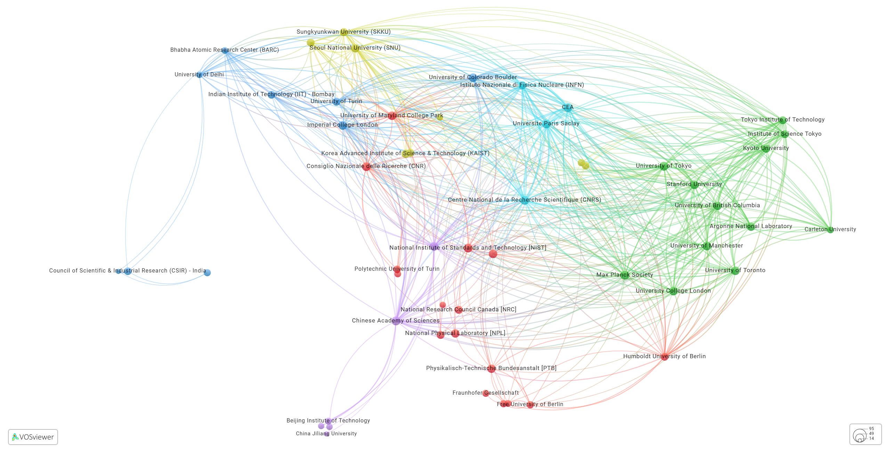

위 그림에 나타나는 표준과학 전영역의 벤치마킹 기관 중심 협력네트워크 연구지형도 예시에서 노드의 크기는 협력 강도(협력 기관 수)에 비례하며, 노드의 색상은 VOSViewer의 자체 알고리즘이 추정한 클러스터를 이와 같은 협력네트워크는 VOSviewer를 통해 인터랙티브 지도화하였으며 온라인에 게시되어 있다([https://app.vosviewer.com/?json=https%3A%2F%2Fdrive.google.com%2Fuc%3Fid%3D12fNZlZBBC-yR5v5SAQEUOIuSTlKSGCEw](https://app.vosviewer.com/?json=https%3A%2F%2Fdrive.google.com%2Fuc%3Fid%3D12fNZlZBBC-yR5v5SAQEUOIuSTlKSGCEw)).

[그림 22] 주요 표준과학 연구 기관간 협력 네트워크 지형도 (물리측정 영역)

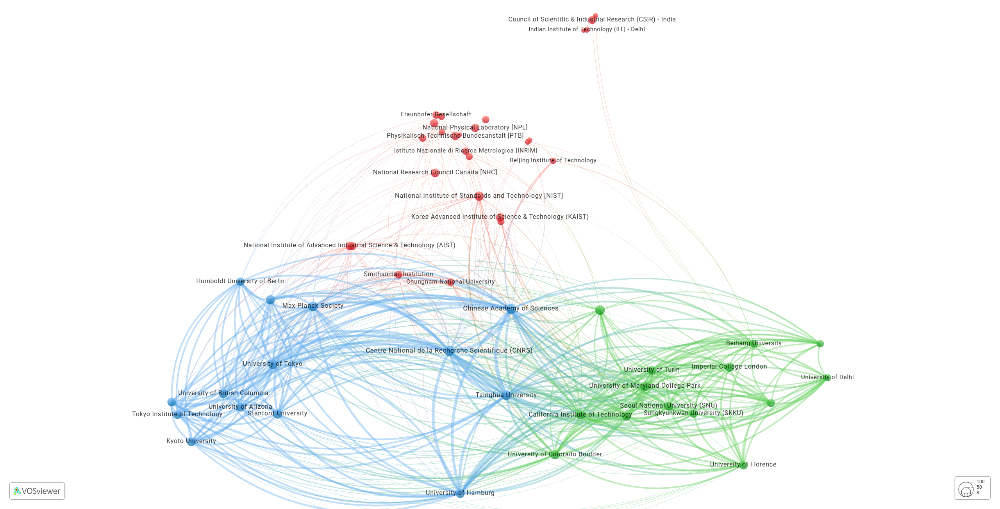

위 그림에 나타나는 물리측정 영역의 벤치마킹 기관 중심 협력네트워크 연구지형도 예시에서 노드의 크기는 협력 강도(협력 기관 수)에 비례하며, 노드의 색상은 VOSViewer의 자체 알고리즘이 추정한 클러스터를 이와 같은 협력네트워크는 VOSviewer를 통해 인터랙티브 지도화하였으며 온라인에 게시되어 있다([https://app.vosviewer.com/?json=https%3A%2F%2Fdrive.google.com%2Fuc%3Fid%3D12fNZlZBBC-yR5v5SAQEUOIuSTlKSGCEw](https://app.vosviewer.com/?json=https%3A%2F%2Fdrive.google.com%2Fuc%3Fid%3D1HCzWTCSrE7yfSh_Ksi_QdryFsRdK6Mg-)).

[그림 23] 주요 표준과학 연구 기관간 협력 네트워크 지형도 (화학소재측정 영역)

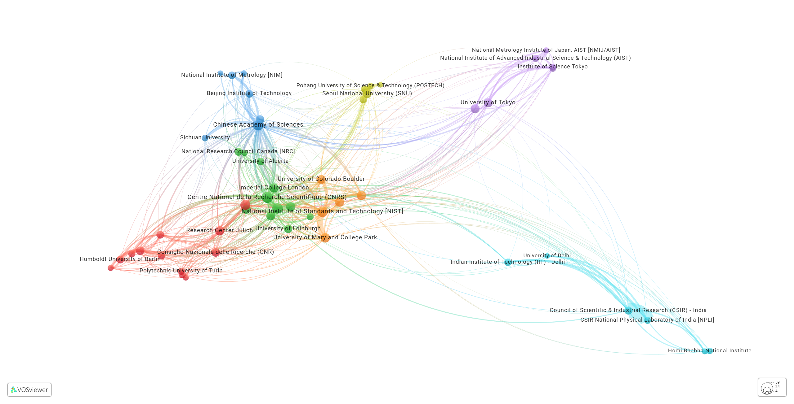

위 그림에 나타나는 화학소재측정 영역의 벤치마킹 기관 중심 협력네트워크 연구지형도 예시에서 노드의 크기는 협력 강도(협력 기관 수)에 비례하며, 노드의 색상은 VOSViewer의 자체 알고리즘이 추정한 클러스터를 이와 같은 협력네트워크는 VOSviewer를 통해 인터랙티브 지도화하였으며 온라인에 게시되어 있다([https://app.vosviewer.com/?json=https%3A%2F%2Fdrive.google.com%2Fuc%3Fid%3D12fNZlZBBC-yR5v5SAQEUOIuSTlKSGCEw](https://app.vosviewer.com/?json=https%3A%2F%2Fdrive.google.com%2Fuc%3Fid%3D1N2RfNURIGNDnIrJXqs87dol4mKMYLhTR)).

[그림 24] 주요 표준과학 연구 기관간 협력 네트워크 지형도 (바이오의료측정 영역)

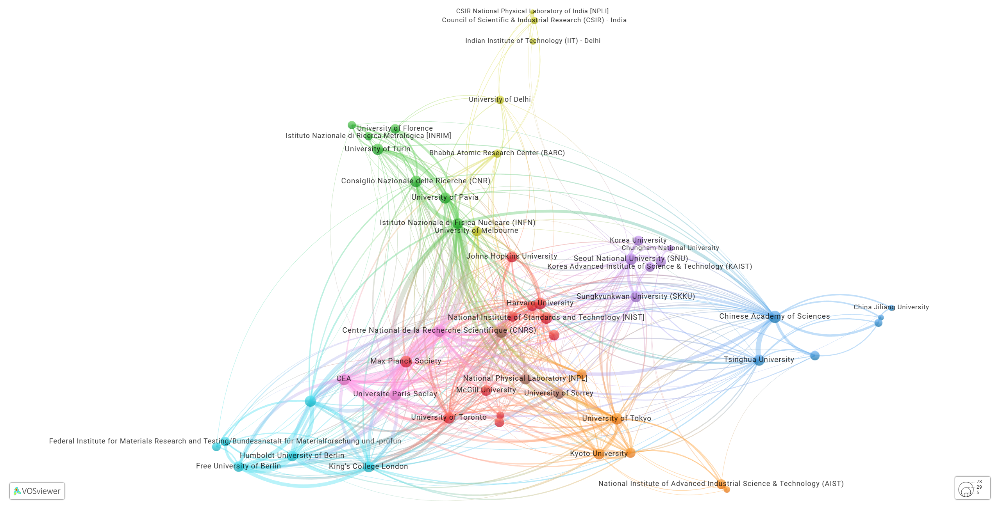

위 그림에 나타나는 바이오의료측정 영역의 벤치마킹 기관 중심 협력네트워크 연구지형도 예시에서 노드의 크기는 협력 강도(협력 기관 수)에 비례하며, 노드의 색상은 VOSViewer의 자체 알고리즘이 추정한 클러스터를 이와 같은 협력네트워크는 VOSviewer를 통해 인터랙티브 지도화하였으며 온라인에 게시되어 있다([https://app.vosviewer.com/?json=https%3A%2F%2Fdrive.google.com%2Fuc%3Fid%3D12fNZlZBBC-yR5v5SAQEUOIuSTlKSGCEw](https://app.vosviewer.com/?json=https%3A%2F%2Fdrive.google.com%2Fuc%3Fid%3D1SnjTp57fg3N6pXm1yiEJo57sg0TddWF5)).

[그림 25] 주요 표준과학 연구 기관간 협력 네트워크 지형도 (양자기술 영역)

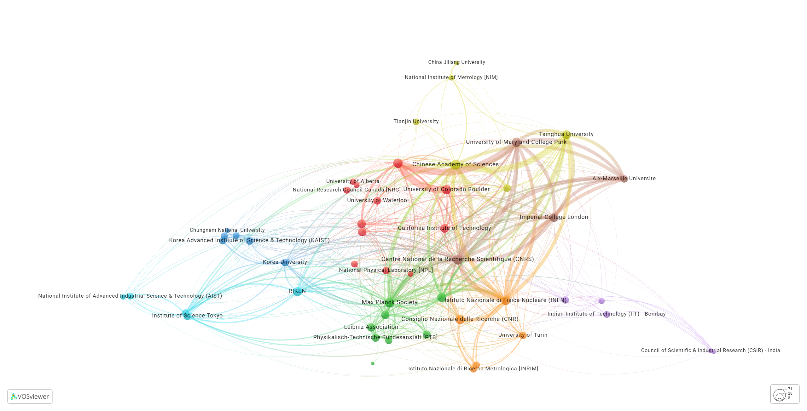

위 그림에 나타나는 양자기술 영역의 벤치마킹 기관 중심 협력네트워크 연구지형도 예시에서 노드의 크기는 협력 강도(협력 기관 수)에 비례하며, 노드의 색상은 VOSViewer의 자체 알고리즘이 추정한 클러스터를 이와 같은 협력네트워크는 VOSviewer를 통해 인터랙티브 지도화하였으며 온라인에 게시되어 있다([https://app.vosviewer.com/?json=https%3A%2F%2Fdrive.google.com%2Fuc%3Fid%3D12fNZlZBBC-yR5v5SAQEUOIuSTlKSGCEw](https://app.vosviewer.com/?json=https%3A%2F%2Fdrive.google.com%2Fuc%3Fid%3D1zKWEwz3MisYMVzhz10WMRBryvaF_w6Ao)).

추가로 KRISS를 비롯한 10대 BIPM 표준과학 전문 연구기관의 국제협력비율과 국제협력논문수를 살펴보았다. 이를 통해 KRISS의 국제협력이 **벤치마킹 기관 대비 어느 정도 수준인지**, 그리고 국제협력이 어떤 연구영역에서 강하거나 약한지를 한눈에 확인할 수 있다. 이를 통해 국제협력 성과를 기관 간에 비교하고, KRISS가 협력을 강화해야 할 영역과 상대적으로 경쟁력이 있는 영역을 살펴 볼 수 있다. 

아래 표는 각 기관이 2020–2024년 5개년 동안 생산한 논문 중에서 국제공저(해외 기관과 공동저자)로 수행된 논문의 비중을 계산해, 기관별·연구영역별 국제협력 수준을 비교한 결과를 나타내고 있다. 표 안의 각 %는 해당 기관의 전체(또는 해당 영역) 논문 중 국제공저 논문이 차지하는 비율이고, 괄호 안의 분자와 분모는 각각 국제공저 논문 수와 전체 논문 수를 의미한다.

[표 XX] 표준과학 영역별 KRISS와 주요벤치마킹 기관의 국제협력비율(국제협력논문수/전체논문수)

| 기관명 | 전체 | 물리측정 | 화학소재측정 | 바이오의료측정 | 양자기술 |
| --- | --- | --- | --- | --- | --- |
| NPL | 71.87% (963/1340) | 72.48% (295/407) | 72.24% (203/281) | 72.62% (305/420) | 70.10% (143/204) |
| PTB | 61.45% (1014/1650) | 56.43% (259/459) | 54.55% (126/231) | 68.84% (411/597) | 61.05% (210/344) |
| NRC | 57.86% (464/802) | 56.44% (149/264) | 68.65% (208/303) | 43.41% (56/129) | 48.54% (50/103) |
| INRIM | 51.50% (377/732) | 52.75% (115/218) | 57.46% (77/134) | 44.08% (67/152) | 52.70% (117/222) |
| BAM | 50.70% (1018/2008) | 46.96% (332/707) | 52.18% (466/893) | 54.70% (192/351) | 50.00% (6/12) |
| NIST | 43.76% (2630/6010) | 44.34% (850/1917) | 43.50% (599/1377) | 37.17% (333/896) | 47.72% (804/1685) |
| KRISS | 28.84% (473/1640) | 23.00% (141/613) | 31.03% (126/406) | 26.48% (85/321) | 42.21% (111/263) |
| NPLI | 22.98% (364/1584) | 22.41% (106/473) | 23.55% (171/726) | 21.58% (30/139) | 22.47% (51/227) |
| NMIJ/AIST | 22.61% (161/712) | 29.47% (89/302) | 17.42% (31/178) | 11.67% (14/120) | 25.71% (27/105) |
| NIM | 15.14% (194/1281) | 20.00% (87/435) | 14.17% (36/254) | 12.53% (45/359) | 10.80% (19/176) |

2020–2024년 기준으로 KRISS의 국제공저 비중은 28.84%(473/1,640)로, 비교 대상 10대 BIPM 기관 중 7위에 위치한다. 상위 기관인 NPL(71.87%), PTB(61.45%), NRC(57.86%)와 비교하면 국제협력 기반의 논문 생산 비중이 낮고, NIST(43.76%)와 비교해도 격차가 크다. 반면 하위권 기관인 NPLI(22.98%), NMIJ/AIST(22.61%), NIM(15.14%)보다는 높은 수준으로, 국제협력이 일정 수준에서는 작동하고 있으나 선도기관 대비 확장 여지가 큰 상태로 해석된다.

세부 영역별로 보면 KRISS의 국제공저 비중은 물리측정 23.00%, 화학소재측정 31.03%, 바이오의료측정 26.48%, 양자기술 42.21%로 나타난다. 특히 양자기술 영역은 KRISS 내부에서 가장 높은 국제공저 비중을 보이며, NIST(47.72%)와 유사한 수준에 근접해 상대적으로 국제협력 네트워크가 활발한 편이다. 반대로 물리측정 영역은 23.00%로 가장 낮아, 전통 핵심 분야에서 국제공저 기반의 연구 확장이 제한적으로 이루어지고 있음을 시사한다. 화학소재측정과 바이오의료측정은 중간 수준이지만, 상위 기관들이 대체로 50~70%대의 국제공저 비중을 유지하는 것과 대비하면 추가적인 협력 확대가 필요하다.

종합하면 KRISS의 국제협력은 양자기술을 중심으로 비교적 강하게 나타나지만, 기관 전체의 국제공저 비중은 선도 BIPM 기관 대비 낮은 편이다. NPL, PTB, BAM, INRIM 등 유럽권 국가의 국제협력에 비해 KRISS, NPLI, NMIJ/AIST, NIM의 국제협력 활동이 저조한 특성도 나타나며, 자국에 연구 역량이 뛰어난 대학이 많은 미국의 NIST는 국내협력이 상대적으로 높은 것으로 해석할 수 있다. 이렇듯 자국의 연구 역량이 뛰어난 대학과 협력하는 양상은 중국의 NIM에도 유사하게 나타나는 것으로 해석할 수 있다.

## **2-4) 표준과학 연구 분야 영역별 주요 국가 및 벤치마킹 기관의 성과수준 비교 분석**

여기서는 1-2-2)에서 구축한 연구지형도의 세부 영역인 물리측정, 화학소재측정, 바이오의료측정, 양자기술을 기준으로, 주요 선진국과 대한민국의 성과 수준을 비교하고, 주요 벤치마킹 기관과 한국표준과학연구원(KRISS)의 연구성과를 비교·진단하기 위한 분석 틀과 지표 체계를 제시한다. 즉, 앞 절에서 확정한 주요 국가 및 벤치마킹 기관을 대상으로, 표준과학 전영역을 단순 집계하는 방식이 아니라 세부 영역별로 성과의 수준과 구조가 어떻게 다른지까지 분해하여 확인하는 것을 목표로 한다. 이 절 아래에서는 동일한 체계를 적용해 주요 국가 비교 분석과 벤치마킹 기관 비교 분석을 각각 수행할 예정이다.

성과 수준 비교에는 인용영향력(citation impact) 지표 중 안정성이 높고 상이한 분야 간 비교에 유리한 것으로 평가되는 피인용수 백분위 기반의 엑셀런스(excellence) 지표를 핵심 지표로 적용하고, 성과 수준의 장기 추이 분석을 병행한다. 기존에 자주 사용되는 ‘논문 1편당 평균 피인용수’나 ‘분야 평균 대비 정규화된 피인용수’ 같은 평균 기반 지표는 학술논문의 피인용 분포가 극단적으로 비대칭(skewed)인 특성 때문에 대표값으로서의 적합성이 낮고, 소수의 초고피인용 논문 존재 여부에 따라 값이 불안정하게 변동할 수 있다. 반면 백분위(percentile) 기반 지표는 분포의 꼬리 효과를 상대적으로 통제하면서 평가 대상 집단의 수준을 더 안정적으로 측정할 수 있고, 분야 간 비교 가능성도 높다는 점에서 우선 적용할 근거가 충분하다. 이러한 문제의식은 2015년 과학계량학자들이 Nature지를 통해 계량분석의 문제점과 방향성에 대해 제안한 ｢라이덴 선언｣에서 백분위 기반 지표를 최우선으로 권고한 흐름과도 일치한다.

엑셀런스 지표의 산출은 전역(글로벌) 과학기술 지형을 기준으로 상위 10% 문헌을 먼저 식별한 뒤, 표준과학 영역 내에서 해당 상위 10% 문헌의 분포를 재집계하는 방식으로 수행한다. 구체적으로는 글로벌 과학기술 지형 전체 문헌을 대상으로 각 인용 주제(citation topic) 메소(meso)-레벨 클러스터(326개)별로 피인용 상위 10% 문헌을 식별하고, 이후 109만여 편 규모의 표준과학 영역 문헌 집합에서 앞서 식별된 상위 10% 문헌에 해당하는 문헌을 기준으로 국가 및 기관의 상위 10% 논문 점유율을 계산한다. 이 방식은 분야/주제별 인용 환경의 차이를 일정 부분 반영하면서도, 표준과학 영역 내부에서 국가·기관 간 상대적 성과 수준을 비교 가능한 형태로 정렬하기 위한 목적을 가진다. 성과 수준 비교는 엑셀런스 지표(예: 상위 10% 문헌 비율)에 더해 우수성의 ‘크기’를 반영하는 척도인 상위 분위수 구간에서의 점유율 분석을 병행하고, 이를 결합해 국가·기관의 성과 수준을 다면적으로 해석한다. 또한 시기 구간별로 각 기관의 최상위(상위 10%) 문헌 비율과 최하위(하위 10%) 문헌 비율을 함께 살펴봄으로써 기관별 문헌의 질적 수준 분포가 어떻게 변화하는지를 분석한다. 

이에 더해 엑셀런스 지표 및 점유율 분석에 그치지 않고 KISTI에서 개발한 분위수 분포 기반 측정 모형을 함께 적용한다. 전통적인 엑셀런스 방식은 상위 10% 또는 상위 1%처럼 특정 기준선을 정한 뒤, 분석 대상 주체가 생산한 문헌 중 그 기준을 만족하는 문헌의 상대적 비중을 계산하는 구조다. 이 지표는 ‘상대적 우위’의 존재를 파악하는 데 유용하지만, 분석 대상 주체의 성과가 전체 분위수 구간에서 어떤 형태로 분포하는지, 즉 전반적 역량의 구조를 충분히 설명하기에는 한계가 있다. 이에 따라 아래 그림에서 묘사하는 분위수 분포 기반 모형을 통해 전 분위수 구간의 분포를 함께 비교한다.

[그림 26] KISTI의 분위수 분포 기반 수준 비교 모형

### **2-4-1) 표준과학 연구 분야 영역별 주요 국가의 성과수준 비교 분석**

표준과학 연구지형도의 세부 영역별로 주요 국가의 성과수준을 비교 분석한다. 분석은 표준과학 전영역을 포함해 물리측정, 화학소재측정, 바이오의료측정, 양자기술의 4개 영역으로 구분하여 수행하며, 각 영역에서 주요 국가의 성과가 어떤 수준과 분포 형태로 나타나는지를 KISTI의 분위수 분포 기반 수준 비교 모형, 최상위 및 최하위 문헌 비율 시계열, 연평균 문헌수 시계열, 엑셀런스 지수와 최상위 문헌 점유율 결합 분석을 통해 확인한다.

[그림 27] 분위수 분포 기반 수준 비교 모형으로 살펴본 표준과학 연구 영역 주요 국가 성과수준: 표준과학 전영역

[그림 28] 분위수 분포 기반 수준 비교 모형으로 살펴본 표준과학 연구 영역 주요 국가 성과수준: 물리측정 영역

[그림 29] 분위수 분포 기반 수준 비교 모형으로 살펴본 표준과학 연구 영역 주요 국가 성과수준: 화학소재측정 영역

[그림 30] 분위수 분포 기반 수준 비교 모형으로 살펴본 표준과학 연구 영역 주요 국가 성과수준: 바이오의료측정 영역

[그림 31] 분위수 분포 기반 수준 비교 모형으로 살펴본 표준과학 연구 영역 주요 국가 성과수준: 양자기술 영역

[그림 32] 최상위 및 최하위 문헌 비율 시계열로 살펴본 표준과학 연구 영역 주요 국가 성과수준: 표준과학 전영역

[그림 33] 최상위 및 최하위 문헌 비율 시계열로 살펴본 표준과학 연구 영역 주요 국가 성과수준: 물리측정 영역

[그림 34] 최상위 및 최하위 문헌 비율 시계열로 살펴본 표준과학 연구 영역 주요 국가 성과수준: 화학소재측정 영역

[그림 35] 최상위 및 최하위 문헌 비율 시계열로 살펴본 표준과학 연구 영역 주요 국가 성과수준: 바이오의료측정 영역

[그림 36] 최상위 및 최하위 문헌 비율 시계열로 살펴본 표준과학 연구 영역 주요 국가 성과수준: 양자기술 영역

[그림 37] 연평균 문헌수 시계열로 살펴본 표준과학 연구 영역 주요 국가 성과수준: 표준과학 전영역

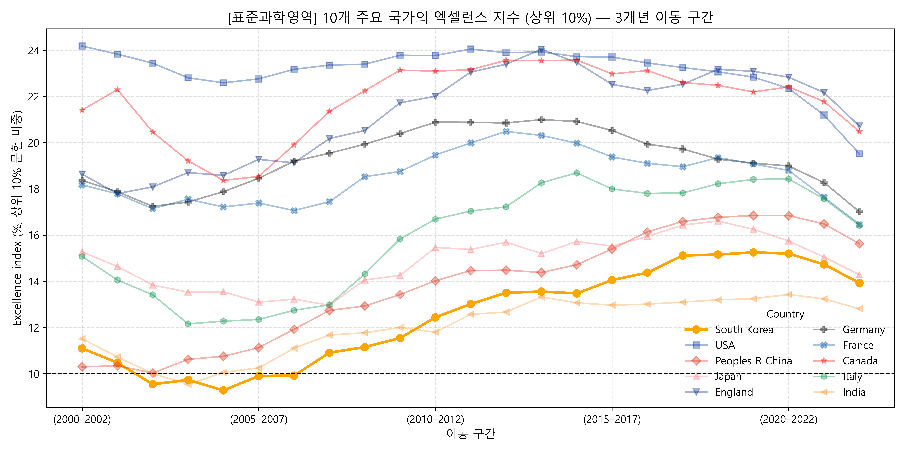

[그림 38] 연평균 문헌수 시계열로 살펴본 표준과학 연구 영역 주요 국가 성과수준: 물리측정 영역

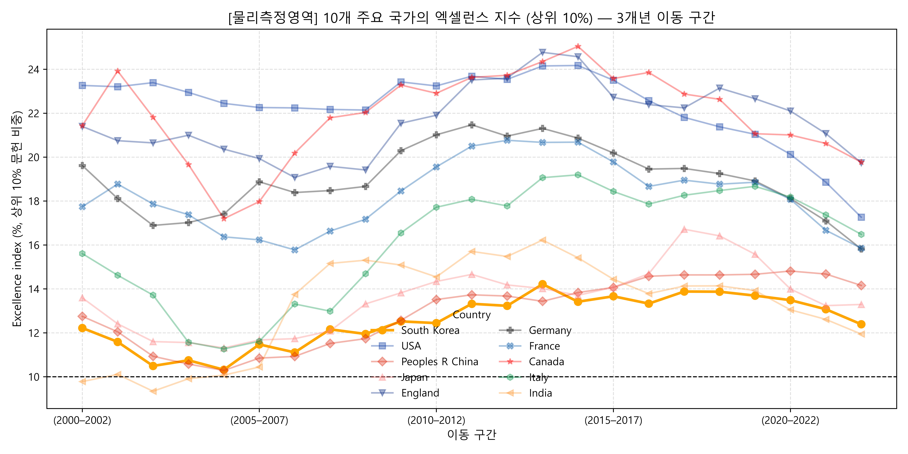

[그림 39] 연평균 문헌수 시계열로 살펴본 표준과학 연구 영역 주요 국가 성과수준: 화학소재측정 영역

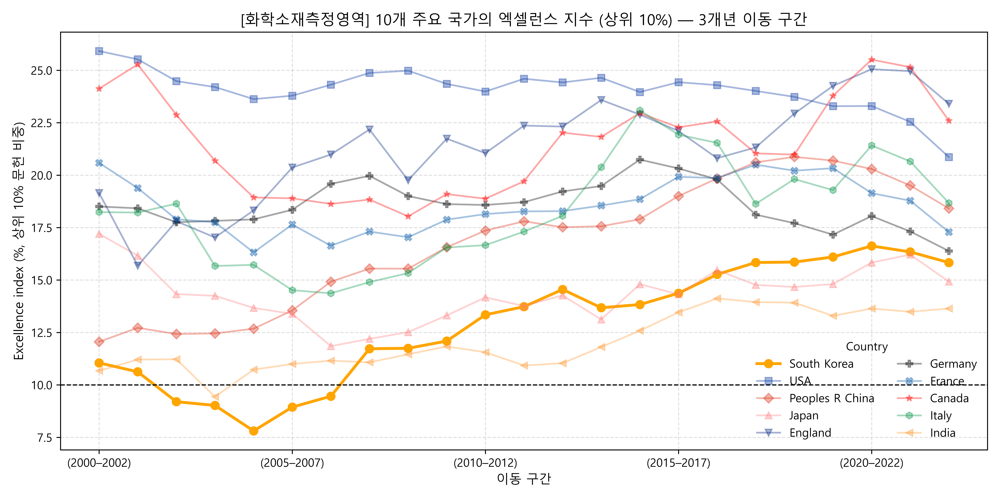

[그림 40] 연평균 문헌수 시계열로 살펴본 표준과학 연구 영역 주요 국가 성과수준: 바이오의료측정 영역

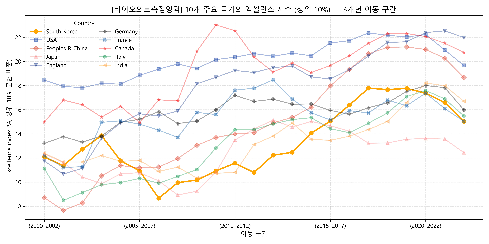

[그림 41] 연평균 문헌수 시계열로 살펴본 표준과학 연구 영역 주요 국가 성과수준: 양자기술 영역

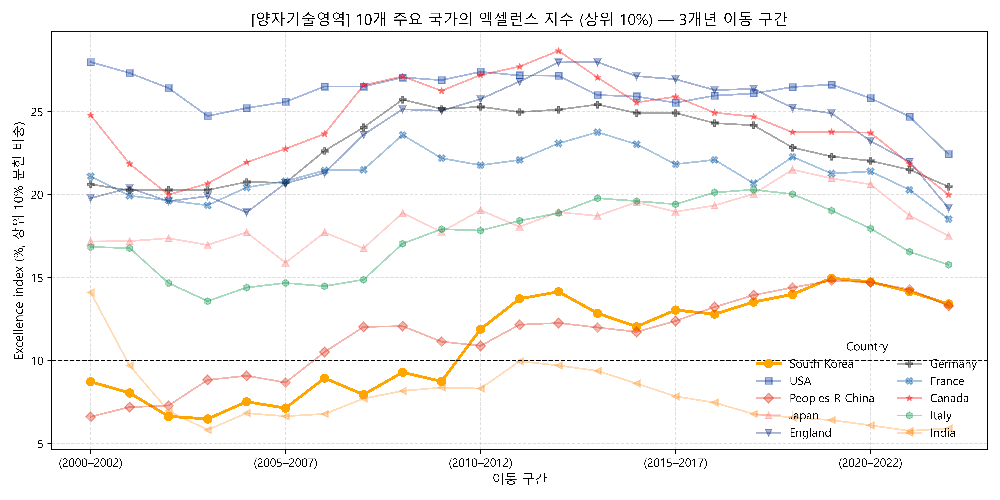

[그림 42] 엑셀런스 지수와 최상위 문헌 점유율 결합 분석 결합 분석로 살펴본 표준과학 연구 영역 주요 국가 성과수준: 표준과학 전영역

[그림 XX 엑셀런스 지수와 최상위 문헌 점유율 결합 분석 결합 분석로 살펴본 표준과학 연구 영역 주요 국가 성과수준: 물리측정 영역]

[그림 43] 엑셀런스 지수와 최상위 문헌 점유율 결합 분석 결합 분석로 살펴본 표준과학 연구 영역 주요 국가 성과수준: 화학소재측정 영역

[그림 44] 엑셀런스 지수와 최상위 문헌 점유율 결합 분석 결합 분석로 살펴본 표준과학 연구 영역 주요 국가 성과수준: 바이오의료측정 영역

[그림 45] 엑셀런스 지수와 최상위 문헌 점유율 결합 분석 결합 분석로 살펴본 표준과학 연구 영역 주요 국가 성과수준: 양자기술 영역

분석 대상이 주요 선진국 중심으로 구성되어 있기 때문에, 표준과학 영역에서 관측되는 문헌 성과 분포는 전반적으로 ‘우수 모형’에 가까운 형태를 띤다. 이는 표준과학 연구가 국가 연구 인프라와 강하게 결합되어 있고, 상위권 국가들 간 비교에서는 기본적인 연구역량 수준이 이미 높게 형성되어 있음을 시사한다. 따라서 위 그림들을 통한 분석 결과 해석의 초점은 국가들이 ‘우수한가 아닌가’를 가르는 데 두기보다, 우수한 집단 내부에서 상대적으로 어떤 국가가 상위 분위수 구간에서 더 높은 점유율을 보이는지, 또는 시간 구간에 따라 분포가 어느 방향으로 이동하는지 같은 미세한 차이를 구체적으로 확인하는 데 두는 것이 타당하다.

최상위 및 최하위 문헌 비율 시계열을 보면, 한국은 2000년대 중반 이후 상위 10% 문헌 비율이 기준선을 상회한 뒤 전반적으로 증가하는 흐름을 보인다. 다만 동일 집단 내 10대 주요 국가와의 상대 비교에서는 한국의 상위 10% 비율이 여전히 낮은 편에 속한다. 영역별로는 바이오의료측정과 화학소재측정에서 엑셀런스의 증가가 다른 영역에 비해 더 두드러지게 나타나며, 이 두 영역에서는 한국의 성과 수준이 상대적으로 더 강하게 관측된다. 그럼에도 불구하고 전체적으로는 물리측정, 화학소재측정, 바이오의료측정, 양자기술 모든 영역에서 한국이 10대 주요 국가 기준 하위권에 위치하는 양상이 유지된다.

또한 표준과학 전영역 및 세부 영역 공통으로 최근 3~4년 동안 엑셀런스 추이가 하락하는 현상이 관측된다. 이는 단순한 산출 규모 변화와 분리하여, 최상위 성과 문헌의 비중이 최근 시기에 상대적으로 축소되었음을 의미하며, 국가 간 상대 비교에서도 최근 구간의 변화 방향을 해석할 때 중요한 맥락으로 작용한다.

마지막으로 엑셀런스 지수(상위 10% 비율)와 상위 10% 문헌 점유율을 결합해 보면, 중국의 빠른 상승세와 미국의 영향력 약화를 동시에 확인할 수 있다. 중국은 상위 10% 비율의 개선과 함께 상위권 문헌 집합에서의 점유율 확대가 동반되는 방향으로 이동하는 반면, 미국은 여전히 높은 절대적 기반을 갖고 있음에도 상위권 점유율과 상대적 우위가 약화되는 것으로 나타난다. 이 결합 분석은 단일 지표만으로는 구분하기 어려운 상위 성과의 질적 우위와 상위 성과의 규모(점유)를 동시에 보여주기 때문에, 주요 국가들의 위상 변화와 경쟁 구도의 재편을 해석하는 데 유용한 근거를 제공한다.

### **2-4-2) 표준연구 분야 세부 영역별 벤치마킹 기관의 성과수준 비교 분석**

앞선 분석과 유사하게 표준과학 연구지형도의 세부 영역별로 벤치마킹 기관의 성과수준을 비교 분석한다. 분석은 표준과학 전영역을 포함해 물리측정, 화학소재측정, 바이오의료측정, 양자기술의 4개 영역으로 구분하여 수행하며, 각 영역에서 벤치마킹 기관의 성과가 어떤 수준과 분포 형태로 나타나는지를 KISTI의 분위수 분포 기반 수준 비교 모형, 최상위 및 최하위 문헌 비율 시계열, 연평균 문헌수 시계열, 엑셀런스 지수와 최상위 문헌 점유율 결합 분석을 통해 확인한다.

[그림 46] 분위수 분포 기반 수준 비교 모형으로 살펴본 표준과학 연구 영역 벤치마킹 기관 성과수준: 표준과학 전영역

[그림 47] 분위수 분포 기반 수준 비교 모형으로 살펴본 표준과학 연구 영역 벤치마킹 기관 성과수준: 물리측정 영역

[그림 48] 분위수 분포 기반 수준 비교 모형으로 살펴본 표준과학 연구 영역 벤치마킹 기관 성과수준: 화학소재측정 영역

[그림 49] 분위수 분포 기반 수준 비교 모형으로 살펴본 표준과학 연구 영역 벤치마킹 기관 성과수준: 바이오의료측정 영역

[그림 50] 분위수 분포 기반 수준 비교 모형으로 살펴본 표준과학 연구 영역 벤치마킹 기관 성과수준: 양자기술 영역

[그림 51] 최상위 및 최하위 문헌 비율 시계열로 살펴본 표준과학 연구 영역 벤치마킹 기관 성과수준: 표준과학 전영역

[그림 52] 최상위 및 최하위 문헌 비율 시계열로 살펴본 표준과학 연구 영역 벤치마킹 기관 성과수준: 물리측정 영역

[그림 53] 최상위 및 최하위 문헌 비율 시계열로 살펴본 표준과학 연구 영역 벤치마킹 기관 성과수준: 화학소재측정 영역

[그림 54] 최상위 및 최하위 문헌 비율 시계열로 살펴본 표준과학 연구 영역 벤치마킹 기관 성과수준: 바이오의료측정 영역

[그림 55] 최상위 및 최하위 문헌 비율 시계열로 살펴본 표준과학 연구 영역 벤치마킹 기관 성과수준: 양자기술 영역

[그림 56] 문헌수 시계열로 살펴본 표준과학 연구 영역 벤치마킹 기관 성과수준: 표준과학 전영역

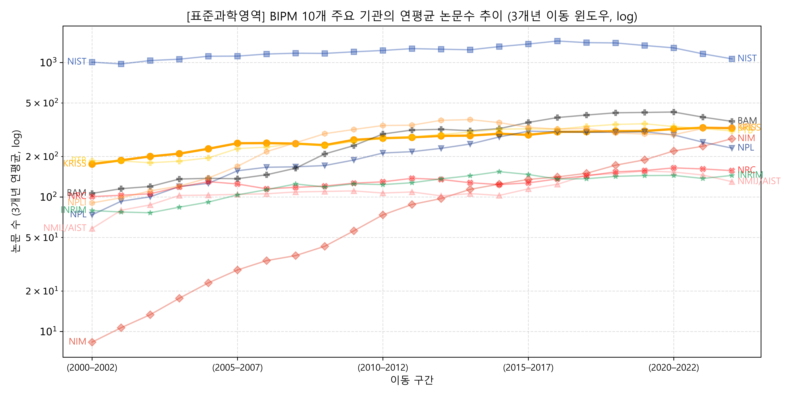

[그림 57] 문헌수 시계열로 살펴본 표준과학 연구 영역 벤치마킹 기관 성과수준: 물리측정 영역

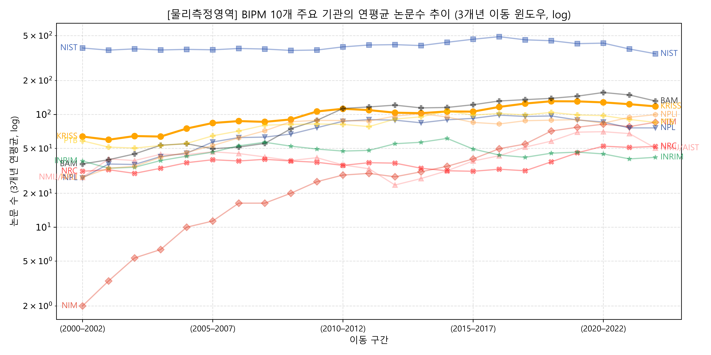

[그림 58] 문헌수 시계열로 살펴본 표준과학 연구 영역 벤치마킹 기관 성과수준: 화학소재측정 영역

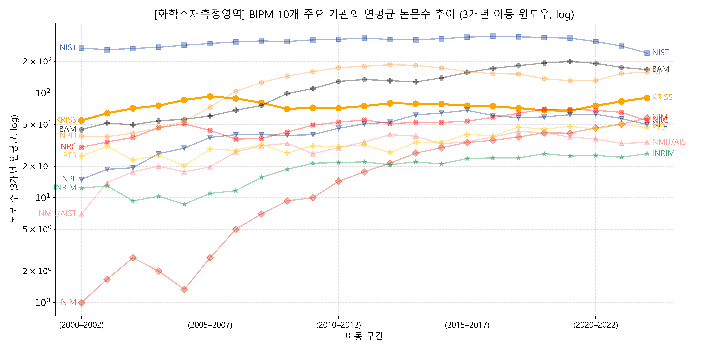

[그림 59] 문헌수 시계열로 살펴본 표준과학 연구 영역 벤치마킹 기관 성과수준: 바이오의료측정 영역

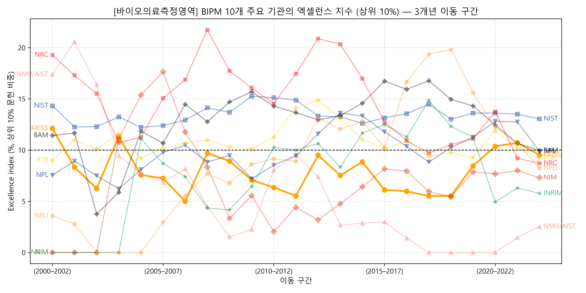

[그림 60] 문헌수 시계열로 살펴본 표준과학 연구 영역 벤치마킹 기관 성과수준: 양자기술 영역

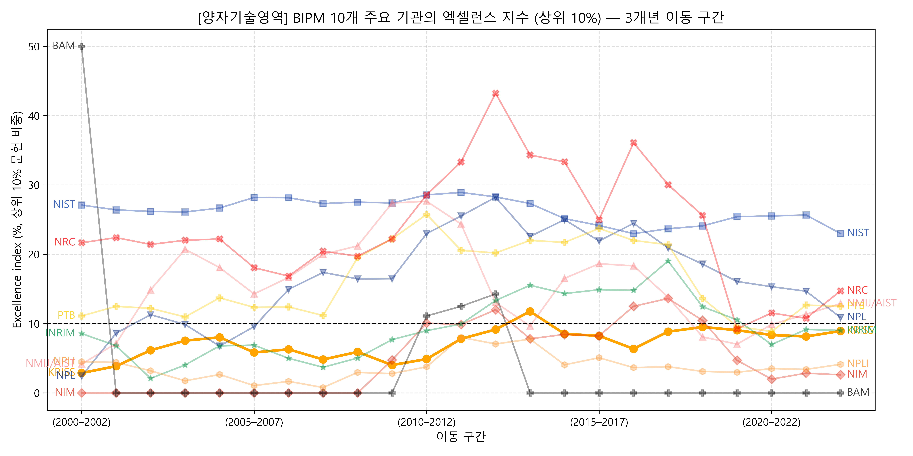

[그림 61] 엑셀런스 지수와 최상위 문헌 점유율 결합 분석로 살펴본 표준과학 연구 영역 벤치마킹 기관 성과수준: 표준과학 전영역

[그림 62] 엑셀런스 지수와 최상위 문헌 점유율 결합 분석로 살펴본 표준과학 연구 영역 벤치마킹 기관 성과수준: 물리측정 영역

[그림 63] 엑셀런스 지수와 최상위 문헌 점유율 결합 분석로 살펴본 표준과학 연구 영역 벤치마킹 기관 성과수준: 화학소재측정 영역

[그림 64] 엑셀런스 지수와 최상위 문헌 점유율 결합 분석로 살펴본 표준과학 연구 영역 벤치마킹 기관 성과수준: 바이오의료측정 영역

[그림 65] 엑셀런스 지수와 최상위 문헌 점유율 결합 분석로 살펴본 표준과학 연구 영역 벤치마킹 기관 성과수준: 양자기술 영역

표준과학 전영역을 대상으로 분위수 분포 기반 수준 비교 모형을 적용해보면, 미국 NIST와 캐나다 NRC는 피인용 분위수 분포가 전반적으로 우수한 형태를 보이는 반면 일본 NMIJ와 중국 NIM은 열위 모형에 가까운 분포를 보인다. KRISS는 상위 10% 구간을 제외하면 특정 구간에 편중되지 않고 전 구간에서 비교적 고르게 분포하는 특징이 나타난다. 이는 최상위 성과 비중이 두드러지게 크지는 않지만, 전반적 기반 성과가 균질하게 형성되어 있다는 신호로 해석된다.

엑셀런스 지수(상위 10% 문헌 비중)를 보면, 상위 10% 논문 비중이 일관되게 상승하는 추세는 모든 기관에서 공통적으로 확인되지 않는다. 대체로 유지되거나 감소하는 경향이 나타나며, KRISS는 10대 BIPM 기관 기준 중위권에 위치한다. 엑셀런스 기준선(10%)을 하회하는 수준이지만 최근 구간에서 완만한 상승 추세가 관측된다. 기관별로는 일본 NMIJ와 중국 NIM의 엑셀런스 지표가 최근 증가하는 흐름을 보이는 반면, NIST와 더불어 독일의 BAM, PTB, 영국 NPL 등 주요 선진국 기관들은 엑셀런스 값이 공통적으로 하락하는 방향으로 이동한다. 또한 KRISS는 바이오의료측정과 화학소재측정 영역에서 상위 백분위 구간의 비중이 다른 영역에 비해 상대적으로 높게 나타나, 질적 성과의 상대적 강점이 해당 영역에 더 많이 분포해 있음을 시사한다.

연평균 문헌수 시계열을 함께 보면, NIST가 문헌 규모 측면에서 독보적 위치를 점하는 가운데 KRISS는 PTB, BAM과 유사한 수준이며 NIST 다음의 3~4위권에 해당하는 규모다. 엑셀런스 지수와 최상위 문헌 점유율을 결합해 보면, NIST의 상위 10% 점유율 하락이 특히 큰 폭으로 나타난다. 이는 NIST의 최상위 성과 문헌이 차지하는 상대적 비중이 줄어들고 있음을 의미하며, 단순히 엑셀런스 비중만으로는 포착하기 어려운 “상위권 성과의 규모” 변화가 동반되고 있음을 보여준다.

물리측정 영역에 한정하면, KRISS는 오랜 기간 양적 수준에서 2~3위를 유지해 왔으나 최근에는 BAM이 이를 추월하고, 인도 NPLI와 중국 NIM의 빠른 증가가 겹치면서 상대적 위치 변동이 나타난다. 질적 수준 측면에서 KRISS는 10대 기관 기준 중하위권에 위치한다. 특히 물리측정 영역은 논문 수가 많은 NIST, BAM, KRISS, PTB, NIM에서 상위 10% 엑셀런스 수준이 높지 않은 경향이 함께 관측된다는 점에 주의가 필요하다. 또한 물리측정 영역에는 양자기술 영역이 포함되지 않는다는 점을 함께 고려해야 하며, NIST의 엑셀런스 하락이 양자기술 영역으로의 투자·집중에 따른 구성 변화의 결과일 가능성도 배제하기 어렵다. 독일의 PTB는 양자기술에 상대적으로 집중하는 반면, BAM은 양자기술 영역의 논문 생산이 거의 없고 물리측정 영역에 더 강하게 집중하는 구조가 나타난다.

화학소재측정 영역에서는 KRISS가 양적 수준에서 2~3위를 유지해 왔으며 2000년대에는 연간 약 50편, 최근에는 연간 100편 수준으로 생산 규모가 확대된 흐름이 확인된다. 다만 최근에는 BAM이 KRISS를 추월했고, NPLI와 NIM의 추격이 빠르게 전개되면서 현재는 4위 수준으로 내려온 것으로 정리된다. 질적 수준은 10대 기관 기준 5위권으로 비교적 양호한 편이며, 다수의 BIPM 기관에서 질적 지표가 전반적으로 하향세를 보이는 가운데 KRISS는 상대적으로 질적 수준을 유지하는 것으로 해석된다.

바이오의료측정 영역에서 KRISS는 2000년대 초반 연간 약 10편 수준으로 6위권에 머물렀으나, 현재는 연간 약 50편 수준으로 증가하여 4~5위권을 유지한다. 중국 NIM은 과거 최하위권이었으나 최근 급상승하여 3위권까지 진입하는 양상이 나타난다. 질적 수준은 NIST를 제외하면 상위 기관들과 대체로 유사한 수준을 유지하는 것으로 정리되며, KRISS의 상대적 약점이 두드러지기보다는 상위권과의 격차가 비교적 제한적으로 나타나는 영역으로 볼 수 있다.

양자기술 영역에서는 KRISS가 규모 측면에서 2~3위를 유지하면서 엑셀런스 기준의 질적 수준이 점진적으로 상승하는 흐름이 나타난다. NIST는 규모와 질 모두에서 독보적 위치를 차지한다. NIST를 제외한 여러 기관은 논문 수가 크게 증가하지 않은 상태에서 질적 수준이 큰 폭으로 하락하는 패턴이 특징적으로 관측되며, 양자기술 분야에서 상위권 경쟁구도가 빠르게 재편되고 있음을 시사한다. KRISS는 2000년대부터 매년 50~60편 수준의 논문을 산출해 온 기반 위에서 질적 지표가 개선되는 방향이 나타나, 벤치마킹 기관 비교에서 상대적으로 전략적 의미가 큰 영역으로 해석된다.

### **2-4-3) 표준연구 분야 세부 영역별 벤치마킹 기관의 정책부합성 비교 분석**

본 절에서는 한국표준과학연구원과의 벤치마킹 대상으로 선정된 10개 핵심 기관을 중심으로 연구 영역별 정책부합성을 비교 분석한다. 각 기관의 측정표준 역량 기반 연구 활동이 정책적 수요와 얼마나 밀접하게 연계되어 있는지를 정량적으로 파악하고자 한다.

본 연구에서 정책부합 연구는 CIPM에서 공식 발표한 자료에 기반하여 다음 두 가지 조건을 동시에 충족하는 논문으로 정의하였다.

첫째, 정책 조건으로「CIPM Strategy 2030+」의 5대 글로벌 도전과제 분야(기후·환경, 보건·보건안보, 식품·물·소비자 안전, 에너지 전환·에너지안보, 산업혁신·첨단제조) 중 하나 이상으로 분류되어야 한다.「CIPM Strategy 2030+」는 국제도량형위원회(CIPM)가 향후 30~50년을 대비하여 국제계측시스템의 발전 방향을 제시한 전략 문서이다(BIPM, 2025). 2019년 SI 단위계 개정 이후 CIPM은 2030년 이후의 계측학이 직면할 과학적·사회적 도전 과제를 체계적으로 분석하고, 조직의 미래 대응 방안을 수립하기 위해 본 전략을 개발하였다. BIPM은 측정과학이 기여해야 할 핵심 사회적 수요로서 5대 분야를 제시하고 있으며, 본 연구에서는 이를 정책 축 분류의 핵심 프레임워크로 활용하였다.

둘째, 측정 역량 조건으로 KCDB 9대 계측 분야 중 하나 이상으로 분류되어야 한다. KCDB(Key Comparison Database)는 CIPM 상호인정협정(CIPM MRA)을 지원하기 위해 BIPM이 운영하는 공개 데이터베이스이다. KCDB에는 참여 기관들의 국제적으로 인정된 교정측정역량(CMC)에 관한 정보와 이러한 CMC를 뒷받침하는 핵심비교(Key Comparison) 및 보조비교(Supplementary Comparison)의 결과가 포함되어 있으며, 등재된 모든 데이터는 CIPM MRA 체계 내에서 동료 심사를 거쳐 승인된 것이다. KCDB의 분야는 CIPM 자문위원회의 구조를 반영하여 음향·초음파·진동(AUV), 전기·자기(EM), 길이(L), 질량 및 관련량(M), 온도(T), 시간·주파수(TF), 광도·복사(PR), 전리방사선(RI), 화학·생물(QM)의 9개 영역으로 구분된다.

이처럼 두 조건을 모두 충족하는 연구를 정책부합 연구로 정의한 것은, 표준연구기관이 보유한 Metrology 역량을 기반으로 사회적 수요에 부합하는 연구를 수행하고 있는지를 구분하기 위함이다.

[그림 66] CIPM Strategy 2030+

논문 분류는 두 개의 독립적인 축을 기준으로 수행하였다. 첫째, 정책 축은 BIPM 5대 글로벌 도전과제에 '국가 전략기술·과학기술 인프라 정책 지원 Metrology'를 추가한 6대 분야 체계로 LLM 분류를 수행하였다. 단, 최종 정책부합성 분석에서는 5대 글로벌 도전과제 분야로 분류된 논문만을 정책부합 연구로 정의하였다. '국가 전략기술·과학기술 인프라 정책 지원 Metrology'로 분류된 논문은 표준 그 자체에 대한 연구나 기초 표준 연구 등 측정 인프라 중심의 내용을 다루고 있어 제외하였다. 분류에 사용한 6대 분야의 정의는 다음과 같다.

[표 xx] CIPM Strategy 2030+ 기반 정책분야 유형 정의

| 정책 분야명 | 약어명 | CIPM Strategy 2030+ 내 주요 내용 |
| --- | --- | --- |
| 기후·환경 정책 지원 Metrology | 기후·환경 | **지구 환경 모니터링과 기후변화 완화 정책의 공정한 이행을 위한 과학적 기반으로서의 측정과학***(Metrology provides the scientific basis to monitor the global environment and to ensure fair implementation of mitigation policies)*
예: 온실가스, 대기·수질·토양 오염, 기후변화, 환경 모니터링 등 |
| 보건·보건안보 정책 지원 Metrology | 건강 | **보건 기술 혁신(Innovation in Health Technologies)**
예: 진단·의료기기, 바이러스·박테리아, 백신·의약품, 감염병 대응 등 |
| 식품·물·소비자 안전 정책 지원 Metrology | 식품 | **안전한 식품과 물을 위한 측정과학(Metrology is Needed for Safe Food and Water)**
예: 식품 오염물질, 음용수, 유해물질 검출, 식품안전규제 등 |
| 에너지 전환·에너지안보 정책 지원 Metrology | (재생) 에너지 | **재생에너지 개발을 위한 과학적 기반으로서의 측정과학(Metrology Provides a Scientific Basis for Developing and Establishing Renewable Energy Sources)**
예: 재생에너지, 배터리·연료전지·수소, 전력계량, 에너지효율 등 |
| 산업혁신·첨단제조 정책 지원 Metrology | 첨단 제조 | **첨단 제조를 지원하기 위한 새로운 서비스로서의 측정과학(Metrology is Developing New Services to Support Advanced Manufacturing)**
예: 제조공정, 3D프린팅·나노·반도체, 자동화·로봇, 품질관리 등 |
| 국가 전략기술·과학기술 인프라 정책 지원 Metrology | 해당 분류 최종 미사용 결정 (5대 분야 이외) | **측정 인프라(표준, 불확도, 추적성, 단위 실현, 시간·주파수, 양자 등) 자체의 고도화 연구**
예: 양자센서, 시간·주파수표준, 불확도·추적성, 국제비교 등 |

둘째, 측정 축은 CIPM 자문위원회의 구조를 반영한 KCDB의 9대 분야를 기준으로 분류하였다. 각 분야에 대한 주요 내용은 다음과 같다.

[표 ㅌㅌ] CIPM 자문위원회 기반 측정표준 역량 분야

| 측정 분류 | 주요 내용 |
| --- | --- |
| Acoustics, Ultrasound and Vibration (AUV) | 음향, 초음파, 진동 |
| Electricity and Magnetism (EM) | 전기, 자기, 전자기 |
| Length (L) | 길이·거리·치수, 좌표측정기(CMM), 간섭계 |
| Mass and related quantities (M) | 질량, 힘·토크, 압력, 밀도·점도·유량 |
| Thermometry (T) | 온도, 습도, 열물성 |
| Time and Frequency (TF) | 시간·주파수 표준, 원자시계, 동기화 |
| Photometry and Radiometry (PR) | 광도·조도, 복사량, LED·디스플레이 |
| Ionizing Radiation (RI) | 방사선량, X선·감마선·중성자 |
| Chemistry and Biology (QM) | 농도·물질량, 분석화학, 생체표지자 |

분류 시 정책 축은 논문당 최대 3개, 측정 축은 최대 4개의 레이블을 부여하는 멀티레이블 방식을 적용하였으며, 두 축은 서로 독립적으로 판단하였다. 정책 축 분류에서는 연구의 응용 영역이 명확히 드러나는 경우 해당 정책 카테고리를 부여하되, 느슨한 연관성만으로는 분류하지 않도록 하였다. 측정 축 분류에서는 논문이 다루는 핵심 측정 물리량과 기술을 기준으로 판단하되, 보정용이나 부수적 파라미터는 제외하였다.

각 분류 결과에는 0.0에서 1.0 사이의 신뢰도(confidence) 점수를 부여하였다. 다중 분류 방식을 적용하였으므로 여러 레이블의 신뢰도 합이 1일 필요는 없다. 신뢰도 점수는 제목과 초록의 정보량에 따라 차등 적용하였으며, 상황별 권장 범위는 다음과 같다. 최종적으로 연구진의 검토를 통하여 신뢰도는 0.7 이상인 값만 활용하였다.

[표 X] 대규모언어모델의 신뢰도 판단 기준 정의

| 상황 | 신뢰도 |
| --- | --- |
| 제목과 초록이 매우 명확한 경우 | 0.8~1.0 |
| 초록 내용으로 추론 가능한 경우 | 0.6~0.8 |
| 제목만 있고 초록이 없는 경우 | 0.3~0.6 |
| 미분류 선택 시 | 1.0 |

분류 작업에는 OpenAI의 GPT-5 모델을 활용하였다. 대규모 문헌 집합에 대한 효율적이고 일관된 분류를 위해 상세한 판단 원칙과 카테고리 정의를 포함한 시스템 프롬프트를 설계하였으며, 각 논문의 제목과 초록을 입력으로 제공하여 JSON 형식의 구조화된 분류 결과를 출력하도록 하였다.

본 분석은 BIPM 정회원국 대표 연구기관 중 표준과학연구원과의 벤치마킹 대상으로 선정된 10개 핵심 기관을 대상으로 하였으며, 최근 5년간(2020~2024년) 발표된 논문을 분석 범위로 설정하였다.
데이터 현황은 다음과 같다. 10개 벤치마킹 기관이 발표한 고유 논문 수는 총 16,982편이며, 복수 기관이 공동으로 참여한 논문을 기관별로 분리하면 17,403건이 된다. 이를 정책 분야별로 복수 분류(멀티레이블)를 적용하여 전개하면 18,674건으로 집계된다. 이 중 정책부합 연구로 판정된 논문은 복수 분류 기준 11,802건이며, 고유 논문 수 기준으로는 10,366편이다. 이는 전체 고유 논문의 약 61.0%에 해당한다.

정책부합성 분석은 두 가지 차원에서 수행하였다. 첫째, 기관별 연구 영역에 따른 정책부합 논문 집중도를 산출하였다. 이는 각 기관의 특정 영역 내 정책부합 논문 수를 해당 영역 전체 논문 수로 나눈 비율로 정의되며, 다음과 같이 계산된다.
****[표 ㅌㅌ] 벤치마킹 10대 기관의 최근 5개년(2020~2024년)의 정책부합성 논문 현황

| 구분 | 건수 |
| --- | --- |
| 고유 논문 수 | 16,982 |
| 기관별 전개 논문 수 | 17,403 |
| 정책 분야별 복수 분류 전개 건수 | 18,674 |
| 정책부합 논문 수 (복수 분류 기준) | 11,802 |
| 정책부합 논문 수 (고유 논문 기준) | 10,366 |

 10대 벤치마킹 기관의 논문 수 대비 정책부합 논문의 비율을 계산하였다. 10개 벤치마킹 기관이 최근 5년간 생산한 논문을 기관별로 전개하면 총 17,403건이며, 이 중 5대 정책 카테고리 중 하나 이상에 해당하는 정책부합 논문은 10,366건으로 집계되었다. 기관별 정책부합 논문 수를 기준으로 순위를 산출한 결과, 미국의 NIST가 2,786건으로 전체 정책부합 논문의 26.9%를 차지하며 1위를 기록하였다. 이어서 독일의 BAM이 2위, 인도의 NPLI가 3위를 차지하였으며, KRISS는 1,150건(11.1%)으로 4위에 해당한다.
[그림 67] 기관별 정책부합 연구 수 및 점유율 비교(Full Counting)

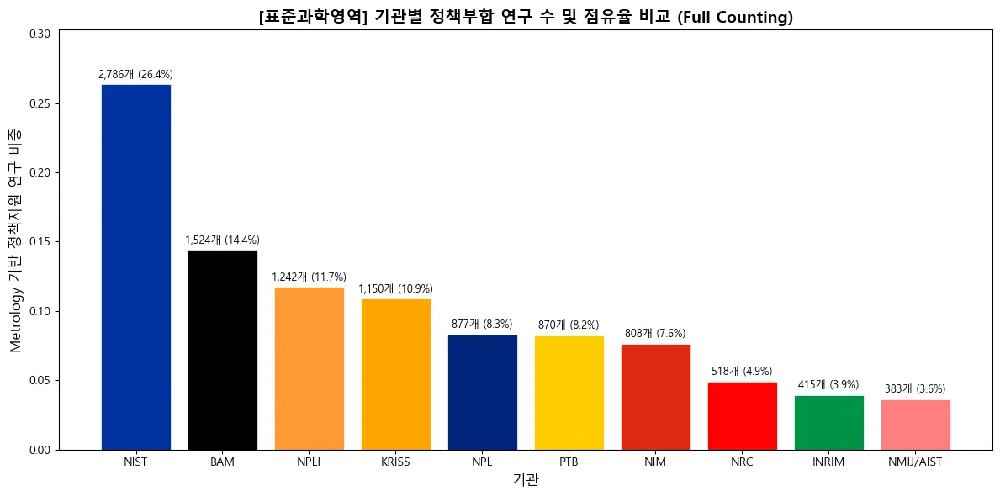

각 기관의 연구 규모를 통제하기 위해 정책부합 논문 수를 해당 기관의 전체 논문 수로 나눈 정책부합 논문 비율을 산출하였다. 분석 결과, NPLI가 79.4%(1,242건)로 가장 높은 정책부합 비율을 보였으며, BAM이 77.6%(1,524건), KRISS가 71.7%(1,150건)로 그 뒤를 이었다. 이어서 NPL 66.8%(877건), NIM 66.0%(808건), NRC 64.8%(518건), INRIM 57.2%(415건), NMIJ/AIST 54.3%(383건), PTB 53.3%(870건) 순으로 나타났다. NIST는 정책부합 논문의 절대 건수(2,786건)에서는 1위를 차지하였으나, 정책부합 비율은 47.4%로 10개 기관 중 가장 낮았다.

[그림 68] 기관별 정책부합 연구 비율 비교 (Full Counting)

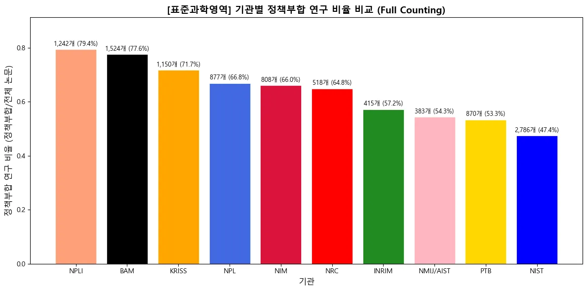

[그림 X]는 10개 벤치마킹 기관의 정책 카테고리별 연구 분포를 나타낸 결과이다. 각 기관별로 기후·환경, 건강(보건·보건안보), 첨단제조(산업혁신·첨단제조), 식품(식품·물·소비자 안전), 에너지(에너지 전환·에너지안보) 5대 정책 카테고리에 대한 논문 건수와 비율을 보여준다.분석 결과, 기관별로 연구 역량이 집중된 정책 분야에 뚜렷한 차이가 나타났다. KRISS는 첨단제조 분야가 49.9%(643건)로 가장 높은 비중을 차지하였으며, 건강 분야가 23.6%(304건)로 그 뒤를 이었다. NIST 역시 첨단제조 분야가 46.2%(1,403건)로 압도적이며, 건강 분야 23.8%(722건), 에너지 분야 15.6%(473건) 순으로 나타났다.

[그림 69] 기관별 정책 카테고리별 연구 분포

[그림 X]는 10개 벤치마킹 기관의 정책 카테고리별 연구 집중도를 나타낸 결과이다. 분석 결과, 기관별로 비교우위를 가진 정책 분야에 뚜렷한 차이가 나타났다. KRISS는 첨단제조(1.13)와 건강(1.03) 분야에서 비교우위를 보이며, 에너지(1.00)는 평균 수준이다. 반면 기후·환경(0.57)과 식품(0.87) 분야는 비교열위로 나타났다. NIST는 모든 정책 분야에서 RTA가 0.87~1.06 범위로 비교적 균형 잡힌 연구 포트폴리오를 보유하고 있으며, 특정 분야에 대한 극단적 집중이나 취약점이 없는 것이 특징이다.

NRC와 NMIJ/AIST는 첨단제조 분야에, PTB와 NIM은 건강 분야에, NPLI는 에너지 분야에 특화된 연구 역량을 보유하고 있다. KRISS는 첨단제조와 건강 분야에서 비교우위를 보이나, 기후·환경 분야의 RTA가 0.57로 10개 기관 중 가장 낮아 해당 분야의 연구 강화가 필요한 것으로 판단된다. 반면 NIST는 전 분야에서 균형 잡힌 포트폴리오를 보유하여 종합적 연구 역량을 갖춘 기관으로 평가된다.
[그림 70] 기관별 정책 카테고리별 연구 집중도

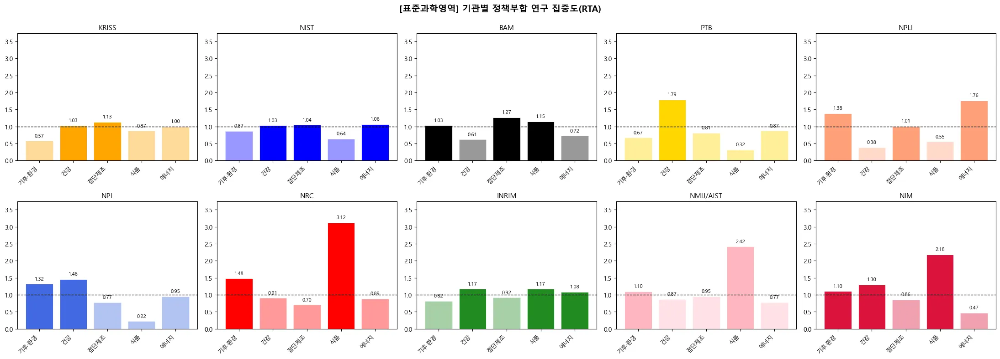

[그림 X]는 10개 벤치마킹 기관의 전체 논문과 연구 영역별 정책부합 논문 비율을 비교한 결과이다. 각 기관에 대해 전체 영역과 물리측정, 화학소재측정, 바이오의료측정, 양자기술 4개 세부 영역의 정책부합 비율을 막대그래프로 나타내었다. 이를 통해 기관별로 어떤 연구 영역에서 정책부합 연구가 특히 집중되어 있는지 확인할 수 있다.

전체 영역 기준으로 정책부합 비율이 가장 높은 기관은 NPLI(79.4%)이며, BAM(77.6%), KRISS(71.7%)가 그 뒤를 이었다. 반면 NIST(47.4%)와 PTB(53.3%)는 상대적으로 낮은 정책부합 비율을 보였다. 이는 NIST와 PTB가 기초 표준 연구 및 측정 인프라 관련 연구의 비중이 높기 때문으로 해석된다.
연구 영역별로 살펴보면, 대부분의 기관에서 화학소재측정과 바이오의료측정 영역의 정책부합 비율이 높게 나타났다.

[그림 71] 기관별 정책부합 논문비율: 전체 및 4개 영역

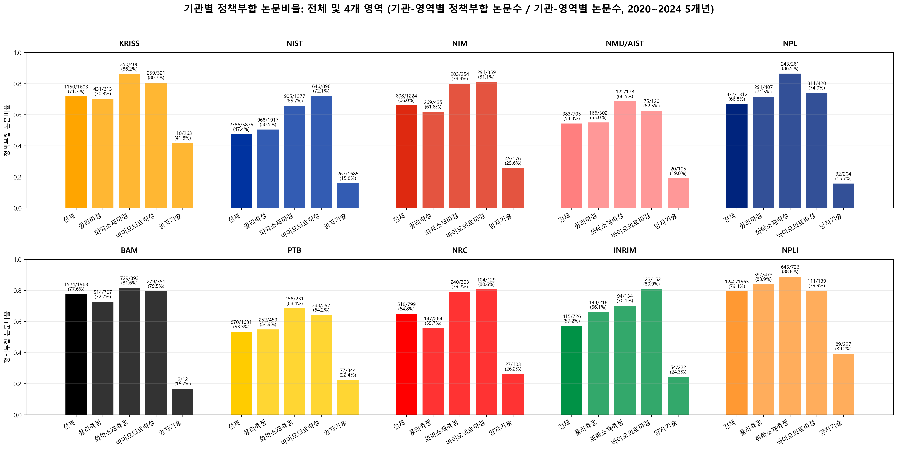

다음으로 전체연구 및 연구 영역별로 기관별 정책부합 논문비율을 분석한다. 이를 통해 전체 영역 1개와 연구 영역별로 총 4개의 그래프를 생성하였으며, 각 그래프에서는 10개 기관의 정책 카테고리별 집중도를 비교할 수 있다. 

분석 결과, 기관별로 집중하는 정책 분야 비중에 차이가 나타났다. KRISS는 첨단제조(40.1%)가 압도적으로 높고, 건강(19.0%), 재생에너지(11.7%) 순으로 나타났다. 기후·환경(6.0%)과 식품(3.6%)은 상대적으로 낮은 비중을 보였다. KRISS와 유사한 분포를 가지는 NIST 역시 첨단제조(23.9%)가 가장 높으나 KRISS보다 집중도가 낮으며, 건강(12.3%), 재생에너지(8.1%), 기후·환경(5.8%) 순의 분포를 보였다. BAM은 건강(49.3%)이 압도적으로 높아 보건 분야에 특화된 기관임을 확인할 수 있다. PTB도 건강(23.5%)과 첨단제조(20.5%)가 주요 분야이며, NIM은 건강(28.2%)과 첨단제조(22.1%)에 집중되어 있다. NRC는 첨단제조(24.3%)가 가장 높고 건강(16.3%), 기후·환경(15.0%) 순으로 나타났다. NPLI는 건강(40.8%)이 가장 높고, 재생에너지(23.6%)가 그 뒤를 이어 에너지 분야에서도 강점을 보였다. INRIM은 첨단제조(25.3%)와 건강(16.8%)에 집중되어 있으며, NMIJ/AIST는 첨단제조(24.7%)가 가장 높고 건강(11.8%), 기후·환경(8.4%) 순으로 나타났다. NPL은 첨단제조(25.7%), 건강(25.2%), 기후·환경(12.8%)으로 비교적 균형 잡힌 분포를 보였다.

[그림 72] 전체 영역: 기관별 카테고리 정책부합 논문비율

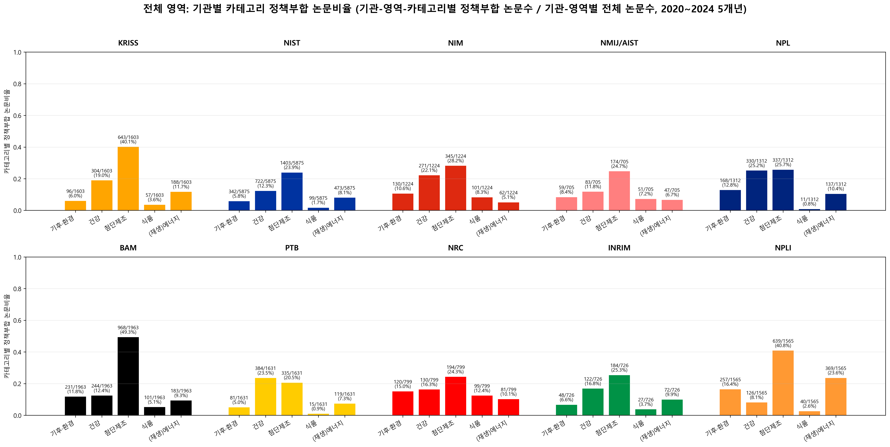

물리측정 영역에서는 대부분의 기관이 첨단제조 분야에 집중하고 있으며, KRISS(54.5%), NRC(48.7%), BAM(62.4%), NPLI(60.5%), PTB(40.7%) 등이 높은 비율을 보였다. 반면 기후·환경, 식품 분야는 전반적으로 10% 미만의 낮은 비율을 나타내어, 물리측정 기반 연구가 주로 산업·제조 응용에 활용되고 있음을 확인할 수 있다.

[그림 73] 물리측정 영역: 기관별 카테고리 정책부합 논문비율

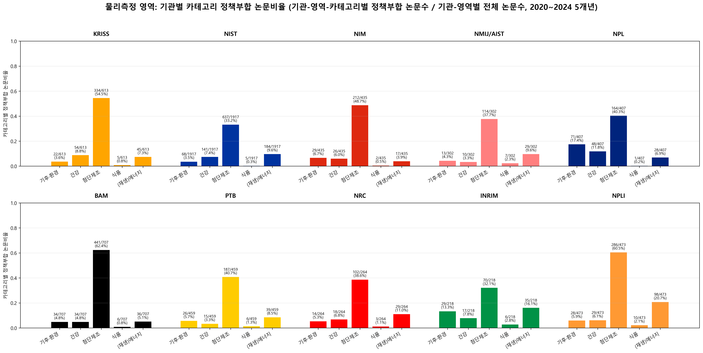

화학소재측정 영역에서는 첨단제조와 함께 기후·환경, 식품 분야의 비중이 물리측정 영역보다 높게 나타났다. KRISS는 첨단제조(45.6%)와 재생에너지(27.1%)에 집중된 반면, BAM(48.9%), NRC(31.7%), NPL(38.8%) 등은 첨단제조 외에도 기후·환경 분야에서 15% 이상의 비율을 보여 화학 기반 환경 모니터링 연구가 활발함을 확인할 수 있다.

[그림 74] 화학소재측정 영역: 기관별 카테고리 정책부합 논문비율

바이오의료측정 영역에서는 건강 분야가 모든 기관에서 압도적으로 높은 비율을 차지하였다. KRISS(59.8%), NIST(52.2%), NIM(51.8%), NPL(63.1%), BAM(41.0%), PTB(53.1%), NRC(58.1%), INRIM(59.2%) 등 대부분의 기관에서 건강 분야가 40~60% 수준을 보였으며, 이는 바이오의료측정 연구가 본질적으로 보건·의료 정책 수요와 밀접하게 연계되어 있음을 반영한다.

[그림 75] 바이오의료측정 영역: 기관별 카테고리 정책부합 논문비율

양자기술 영역에서는 전반적으로 정책부합 비율이 낮으며, 첨단제조 분야에 집중된 양상을 보였다. KRISS(29.7%), NIM(21.0%), NRC(24.3%), NPLI(34.4%) 등이 첨단제조에서 상대적으로 높은 비율을 나타냈으나, 대부분의 기관에서 기후·환경, 식품, 재생에너지 분야는 5% 미만으로 나타나 양자기술 연구가 아직 특정 정책 응용보다는 기초연구 및 인프라 구축 단계에 머물러 있음을 시사한다.
[그림 76] 양자기술 영역: 기관별 카테고리 정책부합 논문비율

# 3) 미래 연구영역 전략수립 지원을 위한 유망연구영역 도출

본 연구는 한국표준과학연구원(KRISS)의 미래 연구영역 전략수립을 지원하기 위해, 표준과학 연구 영역에서의 유망 연구영역을 체계적으로 도출하는 것을 목표로 한다. KRISS의 연구 포트폴리오 구성 전략에서 가장 우선적으로 고려해야 할 조건은 ‘현재 역량의 활용 가능성’이다. 즉, 유망 연구영역은 이미 KRISS가 보유한 연구역량을 직접 활용할 수 있거나, 기존 역량을 기반으로 확장·전환을 통해 접근 가능한 영역이어야 한다. 이러한 접근은 전략 도출 이후 실제 R&D 투자와 조직 역량 재배치로 연결될 가능성을 높이고, 실행 측면에서 불확실성을 줄이는 효과를 가진다.

동시에 미래 경쟁력 확보라는 관점에서는, 현재 KRISS가 충분한 역량을 보유하지 못한 영역이라 하더라도 표준과학 연구의 중요도가 높고 다수의 벤치마킹 기관이 선제적으로 투자하여 역량을 확보한 분야를 함께 고려할 필요가 있다. 이는 ‘현 역량 기반 확장’만으로는 포착하기 어려운 중장기적 전략 기회와 기술·표준 패러다임 변화에 대응하기 위한 선택지 확보 차원에서 의미가 있다.

이러한 문제의식에 따라 유망 연구영역 도출은 다음 3가지 단계로 이루어진 프로세스로 진행한다. 

(1) KRISS와 벤치마킹 연구기관의 현재 연구 포트폴리오 및 역량을 비교 분석하여, KRISS의 강점과 공백, 그리고 벤치마킹 기관들이 집중하는 영역의 공통 패턴을 식별한다. 

(2) KRISS와 벤치마킹 연구기관의 현재 연구 포트폴리오 및 역량 비교 분석 결과를 바탕으로 유망 연구영역 후보군을 세 가지 유형으로 구분해 제시한다. 이때 후보군은 ‘KRISS의 기존 역량을 즉시 활용 가능한 영역’, ‘기존 역량을 기반으로 확장이 가능한 인접 영역’, ‘현재 역량은 제한적이나 전략적 중요도가 강한 도전 영역’처럼 서로 다른 성격을 갖도록 설계한다. 

(3) 각 연구영역에 대해 과학계량지표 기반의 유망성 분석을 수행하고, 세 가지 유형별로 유망성이 높은 상위 연구영역을 중심으로 최종 유망연구영역을 도출한다. 

이러한 프로세스는 단일 기준의 순위화가 아니라, 실행 가능성과 전략적 필요성을 함께 반영해 후보를 구조화하고, 그 위에 계량적 근거를 결합해 최종 선택의 타당성을 강화하는 의도로 설계되었다.

## **3-1) 벤치마킹 기관과 한국표준과학연구원의** 포트폴리오 **및 역량 분석**

여기서는 KRISS와 벤치마킹 연구기관의 현재 연구 포트폴리오 및 역량을 분석하기 위한 프레임워크를 제시한다. 목적은 주요 기관들이 어떤 연구영역에서 상대적 강점을 보유하고 있는지, 그리고 KRISS가 상대적으로 취약하거나 공백이 존재하는 연구영역이 무엇인지 식별하는 데 있다. 이를 위해 단일 지표에 의존하지 않고 연구영역별 산출 규모와 특화 정도, 그리고 질적 성과 수준을 함께 반영할 수 있는 지표 조합을 구성한다. 

구체적으로 연구영역별로 각 기관의 역량 보유 여부는 양적 역량과 질적 역량을 구분하여 판단한다. 양적 역량은 해당 연구영역에서 연구가 지속적으로 수행되고 있는지와 최소한의 지식 생산 기반이 확보되어 있는지를 확인하기 위한 기준으로 정의하며, 최근 5년 기준으로 RTA가 1 이상이면서 동시에 최근 5년 기준 문헌수가 5편 이상(연평균 1편 이상)인 경우를 양적 역량 보유로 간주한다. 질적 역량은 해당 연구영역에서 생산된 성과가 상위권 성과로 이어지는지를 확인하기 위한 기준으로 정의하며, 최근 5년 기준 엑셀런스 지수(상위 10% 문헌 비중)가 8 이상인 경우를 질적 역량 보유로 간주한다.

이 기준을 적용하여 기관별로 특정 연구영역이 ‘활동이 있는 영역’인지(양적 역량) 또는 ‘상위권 성과까지 확보한 영역’인지(질적 역량)를 구분할 수 있으며, 이를 통해 KRISS의 강점 영역과 개선 필요 영역, 그리고 벤치마킹 기관 대비 공백 영역을 체계적으로 탐색할 수 있다. 예컨대 복수의 벤치마킹 기관들이 공통적으로 역량을 확보하고 있는 영역인데 KRISS가 양적·질적 기준을 동시에 충족하지 못하는 경우, 해당 영역은 전략적 공백 후보로 우선순위를 높게 부여할 수 있다.

[그림 XX KRISS와 벤치마킹 연구기관 중 2개 이상 기관의 역량이 뛰어난 연구 영역: 물리측정 영역]

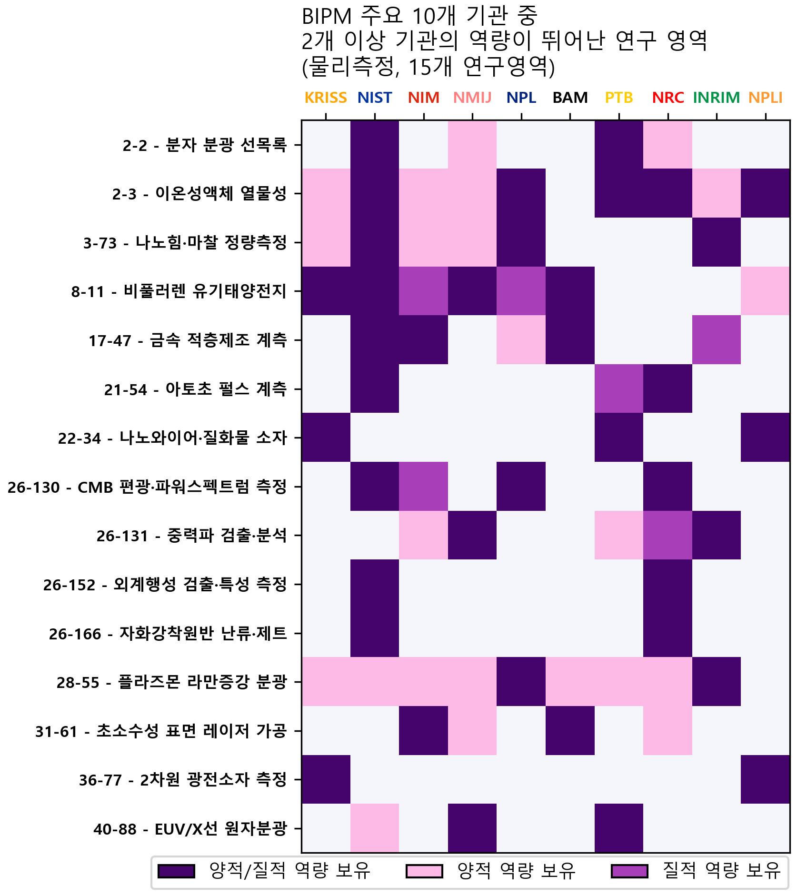

[그림 XX KRISS와 벤치마킹 연구기관 중 1개 기관만의 역량이 뛰어난 연구 영역: 물리측정 영역]

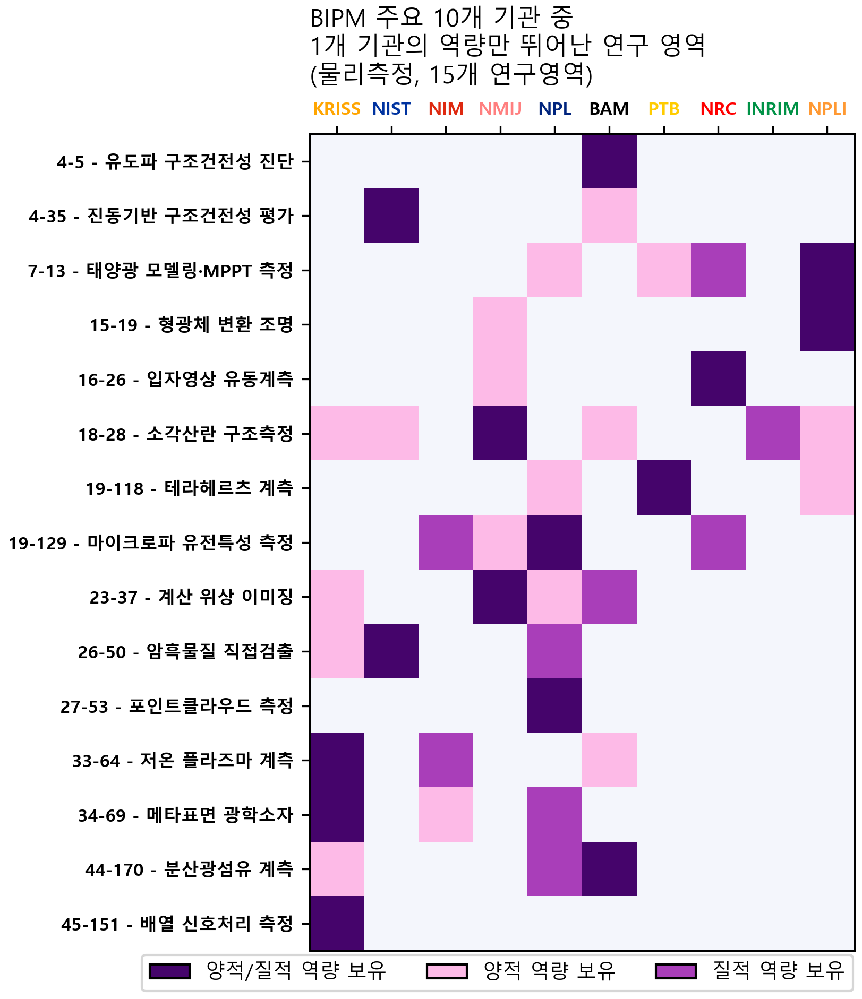

[그림 XX KRISS와 벤치마킹 연구기관 중 2개 이상 기관의 역량이 뛰어난 연구 영역: 화학소재측정 영역]

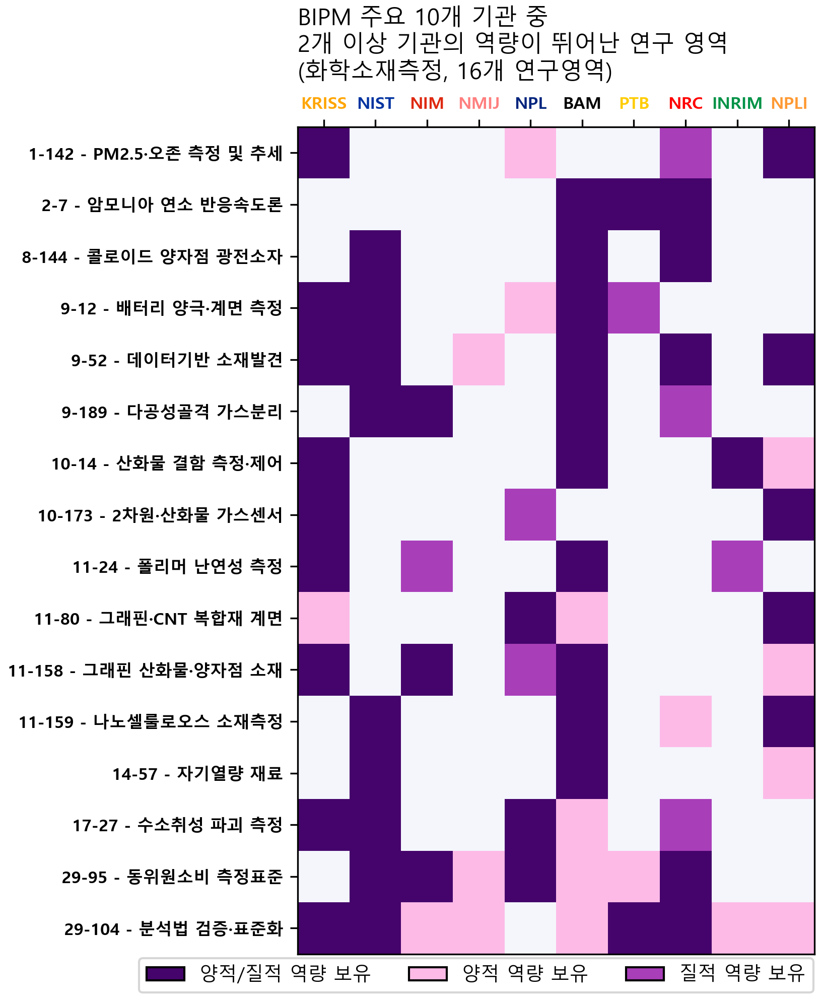

[그림 XX KRISS와 벤치마킹 연구기관 중 1개 기관만의 역량이 뛰어난 연구 영역: 화학소재측정 영역]

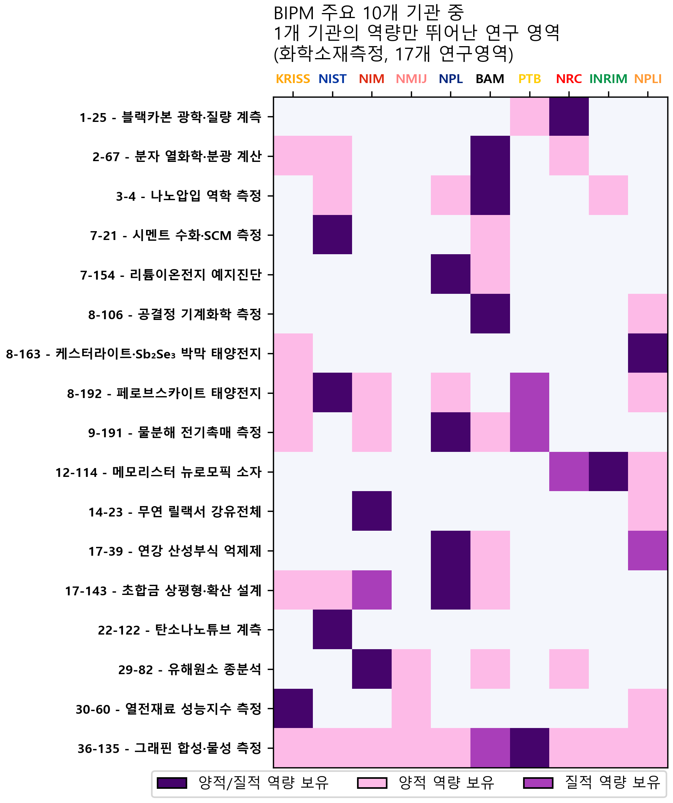

[그림 XX KRISS와 벤치마킹 연구기관 중 2개 이상 기관의 역량이 뛰어난 연구 영역: 바이오의료측정 영역]

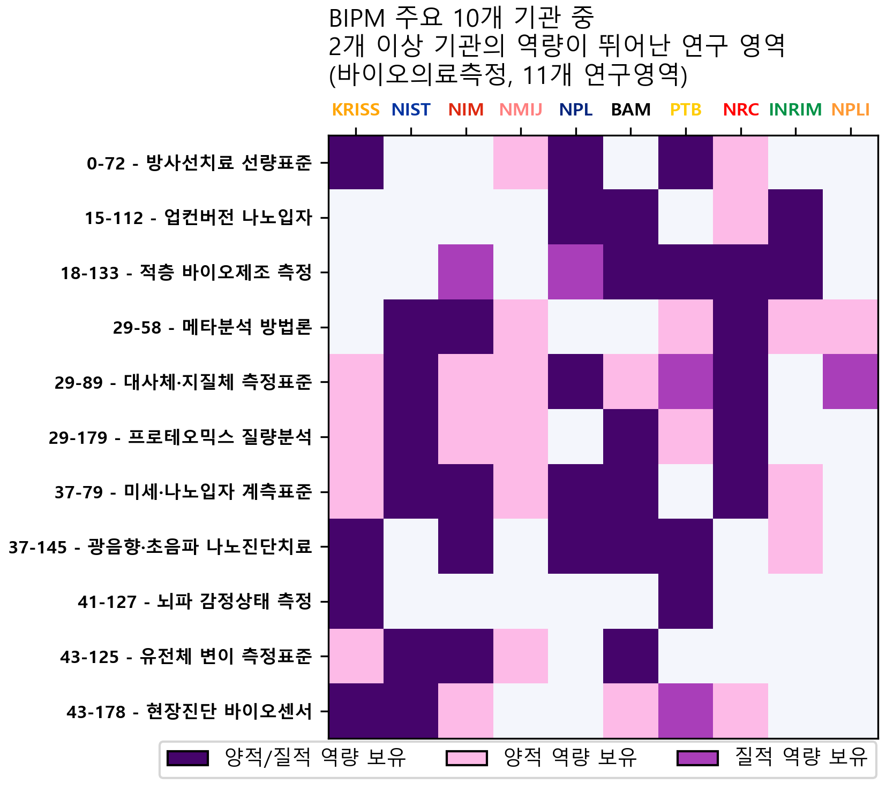

[그림 XX KRISS와 벤치마킹 연구기관 중 1개 기관만의 역량이 뛰어난 연구 영역: 바이오의료측정 영역]

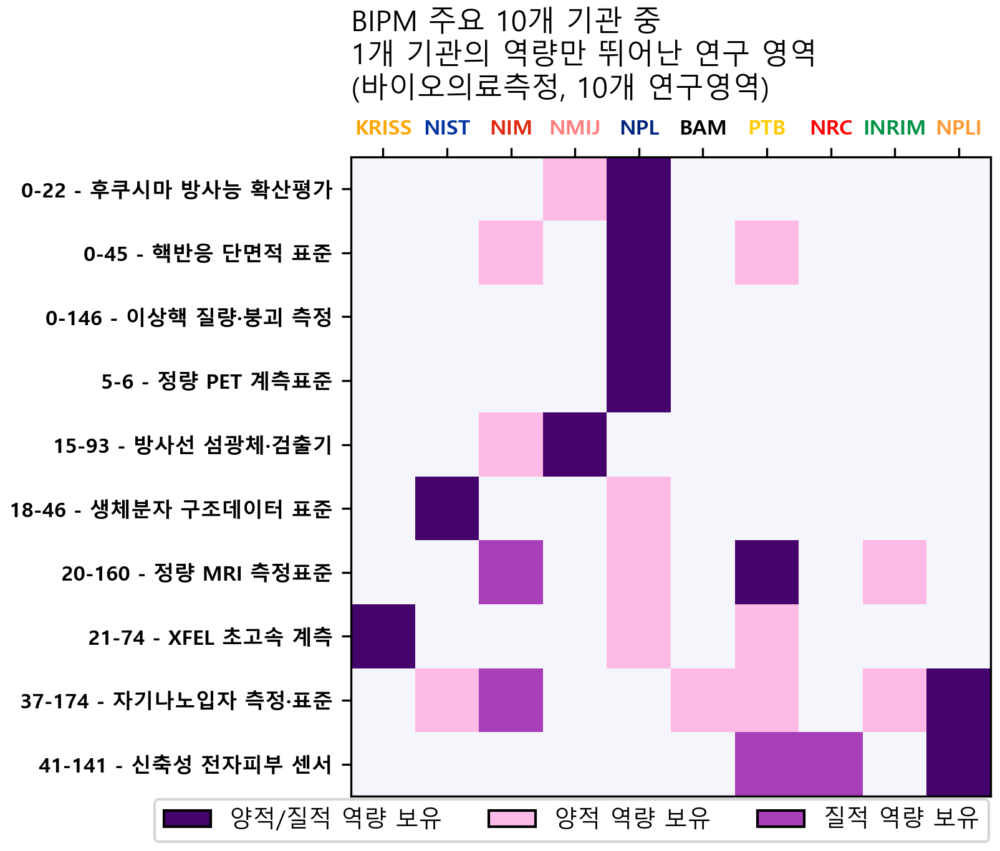

[그림 XX KRISS와 벤치마킹 연구기관 중 2개 이상 기관의 역량이 뛰어난 연구 영역: 양자기술 영역]

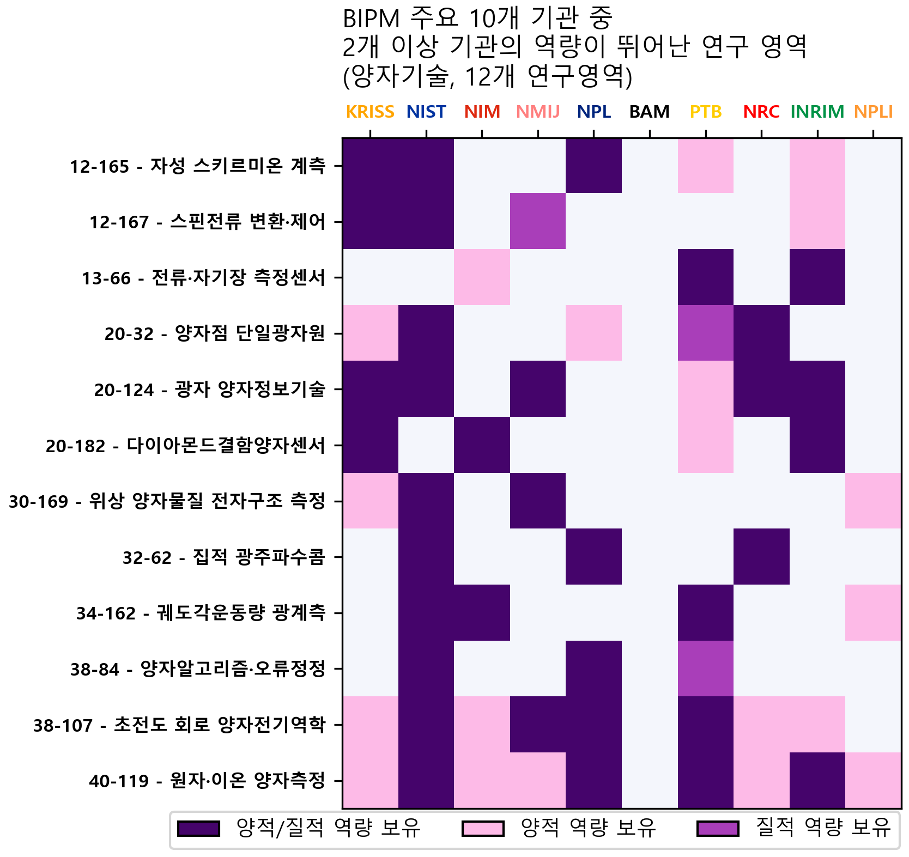

[그림 XX KRISS와 벤치마킹 연구기관 중 1개 기관만의 역량이 뛰어난 연구 영역: 양자기술 영역]

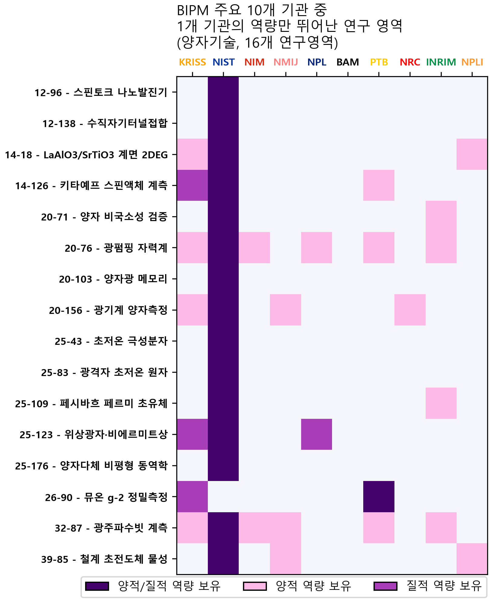

## **3-2) KRISS와 BIPM 주요 연구기관의 연구 포트폴리오 및 역량을 고려한 유망 연구영역 후보군 도출**

여기서는 표준과학 연구 분야 문헌 클러스터링의 마이크로(micro)-레벨 클러스터(195개)에 대해 3-1에서 수행한 벤치마킹 기관과 KRISS의 연구프로파일 분석 결과를 바탕으로, KRISS의 연구 포트폴리오 구성 전략을 지원하기 위한 유망 연구영역 후보군을 유형화한다. KRISS의 현재 역량과 확장 가능성, 그리고 벤치마킹 기관들의 집중 영역을 함께 고려해 실행 가능한 포트폴리오 구성 시나리오를 제시하는 것을 목표로 한다. 우선 양적 역량을 갖추었는가의 기준은 최근 5년 기준으로 RTA가 1 이상이면서 동시에 최근 5년 기준 문헌수가 5편 이상(연평균 1편 이상)인지의 여부로, 질적 역량을 갖추었는가의 기준은 해당 연구영역에서 최근 5년 기준 엑셀런스 지수(상위 10% 문헌 비중)가 8 이상인인지의 여부로 판정하였다.

첫 번째 시나리오는 KRISS가 이미 양적·질적으로 역량을 확보한 영역을 ‘핵심 역량 연구영역’으로 정의하고, 이를 유망 후보군 유형1으로 제시하는 방식이다. 이 후보군에 속하는 연구 영역들에서는 KRISS가 평균 이상의 특화(또는 집중)를 보이면서, 상위 10% 문헌 비중이 일정 수준 이상으로 확보되어 있고, 최소한의 산출 규모도 유지되는 경우만을 포함하고 있다. 이 조건을 만족하는 영역은 총 25개이며, 이 유형의 후보군에 포함된 연구영역은 아래 표와 같다.

[표XX KRISS 핵심 역량 연구영역(후보군 유형1)]

| 연구영역(Meso-Micro) | KRISS RTA | KRISS Excellence 10 지수 | KRISS 5개년 문헌수 |
| --- | --- | --- | --- |
| 0-72 - 방사선치료 선량표준 | 1.87 | 9.52 | 21 |
| 1-142 - PM2.5·오존 측정 및 추세 | 1.01 | 9.09 | 22 |
| 8-11 - 비풀러렌 유기태양전지 | 1.71 | 8.33 | 24 |
| 9-12 - 배터리 양극·계면 측정 | 2.69 | 10.00 | 20 |
| 9-52 - 데이터기반 소재발견 | 1.66 | 8.33 | 24 |
| 10-14 - 산화물 결함 측정·제어 | 2.77 | 16.67 | 12 |
| 10-173 - 2차원·산화물 가스센서 | 1.65 | 10.00 | 20 |
| 11-158 - 그래핀 산화물·양자점 소재 | 1.15 | 14.29 | 14 |
| 11-24 - 폴리머 난연성 측정 | 2.21 | 8.11 | 37 |
| 12-165 - 자성 스키르미온 계측 | 2.82 | 12.50 | 16 |
| 12-167 - 스핀전류 변환·제어 | 2.36 | 21.62 | 37 |
| 17-27 - 수소취성 파괴 측정 | 7.29 | 14.29 | 35 |
| 20-124 - 광자 양자정보기술 | 1.28 | 11.11 | 18 |
| 20-182 - 다이아몬드결함양자센서 | 1.79 | 28.57 | 7 |
| 21-74 - XFEL 초고속 계측 | 1.76 | 10.00 | 10 |
| 22-34 - 나노와이어·질화물 소자 | 2.56 | 11.11 | 9 |
| 29-104 - 분석법 검증·표준화 | 7.33 | 15.16 | 46 |
| 30-60 - 열전재료 성능지수 측정 | 1.09 | 12.92 | 13 |
| 33-64 - 저온 플라즈마 계측 | 6.88 | 13.73 | 38 |
| 34-69 - 메타표면 광학소자 | 3.08 | 19.23 | 52 |
| 36-77 - 2차원 광전소자 측정 | 4.13 | 8.20 | 61 |
| 37-145 - 광음향·초음파 나노진단치료 | 1.17 | 10.02 | 10 |
| 41-127 - 뇌파 감정상태 측정 | 1.16 | 57.14 | 14 |
| 43-178 - 현장진단 바이오센서 | 1.04 | 16.37 | 12 |
| 45-151 - 배열 신호처리 측정 | 1.13 | 28.57 | 7 |

두 번째 시나리오는 후보군 유형1로 도출된 25개 핵심 역량 연구영역을 기반으로, 인지적 유사성이 높은 인접 연구영역으로 포트폴리오를 확장하는 전략을 가정한다. 이를 유망 후보군 유형2인 ‘확장 가능 연구영역’으로 정의한다. 이때 유형2는 “KRISS가 현재 역량을 갖추었다고 볼 수는 없지만, 유형1의 핵심 역량과 지식 기반이 유사하여 기존 역량을 바탕으로 접근 가능한 영역”을 체계적으로 선별하는 데 목적이 있다.

구체적으로는 먼저 유형1의 25개 영역에서 각 영역 문헌들의 기반 문헌의 인지적 유사도(cognitive similarity)가 0.4 이상인 연구영역을 확장 후보로 설정한다. 이후 확장 후보 가운데서, 앞서 정의한 양적 역량 기준과 질적 역량 기준을 동시에 충족하지 못한 영역만을 유형2에 포함한다. 다시 말해 유형2는 핵심 역량(유형1)과 유사도 기준으로 연결되지만, 양적 역량 또는 질적 역량 중 하나 이상이 아직 충분히 확보되지 않은 영역으로 구성된다. 이 방식은 KRISS가 이미 강점을 가진 축과의 근접성을 활용해 연구 포트폴리오를 확장가능한 영역을 선별적으로 관리하기 위한 기준으로 설계되었다. 유형2 후보군은 총 56개이며, 이 유형의 후보군에 포함된 연구영역은 아래 표와 같다.

[표XX KRISS 확장 가능 연구영역(후보군 유형2)]

| 연구영역(Meso-Micro) | 기반이 되는 유형1 연구영역, 인지적 유사도 |
| --- | --- |
| 1-1 - 에어로졸·POPs 측정표준 | 1-142 - PM2.5·오존 측정 및 추세, 0.904 |
| 2-117 - 레이저 미량가스 분광측정 | 9-52 - 데이터기반 소재발견, 0.687; 21-74 - XFEL 초고속 계측, 0.58 |
| 2-2 - 분자 분광 선목록 | 9-52 - 데이터기반 소재발견, 0.68; 21-74 - XFEL 초고속 계측, 0.576 |
| 2-67 - 분자 열화학·분광 계산 | 9-52 - 데이터기반 소재발견, 0.691; 21-74 - XFEL 초고속 계측, 0.577 |
| 3-4 - 나노압입 역학 측정 | 17-27 - 수소취성 파괴 측정, 0.873 |
| 3-65 - DLC·질화물 경질코팅 | 20-182 - 다이아몬드결함양자센서, 0.982 |
| 7-154 - 리튬이온전지 예지진단 | 9-12 - 배터리 양극·계면 측정, 0.997 |
| 8-144 - 콜로이드 양자점 광전소자 | 37-145 - 광음향·초음파 나노진단치료, 0.631 |
| 8-163 - 케스터라이트·Sb₂Se₃ 박막 태양전지 | 30-60 - 열전재료 성능지수 측정, 0.998 |
| 9-191 - 물분해 전기촉매 측정 | 9-12 - 배터리 양극·계면 측정, 0.998 |
| 11-15 - 전자파 차폐·흡수 복합재 | 34-69 - 메타표면 광학소자, 0.852 |
| 11-80 - 그래핀·CNT 복합재 계면 | 36-77 - 2차원 광전소자 측정, 0.878 |
| 12-138 - 수직자기터널접합 | 12-165 - 자성 스키르미온 계측, 0.998; 12-167 - 스핀전류 변환·제어, 0.978 |
| 12-16 - 교환바이어스 계면자성 | 12-165 - 자성 스키르미온 계측, 0.997; 12-167 - 스핀전류 변환·제어, 0.974 |
| 12-63 - 자구벽 동역학 측정 | 12-165 - 자성 스키르미온 계측, 0.943; 12-167 - 스핀전류 변환·제어, 0.924 |
| 12-96 - 스핀토크 나노발진기 | 12-165 - 자성 스키르미온 계측, 0.998; 12-167 - 스핀전류 변환·제어, 0.974 |
| 13-17 - 연자성재료 손실·센싱 | 12-165 - 자성 스키르미온 계측, 0.992; 12-167 - 스핀전류 변환·제어, 0.968 |
| 13-66 - 전류·자기장 측정센서 | 12-165 - 자성 스키르미온 계측, 0.626; 12-167 - 스핀전류 변환·제어, 0.62 |
| 14-57 - 자기열량 재료 | 12-165 - 자성 스키르미온 계측, 0.988; 12-167 - 스핀전류 변환·제어, 0.967 |
| 17-143 - 초합금 상평형·확산 설계 | 17-27 - 수소취성 파괴 측정, 0.959 |
| 17-47 - 금속 적층제조 계측 | 17-27 - 수소취성 파괴 측정, 0.754 |
| 18-28 - 소각산란 구조측정 | 11-24 - 폴리머 난연성 측정, 0.781 |
| 19-118 - 테라헤르츠 계측 | 34-69 - 메타표면 광학소자, 0.891 |
| 19-129 - 마이크로파 유전특성 측정 | 34-69 - 메타표면 광학소자, 0.755 |
| 19-29 - 밀리·테라파 채널측정 | 34-69 - 메타표면 광학소자, 0.866 |
| 20-103 - 양자광 메모리 | 20-124 - 광자 양자정보기술, 0.993 |
| 20-156 - 광기계 양자측정 | 20-124 - 광자 양자정보기술, 0.887 |
| 20-32 - 양자점 단일광자원 | 22-34 - 나노와이어·질화물 소자, 0.719 |
| 20-71 - 양자 비국소성 검증 | 20-124 - 광자 양자정보기술, 0.98 |
| 20-76 - 광펌핑 자력계 | 20-124 - 광자 양자정보기술, 0.861 |
| 21-147 - 레이저 플라즈마 가속 | 21-74 - XFEL 초고속 계측, 0.809 |
| 21-54 - 아토초 펄스 계측 | 21-74 - XFEL 초고속 계측, 0.846 |
| 22-122 - 탄소나노튜브 계측 | 36-77 - 2차원 광전소자 측정, 0.962 |
| 22-36 - 실리콘 나노광전소자 | 22-34 - 나노와이어·질화물 소자, 0.699; 9-52 - 데이터기반 소재발견, 0.572 |
| 25-109 - 페시바흐 페르미 초유체 | 20-124 - 광자 양자정보기술, 0.996 |
| 25-123 - 위상광자·비에르미트상 | 20-124 - 광자 양자정보기술, 0.846 |
| 25-176 - 양자다체 비평형 동역학 | 20-124 - 광자 양자정보기술, 0.985 |
| 25-43 - 초저온 극성분자 | 20-124 - 광자 양자정보기술, 0.982 |
| 25-48 - 보스응축체 비선형 여기 | 20-124 - 광자 양자정보기술, 0.982 |
| 25-83 - 광격자 초저온 원자 | 20-124 - 광자 양자정보기술, 0.968 |
| 28-55 - 플라즈몬 라만증강 분광 | 37-145 - 광음향·초음파 나노진단치료, 0.572 |
| 31-120 - 레이저 플라즈마 원소분광 | 21-74 - XFEL 초고속 계측, 0.789 |
| 31-61 - 초소수성 표면 레이저 가공 | 21-74 - XFEL 초고속 계측, 0.721 |
| 32-87 - 광주주파수빗 계측 | 21-74 - XFEL 초고속 계측, 0.42 |
| 34-185 - 테라헤르츠 메타물질 측정 | 34-69 - 메타표면 광학소자, 0.911 |
| 35-94 - 연료전지 수분 계측 | 9-12 - 배터리 양극·계면 측정, 0.716 |
| 36-135 - 그래핀 합성·물성 측정 | 36-77 - 2차원 광전소자 측정, 0.947 |
| 37-174 - 자기나노입자 측정·표준 | 37-145 - 광음향·초음파 나노진단치료, 0.651 |
| 37-79 - 미세·나노입자 계측표준 | 37-145 - 광음향·초음파 나노진단치료, 0.607 |
| 38-107 - 초전도 회로 양자전기역학 | 20-124 - 광자 양자정보기술, 0.874 |
| 38-84 - 양자알고리즘·오류정정 | 20-124 - 광자 양자정보기술, 0.996 |
| 40-108 - 양성자 반지름 정밀측정 | 9-52 - 데이터기반 소재발견, 0.64; 21-74 - XFEL 초고속 계측, 0.563 |
| 40-119 - 원자·이온 양자측정 | 20-124 - 광자 양자정보기술, 0.979 |
| 40-88 - EUV/X선 원자분광 | 9-52 - 데이터기반 소재발견, 0.683; 21-74 - XFEL 초고속 계측, 0.643 |
| 41-141 - 신축성 전자피부 센서 | 8-11 - 비풀러렌 유기태양전지, 0.812 |
| 45-136 - 시변주파수 정밀분석 | 45-151 - 배열 신호처리 측정, 0.409 |

세 번째 시나리오는 KRISS의 공백 영역을 중심으로 유망 후보를 설정하는 접근이다. 이를 유망 후보군 유형3인 ‘역량 공백 연구영역’으로 정의하며, 유형1(핵심 역량 연구영역)과 유형2(확장 가능 연구영역)에 포함되지 않은 영역 가운데서 벤치마킹 기관들이 공통적으로 역량을 보유한 영역을 우선적으로 식별한다. 여기서 ‘공백’은 단순히 KRISS의 성과가 낮다는 의미가 아니라, KRISS의 현재 포트폴리오 구조상 핵심 역량으로도, 인접 확장 후보로도 분류되지 않은 영역임에도 불구하고 외부 주요 기관에서는 이미 역량이 축적된 영역을 의미한다.

구체적으로 유형3은 “유형1 또는 유형2에 속하지 않으면서”, 동시에 “벤치마킹 기관 중 2개 이상이 양적 역량 기준과 질적 역량 기준을 모두 충족하는 연구영역으로 정의한다. 즉, 외부에서는 다수 기관이 해당 영역에서 충분한 산출 규모와 상위권 성과를 동시에 확보하고 있는 반면, KRISS는 아직 포트폴리오로 편입하지 못했거나 역량이 충분히 축적되지 않은 영역을 체계적으로 추려내는 구조다. 유형3 후보군은 총 20개이며, 이 유형의 후보군에 포함된 연구영역은 아래 표와 같다.

[표XX KRISS 역량 공백 연구영역(후보군 유형3)]

| 연구영역(Meso-Micro) | 역량을 갖춘 벤치마킹 기관 |
| --- | --- |
| 2-3 - 이온성액체 열물성 | NIST; NPL; NPLI; NRC; PTB |
| 2-7 - 암모니아 연소 반응속도론 | BAM; NRC; PTB |
| 3-73 - 나노힘·마찰 정량측정 | INRIM; NIST; NPL |
| 9-189 - 다공성골격 가스분리 | BAM; NIM; NIST |
| 11-159 - 나노셀룰로오스 소재측정 | BAM; NIST; NPLI |
| 15-112 - 업컨버전 나노입자 | BAM; INRIM; NPL |
| 18-133 - 적층 바이오제조 측정 | BAM; INRIM; NRC; PTB |
| 26-130 - CMB 편광·파워스펙트럼 측정 | NIST; NPL; NRC |
| 26-131 - 중력파 검출·분석 | INRIM; NMIJ/AIST |
| 26-152 - 외계행성 검출·특성 측정 | NIST; NRC |
| 26-166 - 자화강착원반 난류·제트 | NIST; NRC |
| 29-179 - 프로테오믹스 질량분석 | BAM; NIST; NRC |
| 29-58 - 메타분석 방법론 | NIM; NIST; NRC |
| 29-89 - 대사체·지질체 측정표준 | NIST; NPL; NRC |
| 29-95 - 동위원소비 측정표준 | NIM; NIST; NPL; NRC |
| 30-169 - 위상 양자물질 전자구조 측정 | NIST; NMIJ/AIST |
| 32-62 - 집적 광주주파수빗 | NIST; NPL; NRC |
| 34-162 - 궤도각운동량 광계측 | NIM; NIST; PTB |
| 43-125 - 유전체 변이 측정표준 | BAM; NIM; NIST |

요약하면, 유형1은 KRISS가 이미 양적·질적 역량을 동시에 확보한 영역으로 구성된 핵심 역량 보유 후보군이고, 유형2는 유형1과 인지적으로 가까우나 양적 또는 질적 역량이 아직 충분히 확보되지 않은 인접 확장 가능 후보군이며, 유형3은 KRISS의 포트폴리오와 역량을 고려할 때 공백 영역이지만 벤치마킹 기관 다수가 이미 역량을 확보한 영역으로 구성되어 전략적 도전이 필요한 후보군이다. 이후 단계에서는 이 세 유형 후보군을 대상으로 과학계량지표 기반 유망성 분석을 수행하고, 유형별로 유망성이 높은 상위 연구영역을 중심으로 최종 유망 연구영역을 도출한다.

## **3-3)** 과학계량지표 기반 연구 영역별 유망성 분석 및 유망연구영역 도출

### 3-3-1) 연구영역별 유망성 세부지표 정의 및 측정

표준과학 연구 분야 문헌 클러스터링의 마이크로(micro)-레벨 클러스터 195개를 대상으로 과학계량지표 분석을 수행하고, 클러스터별 유망성을 성장성(Growth), 파급력(Impact), 기술 진보 기여도(Contribution to Technological Advancement) 관점에서 정량화한다. 유망성은 단일 지표로 정의하지 않고, “해당 연구영역이 커지고 있는가(성장성)”, “과학기술 지형 전체에서 영향력이 높은가(파급력)”, “기술진보와 연결되는가(기술진보 기여도)”를 동시에 확인하는 방식으로 구성한다.

### 3-3-1-1) 성장성 세부지표 정의 및 측정

성장성(Growth)은 클러스터 규모가 시간에 따라 어떻게 증대되는지를 보는 지표군이다. 여기서는 최근 단기간의 급성장 패턴뿐 아니라, 신규성(최신성)과 장기 추세까지 함께 측정해 성장 패턴을 다면적으로 해석하도록 설계한다. 성장성 세부지표는 (1) 딥러닝 기반 예측 성장가능성(중장기 성장 확률), (2) 급부상성(Emergence Score), (3) 최신성(Recency), (4) 장기성장추세(Long-term Trend)로 구성한다.

(1) 딥러닝 기반 모형 예측 성장가능성은 최근 2년(2023–2024) 동안의 클러스터 특성과 클러스터 간 관계를 종합적으로 고려해, 해당 클러스터가 중장기(7년 후)에도 성장할 확률을 추정하는 방식이다. 이 지표는 두 구성값을 합산하여 사용한다. 첫 번째는 표준과학 연구 분야 문헌 클러스터링의 마이크로(micro)-레벨 클러스터 195개에 대한 딥러닝 기반 예측값으로, 0.90 이상이면 1점, 그 미만이면 0점으로 이산화하여 반영한다. 두 번째는 WoS 인용주제 마이크로-레벨 클러스터에 대한 딥러닝 기반 예측값을 표준과학 연구 분야 문헌 클러스터링의 마이크로-레벨 클러스터 수준에서 가중평균한 값으로, [0,1] 범위에서 연속변수로 사용한다. 

(2) 급부상성의 추정 방식은 Tech Mining 개념(Porter & Cunningham, 2005)을 오랜 기간 발전시켜온 미국 조지아공대 연구그룹에서 최근 제시한 급성장추세의 요약지표인 ‘Emergence Score’(Porter et al., 2018)의 계산 식을 채택하였다. Emergence Score는 하위 3개 지표를 결합하여 구성되며, 추세 변동의 신규성(novelty), 지속성(persistence), 성장성(growth)을 비교적 고르게 반영한다. 기존에 연구주제(topic)에 대해 ‘버스트 탐지(burst detection)’ 기법(Mane & Börner, 2004; Guo et al., 2011; Chen, 2012)을 적용하여 유망 영역을 도출하려는 시도가 있었으나, ‘폭증(burst)’은 단기간 급증한 이벤트 성격이 강하다. 연구 영역의 급속한 성장은 일정한 시계열 구간에서 ‘지속성’도 함께 확인되어야 하며, Emergence Score는 이에 대한 적절한 대안으로 판단된다.

Emergence Score의 계산 식은 다음과 같다.
*Emergence Score = 2 × Active Period Trend + (Recent Trend + Mid-Year to Last-Year Slope)*

Emergence Score의 계산 식에 쓰인 변수**의 정의는 아래와 같다.**

- **Active Period Trend (활성구간 추세)**: 최근 3개년도 빈도 대비 초기 3개년도 빈도의 차이.
    
    {(클러스터 최근 3개년 빈도 ÷ 최근 3개년 전체 문헌수) − (클러스터 초기 3개년 빈도 ÷ 초기 3개년 전체 문헌수)}
    
- **Recent Trend (최근 추세)**: 최근 2개년 빈도 대비 직전 2개년 빈도의 차이 × 10.
    
    {10 × [(클러스터 최근 2개년 빈도 ÷ 최근 2개년 전체 문헌수) − (클러스터 직전 2개년 빈도 ÷ 직전 2개년 전체 문헌수)]}
    
- **Mid-Year to Last-Year Slope (중반 이후 증가율)**: 활성구간 중간 연도(4년차)와 마지막 연도(7년차) 사이의 기울기 × 10/3.
    
    {10 × [(클러스터 마지막 연도 빈도 ÷ 중간 연도 전체 문헌수) − (클러스터 중간 연도 빈도 ÷ 마지막 연도 전체 문헌수)] ÷ 3}
    

[그림 XX 급부상성(Emergence Score) 산출을 위한 시계열 구간 분해도]

(3) 최신성(Recency)은 클러스터가 “얼마나 최근에 형성·확산된 연구영역인가”를 나타내는 지표로, 2000–2024년 25개년 동안 클러스터 문헌의 출판연도를 문헌수 비율로 가중한 가중평균 출판연도로 산출한다. 이 값은 클러스터의 ‘평균적 나이’로 해석할 수 있다. 

$$
\text{Novelty} 
= \frac{\sum \left(\text{연도} \times \text{해당 연도 클러스터 문헌수}\right)}
       {\sum \text{클러스터 전체 문헌수}}
$$

(4) 장기성장추세(Long-term Trend)는 클러스터가 장기간에 걸쳐 꾸준히 성장해 왔는지를 보기 위한 지표로, 2000–2024년 연도별 문헌 수의 3개년 이동평균 값을 사용해 연평균복합성장률(CAGR)로 계산한다. 문헌 수가 0인 초기 연도가 존재할 수 있으므로, 최초로 문헌 수가 0이 아닌 첫 해를 최초 유효 연도로 간주해 CAGR을 산출한다. 또한 모든 클러스터는 2024년에도 문헌이 출판되는 것으로 확인된 범위에서 분석을 수행한다.

클러스터의 장기추세는 시계열 분석에서 널리 사용되는 연평균복합성장률(CAGR) 로 측정하였다. 즉, 문헌 규모의 CAGR: 2000–2024년 전체 기간의 연도별 문헌 수를 3개년 이동평균 처리한 값을 바탕으로 계산하였다. 이 때, 최초로 문헌 수가 0이 아닌 첫 해를 최초 유효 연도로 간주하였으며, 모든 클러스터는 샘플 구간의 마지막 연도인 2024년에도 문헌들이 출판되었다.

$$
\text{CAGR} 
= \left(\frac{V_{\text{end}}}{V_{\text{start}}}\right)^{\tfrac{1}{T}} - 1
\\~\\
V_{\text{start}} := \text{ 시작 시점(3개년 이동평균 적용 후 최초 유효 연도)의 값 }
\\~\\

V_{\text{end}} := \text{ 종료 시점(2024년)의 값 }
\\~\\

T := \text{ 두 시점 사이의 연도 수 }
$$

### 3-3-1-2) 파급력 세부지표 정의 및 측정

파급력(Impact)은 개별 클러스터가 전체 과학기술 지형에서 갖는 영향력 수준을 측정하는 지표군으로 정의한다. 여기서는 (1) 상위 10% 엑셀런스와 (2) 정규화 평균 피인용수을 함께 사용해 “질적 상위 성과가 얼마나 존재하는가”와 “전체적으로 얼마나 인용되는가”를 동시에 확인한다.

(1) 상위 10% 엑셀런스(Excellence)는 클러스터 내 문헌들 중 각 문헌이 속한 분류에서 피인용수가 상위 10%에 해당하는 문헌의 비율을 의미한다(이준영 & 박진서, 2019; Hicks et al., 2015; Waltman & Van Eck, 2019). 상위 10% 기준에서 기대 수준은 10이며, 이 지수의 값이 10 이상이라는 것은 해당 클러스터가 속한 분류 기준으로 상위 10% 문헌 비율이 기대 수준(10%)을 초과함을 뜻한다. 본 분석은 클러스터 간 비교를 목적으로 하므로, 분위수 계산의 분류 단위는 앞선 분석에서와 마찬가지로 문헌이 속한 WoS 인용주제 메소-레벨 연구영역을 적용한다. 정규화를 위해 동일 출판년도, 동일 분류 내에서 분위수를 계산하고, 피인용수 동점 처리에는 분할 처리 방식(Waltman & Schreiber, 2013) 을, 복분류 처리에는 평균 적용 방식(Bornmann et al., 2013)을 적용하였다.

(2) 정규화된 평균 피인용수(Mean Normalized Citation Score, MNCS)는 클러스터 내 문헌의 평균적 영향력을 보기 위한 지표로, 각 문헌이 속한 동일 출판년도, 동일 분류 내에서 상대적 피인용 수준을 기반으로 정규화한 뒤 클러스터 레벨로 집계한다. 여기서도 문헌의 분류 단위는 인용주제 메소-레벨 연구영역을 사용한다. 

유망 연구영역 선정을 위한 파급력 세부지표 계산에는 최근 5개년 데이터를 활용해, 현재 유망성과의 연결성을 높이도록 설계한다.

### 3-3-1-3) 기술진보 기여도 세부지표 정의 및 측정

기술 진보 기여도(Contribution to Technological Advancement)는 논문에 대한 특허의 인용 관계를 활용해 각 연구영역이 기술진보에 기여하는 수준을 정량화하는 지표군으로 정의된다. Science–Technology Linkage 관점에 기반하며(Li et al., 2014; Jefferson et al., 2018; Knaus & Palzenberger 2018; Bryan et al., 2020; Kuan et al., 2020; Hsiao & Torvik 2020; Marx & Fuegi, 2020; Ba & Liang 2021; Hammarfelt, 2021; Marx & Fuegi, 2022), (1) 기술 진보 기여 가능 지식 비율과 (2) 기술 진보 영향력 지수를 활용하여 측정하며, WoS 데이터베이스에 더해 논문과 특허의 인용 관계 정보를 제공하는 Lens 데이터베이스를 활용하였다.

(1) 기술 진보 기여 가능 지식 비율은 클러스터 내 문헌 중 특허에 인용된 문헌의 비율로 계산한다. 이는 “클러스터가 기술 진보로 이어질 수 있는 지식 기반을 어느 정도 제공하는가”를 가장 직접적으로 보여주는 지표다. Nature Index에서 활용하는 ‘Patent influence metric’이 “분석 대상이 산출한 문헌 집합에서 특허에 인용되는 문헌의 비율”을 주요 지표로 설정한다는 점에서, 본 지표는 유사한 해석틀을 공유한다. 다만 Nature Index의 Patent influence는 논문이 특허를 인용하는 방향(논문에 대한 특허의 인용의 역방향)을 포함하지 않는 점에서, 본 분석의 기술 진보 기여도 지표군과는 해석 범위가 일부 다르다.

(2) 기술 진보 영향력 지수는 클러스터 내 문헌이 인용되는 ‘전방 인용 특허’의 가치(피인용 기반)를 반영하여, 클러스터가 기술 진보에 미치는 영향력의 크기를 계량화한다. 이를 위해 우선 개별 특허들의 피인용수(cites)와 출원년도 코호트(cohort)별 평균 피인용(cohort mean) 값을 구한 뒤, 각 특허에 대해 피인용 점수(citation score)를 1 + (cites / cohort mean)로 계산하였다. 이어 논문별로 전방 인용 특허의 피인용 점수 총합을 계산하되 출판년도별로 보정하고, 클러스터 수준에서 최종적으로 집계하는 흐름으로 측정하였다. 기술분야 보정은 적용하지 않으므로 이 지표는 “어떤 분야의 특허이든 영향력이 큰 특허에 연결되는가”에 초점을 둔다. 

논문에서 특허 출원·등록까지의 시차를 고려하면 최근 5개년만으로는 기술 연계의 다양성이 충분히 포착되지 않을 수 있으므로, 유망 연구영역 선정을 위한 기술진보 기여도 세부지표 계산에는 최근 10개년 데이터를 활용한다.

[표 XX 유망성 지표 카테고리별 세부지표]

| 유망성 지표 카테고리 | 세부지표 |
| --- | --- |
| 성장성 | 딥러닝 기반 모형 예측 성장가능성 |
| 성장성 | 급부상성(Emergence Score) |
| 성장성 | 최신성(가중 평균 출판연도) |
| 성장성 | 장기성장추세(CAGR) |
| 파급력 | 상위 10% 엑셀런스(Excellence, Ex10) |
| 파급력 | 정규화된 평균 피인용수(Mean Normalized Citation Score, MNCS) |
| 기술진보 기여도 | 기술 진보 기여 가능 지식 비율(특허에 인용된 문헌 비율) |
| 기술진보 기여도 | 기술 진보 영향력 지수(전방 인용 특허 가치 기반 평균) |

### 3-3-2) 연구영역별 유망성 종합 점수 측정 및 후보군별 **유망연구영역 선정**

이제 성장성, 파급력, 기술진보 기여도 세부지표를 바탕으로, 각 표준과학 연구 분야 마이크로-레벨 클러스터 단위의 유망성을 비교 가능한 단일 점수로 평가하고, 앞서 도출한 후보군(유형1~유형3)별로 유망 연구영역을 선별하고자 한다. 세부지표를 단순 합산해 종합 점수를 만드는 방식이 아니라, 지표들 간 상관관계를 고려해 대표 성분으로 요약하는 방식으로 종합 점수를 구성한다. 이를 위해 성장성, 파급력, 기술진보 기여도의 각 범주별 점수와 최종 통합 점수 모두를 PCA(주성분분석)의 1차 성분으로 산출한다.

우선 각 클러스터에 대해 성장성, 파급력, 기술진보 기여도 세 가지 카테고리 점수를 산출한다. 각 카테고리 점수는 해당 카테고리를 구성하는 세부지표들을 입력값으로 하여 PCA 1차 성분(PC1) 점수를 계산하고, 이를 단일 지표로 사용한다. 성장성 점수는 딥러닝 기반 모형 예측 성장가능성, 급부상성(Emergence Score), 최신성(가중 평균 출판연도), 장기성장추세(CAGR) 네 지표를 사용한다. 파급력 점수는 상위 10% 엑셀런스와 정규화된 평균 피인용수(MNCS) 두 지표를 사용한다. 기술진보 기여도 점수는 기술 진보 기여 가능 지식 비율과 기술 진보 영향력 지수 두 지표를 사용한다.

카테고리별 PCA 점수 산출은 동일한 절차로 수행한다. 먼저 각 세부지표의 단위와 분포 차이를 제거하기 위해 평균 0, 표준편차 1이 되도록 표준화(z-score 표준화)를 적용한다. 이후 표준화된 세부지표들을 이용해 PCA를 수행하고, 첫 번째 주성분(PC1)의 점수를 해당 카테고리의 기본 점수로 정의한다. 유망성 지표 3개 카테고리의 각 세부지표 간에는 양의 상관관계가 있음을 확인하였으므로 성장성·파급력·기술진보 기여도의 세 카테고리 점수는 모두 각각의 세부지표 값이 클수록 점수가 높아진다.

다음으로 유망성 종합점수는 위에서 얻은 세 카테고리 점수를 입력값으로 다시 PCA를 수행해 산출한다. 즉, 성장성 PCA 점수, 파급력 PCA 점수, 기술진보 기여도 PCA 점수의 세 변수를 사용해 통합 PCA를 수행하고, 그 1차 성분 점수를 최종 통합 점수로 정의한다. 마찬가지로 성장성·파급력·기술진보 기여도 PCA 점수는 모두 양의 상관관계가 있음을 확인하였으므로 유망성 종합 점수 역시 세 카테고리 점수가 높을수록 유망성도 높아진다고 해석이 가능하다. 마지막으로 각 카테고리별 PCA 점수와 통합 PCA 점수는 해석과 비교의 직관성을 높이기 위해 퍼센타일(0~100)로 변환하였다. 따라서 전체 195개 클러스터 중 상대적 위치를 의미하며, 후보군 간 또는 영역 간 비교에서도 동일한 척도로 활용할 수 있다.

이렇게 산출된 총점 퍼센타일을 기반으로, 앞서 도출한 유망 연구영역 후보군 유형1(핵심 역량 연구영역), 유형2(확장 가능 연구영역), 유형3(역량 공백 연구영역) 각각의 후보군 내부에서 유망성 순위를 산정하고 상위 연구영역을 선별한다. 

**[표 XX 핵심 역량 연구영역(후보군 유형1) 유망성 종합점수 상위 10개 연구영역]**

| 연구영역(Meso-Micro) | 성장성 퍼센타일 | 파급력 퍼센타일 | 기술진보기여도 퍼센타일 | 유망성 종합점수 퍼센타일 |
| --- | --- | --- | --- | --- |
| 20-182 - 다이아몬드결함양자센서 | 76.92 | 89.23 | 100.00 | 98.97 |
| 41-127 - 뇌파 감정상태 측정 | 86.67 | 100.00 | 76.41 | 98.46 |
| 34-69 - 메타표면 광학소자 | 86.15 | 78.46 | 95.90 | 93.33 |
| 36-77 - 2차원 광전소자 측정 | 93.85 | 83.08 | 66.15 | 86.67 |
| 43-178 - 현장진단 바이오센서 | 83.59 | 83.59 | 83.59 | 86.15 |
| 9-12 - 배터리 양극·계면 측정 | 73.33 | 76.92 | 90.77 | 85.64 |
| 12-167 - 스핀전류 변환·제어 | 83.08 | 92.82 | 53.85 | 84.62 |
| 37-145 - 광음향·초음파 나노진단치료 | 65.13 | 91.79 | 72.31 | 83.59 |
| 11-24 - 폴리머 난연성 측정 | 64.62 | 87.69 | 60.00 | 80.00 |
| 10-173 - 2차원·산화물 가스센서 | 65.64 | 74.36 | 60.51 | 70.77 |

위 표는 핵심 역량 연구영역(후보군 유형1) 가운데 유망성 종합점수 상위 10개 연구영역을 정리한 결과다. 이 연구영역들은 KRISS가 이미 양적·질적으로 역량을 확보하고 있는 동시에 성장성, 파급력, 기술진보 기여도 측면에서도 상대적으로 우수하게 나타나 “향후에도 집중도를 유지하거나 더 강화할 필요가 있는 분야”로 해석된다.

물리측정 영역에서는 KRISS의 역량이 두드러진 연구영역 가운데 ‘34-69 메타표면 광학소자’가 유망연구영역으로 선정되었다. 이 영역은 RTA 3, 상위 10% 엑셀런스 19%, 최근 5년 문헌수 52개로 활동성과 성과가 동시에 확인되며, 특히 특허 연계가 활발해 기술진보 기여도 측면에서 강점이 나타난다. 또한 향후 영역 규모가 성장할 것으로 예측되는 점이 반영되어 종합 유망성이 높게 평가되었다. 벤치마킹 대상인 BIPM 주요기관들과 비교해도 이 영역은 KRISS의 상대적 우위가 뚜렷하게 관측되는 특징을 가진다.

화학소재측정 영역에서는 ‘9-12 배터리 양극·계면 측정’이 이 후보군에서 유망연구영역으로 선정되었다. 이 영역은 KRISS가 이미 역량을 확보한 분야 중에서도 특허로의 연계가 특히 많이 나타나는 영역으로, 산업적 활용 가능성과 기술진보 기여도 측면의 강점이 종합 유망성 평가에 반영되었다. 즉, 연구의 축적이 실제 기술 응용과 연결되는 구조가 확인되는 분야로 해석된다.

바이오의료측정 영역에서는 NIST 외에 NPL이 높은 위상을 보이는 상황에서도 KRISS가 강점을 보이는 ‘41-127 뇌파 감정상태 측정’이 핵심 유망 영역으로 도출되었다. 이 영역은 195개 클러스터 중 유망성 종합점수 4위에 해당하며, 후속 연구에 대한 파급력 지표가 최상위 수준으로 나타나 유망연구영역으로 선정되었다. 또한 지난 5년 동안 KRISS가 생산한 14개 논문 중 8개가 피인용 상위 10%에 해당해(57%) 해당 분야에서 질적 성과가 집중적으로 나타나는 특징이 확인된다. 아울러 ‘43-178 현장진단 바이오센서’ 역시 KRISS가 이미 역량을 보유한 분야로, 종합 유망성이 높아 유망연구영역에 포함되었다. 이 영역에서는 최근 5년 KRISS 문헌 12개 중 2개가 피인용 상위 10%에 해당해(16%) 상위 성과가 일정 수준 확보된 것으로 나타난다.

양자기술 영역에서는 ‘20-182 다이아몬드결함양자센서’가 195개 중 유망성 종합점수 3위로 평가되며 유망연구영역에 선정되었다. 특히 이 영역은 특허 연계가 가장 활발한 영역으로 나타나 기술진보 기여도 측면에서 강점이 두드러지며, 이를 바탕으로 종합 유망성이 높게 평가되었다. 또한 ‘12-167 스핀전류 변환·제어’ 역시 KRISS가 이미 강점을 보이는 분야로, 과학기술 전분야의 후속 연구들에 대한 파급력이 상위권에 위치하고 향후 영역 규모가 성장할 것으로 예측되는 점이 반영되어 유망연구영역에 포함되었다.

한편 핵심 역량 연구영역(후보군 유형1)에 속하더라도 유망성 종합점수 상위 10위에 포함되지 않아 최종 “유망 연구영역 30개”에 들어가지 못한 연구영역이 존재한다. 그러나 이러한 영역이 반드시 전략적 중요도가 낮다고 해석할 수는 없다. 예를 들어 ‘20-124 광자 양자정보기술‘과 같이, 현재의 종합 유망성 점수는 상대적으로 높지 않더라도 향후 유망 연구영역으로의 확장을 위해 기반 역할을 할 수 있는 영역은 전략적으로 지원할 필요가 있다. 따라서 후보군 유형1에 대한 유망성 분석 결과는 “유망겅 점수 상위 영역의 집중”뿐 아니라, “핵심 역량을 활용한 확장 경로를 유지하기 위한 포트폴리오 구성”까지 함께 고려하는 방식으로 고려하는 것이 권장된다.

**[표 XX 확장 가능 연구영역(후보군 유형2) 유망성 종합점수 상위 10개 연구영역]**

| 연구영역(Meso-Micro) | 성장성 퍼센타일 | 파급력 퍼센타일 | 기술진보기여도 퍼센타일 | 유망성 종합점수 퍼센타일 |
| --- | --- | --- | --- | --- |
| 38-84 - 양자알고리즘·오류정정 | 60.51 | 99.49 | 98.97 | 100.00 |
| 41-141 - 신축성 전자피부 센서 | 94.36 | 92.31 | 74.87 | 91.28 |
| 9-191 - 물분해 전기촉매 측정 | 93.33 | 87.18 | 73.33 | 89.74 |
| 7-154 - 리튬이온전지 예지진단 | 96.41 | 58.46 | 86.67 | 89.23 |
| 11-15 - 전자파 차폐·흡수 복합재 | 77.95 | 98.97 | 47.18 | 87.69 |
| 37-79 - 미세·나노입자 계측표준 | 70.77 | 93.85 | 65.13 | 84.10 |
| 25-123 - 위상광자·비에르미트상 | 76.41 | 96.92 | 29.23 | 82.05 |
| 25-176 - 양자다체 비평형 동역학 | 71.79 | 96.41 | 19.49 | 78.97 |
| 2-117 - 레이저 미량가스 분광측정 | 51.28 | 81.54 | 70.77 | 71.79 |
| 38-107 - 초전도 회로 양자전기역학 | 33.33 | 74.87 | 86.15 | 69.74 |

위 표는 확장 가능 연구영역(후보군 유형2)가운데 유망성 종합점수 상위 10개 연구영역을 정리한 결과다. 이 연구영역들은 핵심 역량 연구영역(유형1)과 인지적으로 인접한 영역들 중에서 종합 유망성이 높은 분야를 추려낸 것으로, “확장 투자 시 성과로 연결될 가능성이 큰 영역”을 의미한다. 즉, KRISS가 이미 축적한 지식 기반과 연구 역량, 인프라 등을 활용해 비교적 낮은 비용으로 진입할 수 있으면서도 성장성·파급력·기술진보 기여도가 높아 유망한 영역들로 해석할 수 있다.

[그림 XX 물리측정 영역의 핵심 역량 확장 가능 영역 예시]

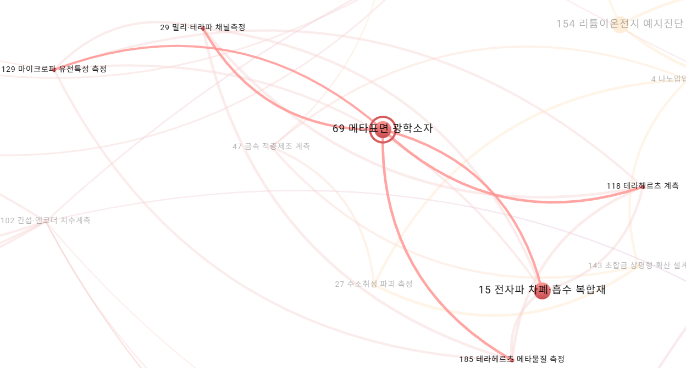

물리측정 영역에서는 ‘34-69 메타표면 광학소자’를 기반으로 확장 가능한 영역 중 ‘11-15 전자파 차폐·흡수 복합재’가 유망연구영역으로 선정되었다. 이 영역은 195개 클러스터 중 후속 연구에 대한 파급력이 3위로 나타나 영향력 측면에서 특히 높은 점수를 받았다. 또한 KRISS도 해당 영역에 논문이 존재해 최소한의 연구 기반과 잠재력이 확인되며, 핵심 역량 영역에서의 축적을 응용·확장해 성과로 연결될 가능성이 높은 후보로 해석된다.

[그림 XX 화학소재측정 영역의 핵심 역량 확장 가능 영역 예시]

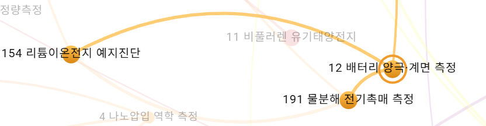

화학소재측정 영역에서는 ‘9-12 배터리 양극·계면 측정’을 기반으로 확장 가능한 유망 영역으로 ‘9-191 물분해 전기촉매 측정’과 ‘7-154 리튬이온전지 예지진단’이 도출되었다. 두 영역 모두 향후 문헌 규모가 확대될 것으로 예측되어 성장성 측면에서 높은 점수를 받았으며, 세부적으로는 ‘9-191 물분해 전기촉매 측정’이 다른 연구들에 대한 파급력이 큰 영역으로 평가되었고, ‘7-154 리튬이온전지 예지진단’은 특허 연계 가능성이 높아 기술진보 기여도 관점에서 유망성이 높게 나타나 정되었다. 다만 KRISS는 최근 5년간 ‘9-191 물분해 전기촉매 측정’에 7편 이상의 논문을 게재했음에도 상위 10% 문헌이 아직 확보되지 않아 질적 성과 축적이 과제로 남아 있다. 반면 ‘7-154 리튬이온전지 예지진단’은 KRISS의 직접 산출 논문이 없는 상태이지만, 지식 기반이 핵심 역량 영역과 상당히 유사한 것으로 평가되는 만큼 기술진보 기여도(특허 연계)를 전략적으로 강화하려면 화학소재측정 분야에서 도전적 확장 대상으로 검토할 수 있다.

바이오의료측정 영역에서 유형2 상위 유망 영역으로는 ‘41-141 신축성 전자피부 센서’가 도출되었다. 이 영역은 바이오의료측정 범주에 속하지만, 인지적 기반이 물리측정 영역의 특정 핵심 역량(예: ‘11 비플러렌 유기태양전지’)과 연결되어 있는 형태로 나타나, 영역 간 지식 확장 경로를 보여주는 사례로 해석된다. 이는 바이오의료측정 내에서의 단순 연장선 확장뿐 아니라, 물리 기반 소재·소자 역량을 바이오 응용 측정으로 전환하는 확장가 가능할 수 있음을 시사한다.

[그림 XX 양자기술 영역의 핵심 역량 확장 가능 영역 예시]

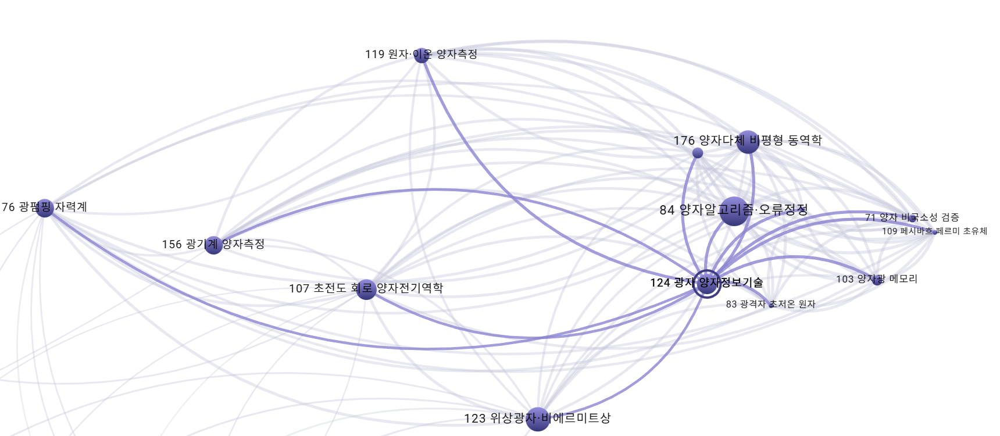

양자기술 영역에서는 ‘20-124 광자 양자정보기술‘이 확장 전략에서 중요한 기반 영역으로 다루어진다. 이 영역은 유망성 점수 자체가 최상위권은 아니지만, 광자 기반 양자정보 처리·전송(네트워크·인터커넥트 포함)이라는 성격상 다른 양자 영역으로 진출하기 위한 인프라적 기반(지식·장비·측정 프레임워크)을 제공한다는 점에서 ‘지식기반으로서의 중요성’이 높게 평가된다. 실제로 이 영역은 다른 기관들에서도 역량이 뛰어난 곳이 다수 존재해 국제 경쟁과 협력의 접점이 넓은 분야로 해석된다.

이 기반을 바탕으로 확장 가능한 유망 영역으로는 초전도 양자컴퓨팅과 직접 연결되는 ‘38-107 초전도 회로 양자전기역학’과 ‘38-84 양자알고리즘·오류정정’이 도출되었다. 두 영역 모두 KRISS가 아직 뚜렷한 성과를 확보하지 못한 편이지만 유망성이 상당히 높아 유망연구영역으로 선정되었다. 특히 ‘38-84 양자알고리즘·오류정정’은 유망성이 전체 연구영역 중 가장 높은 영역으로, 광자 양자정보기술에서 축적되는 기반 역량을 활용해 확장할 수 있는 대표적 후보로 해석되며, 주요 기관들 가운데서도 이미 역량이 두드러진 곳이 존재하고 일부 기관은 잠재력을 보이는 것으로 나타난다. ‘38-107 초전도 회로 양자전기역학’ 역시 중요도 대비 여러 기관에서 역량을 확보하고 있는 분야로, KRISS가 선택적으로 투자할 경우 후발 진입이더라도 성과로 연결될 여지가 있는 확장 후보로 해석된다.

**[표 XX 역량 공백 연구영역(후보군 유형3) 유망성 종합점수 상위 10개 연구영역]**

| 연구영역(Meso-Micro) | 성장성 퍼센타일 | 파급력 퍼센타일 | 기술진보기여도 퍼센타일 | 유망성 종합점수 퍼센타일 |
| --- | --- | --- | --- | --- |
| 11-159 - 나노셀룰로오스 소재측정 | 94.87 | 98.46 | 81.03 | 97.95 |
| 43-125 - 유전체 변이 측정표준 | 44.10 | 77.95 | 99.49 | 93.85 |
| 32-62 - 집적 광주주파수빗 | 61.03 | 91.28 | 97.95 | 92.31 |
| 9-189 - 다공성골격 가스분리 | 82.05 | 97.44 | 77.95 | 91.79 |
| 18-133 - 적층 바이오제조 측정 | 62.05 | 93.33 | 70.26 | 81.54 |
| 29-179 - 프로테오믹스 질량분석 | 44.62 | 65.64 | 96.41 | 81.03 |
| 30-169 - 위상 양자물질 전자구조 측정 | 81.03 | 94.87 | 22.56 | 80.51 |
| 26-131 - 중력파 검출·분석 | 53.85 | 97.95 | 11.28 | 75.38 |
| 34-162 - 궤도각운동량 광계측 | 60.00 | 88.72 | 51.28 | 73.33 |
| 15-112 - 업컨버전 나노입자 | 57.44 | 76.41 | 58.97 | 66.67 |

위 표는 역량 공백 연구영역(후보군 유형3) 가운데 유망성 종합점수 상위 10개 연구영역을 정리한 결과다. 다른 벤치마킹 기관들이 이미 역량을 확보하고 있으나 KRISS는 아직 핵심 역량을 보유하지 못했거나 확장 가능 영역으로 편입시키지 못한 분야를 대상으로 성장성·파급력·기술진보 기여도를 종합적으로 점검해, 전략적으로 도전할 가치가 있는 영역을 선별하였다. 즉, “진입 난이도는 높더라도 중장기적으로 확보할 가치가 큰가”를 판단하기 위한 후보군이다.

물리측정 영역에서 KRISS의 공백 영역 중 ‘26-131 중력파 검출·분석’은 후속 연구로의 파급력이 매우 큰 분야로 나타나 유망 후보로 해석된다. 다만 이 영역은 KRISS가 현재 강점을 가진 영역과 직접적으로 연결하기가 상대적으로 어렵다. 그럼에도 불구하고 다른 기관들, 특히 NMIJ와 INRIM이 해당 분야에서 두드러진 역량을 보이는 것으로 나타났다.

화학소재측정 영역에서는 ‘11-159 나노셀룰로오스 소재측정’이 성장성, 파급력, 기술진보 기여도 모두에서 강한 신호를 보이며 유망성 종합점수 상위권(5위)으로 나타난 영역이다. 특허 연계도 활발해 산업적 활용과 기술진보 기여 가능성이 동시에 큰 것으로 해석된다. 이러한 특성 때문에 NIST, BAM, NPLI 등 화학·소재 측정 역량이 강한 기관들이 이미 해당 분야에서 역량을 확보하고 있는 것으로 관측된다. 반면 KRISS는 2020–2024년 최근 5개년 동안 이 분야 논문이 2편에 그쳐 연구 기반이 충분히 형성되지 않은 상태로 해석되며, 유형3의 “공백” 성격을 직접적으로 보여주는 사례로 볼 수 있다.

바이오의료측정 영역에서 ‘43-125 유전체 변이 측정표준’은 특허 연계가 매우 활발한 분야로, 기술진보 기여도 측면에서 최상위권(2위)인 영역이다. 이 분야에서는 NIST, NIM, NPL이 두드러진 역량을 보이는 것으로 나타나, 표준·측정 관점에서 산업 및 임상 적용과의 연결이 강한 영역으로 해석된다. KRISS도 해당 분야 논문 산출은 존재하지만 질적으로 우수한 상위권 성과가 충분히 축적되지 못한 상태로 보인다. 또한 ‘29-179 프로테오믹스 질량분석’ 역시 특허 연계가 높아 기술진보 기여도 관점에서 유망하며, NIST, BAM, NRC가 강점을 보이는 영역으로 나타나 유망연구영역으로 선정되었다. KRISS는 이 영역에서 논문 산출은 있으나 상위 10% 문헌이 아직 확보되지 않아, “양적 기반은 있으나 질적 성과가 약한 공백”에 해당하는 형태로 해석된다.

양자기술 영역에서는 ‘32-62 집적 광주주파수빗’이 특허 연계가 매우 큰 분야로 나타나 기술진보 기여도가 강한 공백 영역으로 해석되며, NIST, NPL, NRC가 강점을 보이는 것으로 보인다. ‘34-162 궤도각운동량 광계측’은 후속 연구로의 파급력이 높은 영역으로 유망 후보로 평가되며, NIST, NIM, PTB가 두드러진 역량을 보이는 것으로 나타나 유망연구영역으로 선정되었다. 

이상의 결과를 종합하면 KRISS가 지속적으로 다양한 연구영역에서 연구 기반을 축적해 왔으며 특히 유망성이 높은 연구영역들도 다수 역량을 보유하고 있음을 보여주는 동시에, 주요 해외 기관들도 유망한 연구영역에 대해 투자를 통해 역량을 강화해 왔음을 시사한다. 세계적 수준의 벤치마킹 기관들과 같은 범주에서 경쟁을 논의할 수 있다는 사실은 “세계적 수준의 경쟁은 치열하다”는 의미이면서 동시에 “KRISS가 세계적 수준에서 경쟁력이 있다”는 의미이기도 하다.

## **3-4) “포트폴리오 탐색 및 모니터링을 위한 데이터북 및 대시보드 구축 (in 2-3)”**

□포트폴리오 탐색 및 모니터링을 위한 데이터북 및 대시보드 구축

◦분석결과 및 방법론, 지표 설명을 자세히 담은 데이터북 구축
-표준분야 포트폴리오 평가 및 분석을 위한 프레임워크 자체의 설명 및 분석을 위한 결과 해석, 인사이트 제공
-연구지형도, 유망연구영역등 분석결과를 손쉽게 살펴볼 수 있는 온라인 데이터북
-부록자료 포함: 용어 정리, 데이터 사전, 산출식 및 추가 지표 설명
◦분석 데이터를 좀 더 자세히 살펴볼 수 있는 대시보드 구축
-모든 분석 결과를 보다 데이터북 보다 더욱 다양한 방식으로 인터렉티브하게 살펴볼 수 있는 탐색형 도구
-연구지형도, 유망연구영역, 주요 국가 및 연구기관의 지표별 수준, 프로파일 및 포트폴리오를 모두 살펴볼 수 있는 통합 대시보드

## 3-5) LLM 기반 유망 연구 간이 리포팅

과학기술 영역의 범위를 설정하고(또는 세분화하여) 관측하는 일은 계량서지학 분석의 핵심 선행 과제이며, 특히 다학제성과 확산성이 높은 영역에서는 범위 설정이 일관되기 어렵다(Zitt et al., 2019). 이러한 전제에서 동일한 템플릿을 반복 적용해 클러스터 단위의 기술 정체성과 지표를 요약하는 접근은, 후보 간 비교 과정에서 범위·표현의 변동을 줄이는 실무적 절차로 해석할 수 있다.

본 절은 본 보고서에서 전체 연구지형도 분석을 수행한 뒤, 유망영역으로 선정된 10/10/10 총 30개 클러스터를 더 자세히 살펴보고 싶은 독자를 위해 “간이 리포팅”을 자동화하는 절차를 기술한다. 간이 리포트는 클러스터별로 그림을 포함해 약 10쪽 내외의 분량으로 구성되며, 핵심 지표·연결 구조·키워드·기관·정책부합성 정보를 동일한 양식으로 정리한다.

간이 리포팅의 기반이 되는 수치·분포·시각화는 대부분 대시보드에서 확인할 수 있는 내용이며, 본 절은 이를 독자가 빠르게 읽을 수 있도록 서술형 텍스트와 표 중심으로 재구성한다. 대규모언어모델(LLM; large language model)은 이 과정에서 프롬프트(작성 지침)와 API 호출을 통해 문장 구성과 용어 설명을 보조하는 수준으로 활용되며, 기존 데이터에 “약간의 살을 덧대는” 역할에 머문다. 배포용 산출물의 특성상, 본문에는 내부 경로·로컬 파일명·내부 변수명 등 구현 세부를 노출하지 않는다.

### 3-5-1) 작성 방법론

(1) **입력 구성**

간이 리포트는 클러스터별 문헌(제목+초록)과 메타데이터, 지표/키워드 통계, 지식기반 유사도·연결, 기관 분포 및 정책부합성(분류) 결과를 입력으로 한다. 자연어 서술(개요/기관 요약/정책부합성 해석/요약)은 구조화 입력 데이터에 포함된 텍스트·수치만 사용하도록 제한한다.

(2) **출력 형식(고정 템플릿)**

모든 클러스터에 대해 동일한 구성으로 (가) 개요(기술 설명 + 측정 과학 관점 해석), (나) 클러스터 세부지표(문헌 수 추이 + 퍼센타일 + KRISS 기여), (다) 지식기반 인접 클러스터(EA/AA) 및 ego network, (라) 키워드 요약(워드클라우드 + 시계열 + 기간 요약), (마) 기관 분석(성과 표 + 기관별 초록 기반 요약), (바) 정책부합성(분포 + 해석 + 근거 예시), (사) 요약을 포함한다.

| 구간 | 주요 내용 | 생성 방식 |
| --- | --- | --- |
| 1. 개요 | 기술 개요 + 측정 과학 관점 해석 | 대규모언어모델(LLM; large language model) 기반 서술 |
| 2. 클러스터 세부지표 | 문헌 수 추이, 퍼센타일, KRISS 기여 | 규칙 기반(수치 삽입) |
| 3. 지식기반 인접 클러스터·키워드 | EA/AA 표, ego network, 키워드 시각화·표 | 규칙 기반(시각화 포함) |
| 4. 기관 분석 | 성과 표 + 기관별 요약 | 혼합(표=규칙, 요약=LLM) |
| 5. 정책부합성 | 분포 표 + 해석 + 근거 예시 | 혼합(분포/근거=규칙, 해석=LLM) |
| 6. 요약 | 3문단 종합 요약 | LLM 기반 서술 |
| 말미(Notes/약어집) | 안전장치, 약어 목록 | 규칙 기반 |

[표 3-5-1] 간이 리포트 템플릿과 생성 방식 요약

Notes/약어집은 본문(1–6) 이후에 배치되는 말미 부록 성격의 구성요소로, 보고서 표현에서는 본문 번호 체계와 분리해 해석한다.

(3) **유형(분류 프레임) 고정**

유형 코드는 내부에서만 사용하되, 보고서 표기에서는 “핵심 역량 / 확장 가능 / 역량 공백”의 3종 유형 라벨을 사용한다. 여기서 ‘내부 지표 기준’은 본 보고서에서 정의한 유망성 지표(예: RTA, 문헌 수, 상위 10% 인용 논문 비중(Excellence10)) 조건을 의미하며, 세부 기준은 해당 절에서 제시한다. 각 유형 정의는 다음 1문장을 고정해 보고서 간 표현 변동을 최소화한다.

- 핵심 역량: 내부 지표 기준을 충족하는 유형.
- 확장 가능: 핵심 역량과 인접하며 내부 지표 기준에서 일부 부족 축이 표시된 유형.
- 역량 공백: 내부 지표 기준에서 상대적으로 부족 축이 표시된 유형.

(4) **지식기반 인접 클러스터(EA/AA) 정의 및 표기**

지식기반 유사도(예: 코사인 유사도) 임계값을 만족하는 인접 클러스터를 표·그래프로 제시한다. 임계값은 전 클러스터에 동일하게 적용해 비교 가능성을 유지한다.

- EA(ego–alter): 현재 클러스터와 직접 연결된 이웃
- AA(alter–alter): EA를 따라 2단계로 연결되는 이웃(표에서는 중복 제거)
표는 중복 제거로 요약성을 확보하되, 그래프는 연결 구조의 맥락을 위해 연결 노드를 모두 표기할 수 있다.

(5) **키워드 통계의 기본 단위(문서 커버리지)**

키워드 빈도는 동일 문서 내 다중 등장을 중복 계산하지 않는 “키워드 포함 문서 수(문서 커버리지)”를 기본 단위로 사용한다. 연도별 비율(%)은 “해당 연도·클러스터에서 키워드가 포함된 문서 수 / 같은 연도·클러스터 전체 문서 수”로 정의한다.

(6) **대표 키워드 score(간략 정의)**

score는 클러스터 내 용어의 대표성을 나타내는 점수로, 클래스 기반 TF‑IDF(c‑TF‑IDF; class-based term frequency–inverse document frequency) 및(가능한 경우) 로그우도비(LLR; log-likelihood ratio) 기반 통계량을 표준화한 뒤 가중 결합해 산출한다. 자세한 산출 방식은 본 보고서(분야별 상세 리포팅)를 참고한다.

(7) **기관 분석(두 단계) 및 대상 기관 선정 규칙**

기관 분석은 (가) 기관 성과 지표 표와 (나) 기관별 초록 기반 요약으로 구성한다. 기관별 초록 기반 요약은 최근 5개년(예: 2020–2024) 기준으로 RTA 및 문헌 수 조건을 만족하는 기관을 포함하고, KRISS는 항상 포함한다. 요약문에는 수치를 “참고 정보”로만 1회 언급하며, 과도한 해석·추론을 피한다.

(8) **정책부합성 표현 원칙(분포 요약 중심)**

정책부합성은 문헌(제목+초록) 기반 분류 결과의 분포 요약이다. 비율/건수 제시를 중심으로 하며, 표본이 희소하거나 분류된 문헌 수가 0인 경우에는 해석을 보류하고 “분류 기준/표본 범위 점검”의 검토 포인트만 제시한다. 근거 예시는 초록에서 1–2문장 발췌로 압축하되, 형식 안정화를 위해 규칙 기반 렌더링으로 출력 형식을 고정한다.

(9) **LLM 기반 서술의 범위 제한**

LLM은 (가) 기술 개요/측정 과학 관점 해석, (나) 기관별 초록 기반 요약, (다) 정책부합성 해석, (라) 3문단 요약 등 제한된 구간에서만 사용한다. 숫자·표·분포·발췌문은 가능한 한 규칙 기반으로 삽입하여, LLM이 수치나 근거를 새로 생성하는 경로를 차단한다.

(10) **LLM 서술 품질·안전장치**

LLM 적용 구간에서는 다음 원칙을 강제한다.

① 입력 밖 생성 금지(수치·기관·정책 배경·표준·문헌정보) ② 과도한 전략·처방형 어휘 금지(“필수/선점/즉시” 등) ③ 내부 식별자(필드명/변수명) 비노출 ④ 약어 표기 정책(후처리로 일관화) ⑤ 모델 호출이 제한되면 템플릿/규칙 기반 문구로 대체.

### 3-5-2) LLM 기반 자동화 절차와 한계

간이 리포팅에서 LLM은 대시보드·분석 결과를 문장화하여 가독성을 높이는 도구로 제한적으로 사용한다. 이를 위해 개요(기술 설명), 기관별 초록 기반 요약, 정책부합성 해석, 요약 등 서술 영역을 목적별로 분리한 작성 지침(프롬프트)을 적용하고, 모든 지침에 “입력 데이터에 포함된 텍스트·수치만 사용” 규칙과 출력 형식(헤딩·분량) 제약을 포함한다. 또한 서술 영역에서 발생할 수 있는 약어 표기 불일치는 별도 편집 단계에서 정규화하되, 표/인용문·URL·수치 등은 변경하지 않는다.

산출물은 배포 환경을 고려해 후처리 안전장치를 함께 적용한다. 시스템은 내부 필드명/코드값/로컬 파일명 등 구현 세부가 노출되지 않도록 텍스트를 정제하고, 표본이 희소한 경우에는 정책부합성 해석을 보류하거나 검토 포인트만 제시하도록 형식을 고정한다. 기관 성과의 질적 지표처럼 표본 수에 민감한 값은 “참고 정보”로만 언급하도록 제한하며, 말미에는 본문에서 실제 사용된 약어를 추출해 약어집을 자동 갱신한다.

다만 간이 리포트는 제목과 초록 중심 입력에 기반하므로 전체 본문 맥락(실험 조건, 비교 방법, 한계 등)이 충분히 반영되지 않을 수 있다. 정책부합성 역시 문헌(제목+초록) 기반 분류 결과의 분포 요약이므로, 분류 기준·복수 라벨 처리·표본 범위에 따라 결과가 달라질 수 있다. 따라서 간이 리포트는 대시보드에서 확인 가능한 근거를 빠르게 훑기 위한 보조 자료로 사용하고, 결론·처방을 직접 도출하는 용도로 사용하지 않는다.

최종 산출물은 Markdown 기반으로 섹션별 파일을 생성한 뒤 단일 문서로 조합해 HTML/PDF로 변환한다. 변환 과정에서는 A4 여백을 확보하고 표의 열 너비를 고정해 페이지 폭에 따른 깨짐을 최소화하며, PDF 변환 시 자동 머리말/꼬리말을 제거해 인쇄·배포 품질을 확보한다(Singh et al., 2023).

### 3-5-3) 유형별 독해 가이드

간이 리포트는 유형 라벨(핵심 역량/확장 가능/역량 공백)에 따라 읽어야 할 포인트가 달라진다.

핵심 역량 유형에서는 개요 서술이 기술 정체성을 명확히 설명하는지와 함께, 지표 퍼센타일의 상대적 위치를 절대평가 없이 확인한다. EA/AA 연결 구조와 최근 10년 키워드 요약을 통해 지식기반 인접 영역을 파악하되, 기관/정책 항목은 표본 수가 작을 수 있음을 전제로 단정적 해석을 피한다.

확장 가능 유형에서는 핵심 역량과의 인접성(EA/AA)과 함께, 키워드·기관·정책 분포가 어떤 축으로 분화되어 나타나는지 점검한다. 특히 기관별 요약에서 구현 조건(온도·구동·보정 등)과 측정 목표가 어떻게 정렬되는지 확인하되, “가능성”을 우선순위나 처방으로 해석하지 않는다.

역량 공백 유형에서는 표본 수(문헌 수)와 지표 변동성, 정책 근거 예시의 제한 가능성을 함께 고려하여 검토 과제를 도출한다. 이 유형은 “부족/열위”의 평가가 아니라, 입력 데이터 기준에서 관측치가 부족한 축이 표시될 수 있음을 의미하며, 결론은 질문(검토 과제) 중심으로 정리하고 단정 표현을 배제한다.

### 필요없는 것

~~유망연구영역 30개에 대한 추가분석
**= “2-3) 한국표준과학연구원 포트폴리오 구성”?
”표준분야 포트폴리오 프레임워크 개발 (in 2-3)”**~~

~~□표준분야 포트폴리오 프레임워크 개발~~

~~◦과거, 현재 포트폴리오 바탕으로 미래의 포트폴리오 구성을 할 수 있는 근거자료
-표준분야의 특성에 맞는 연구역량과 경쟁력을 종합적으로 분석가능한 프레임워크 개발
-프레임워크는 과거뿐 아니라, 표준분야의 미래성과까지 중장기적으로 평가할 수 있어야 하며, 이를 기반으로 미래 연구전략을 수립/재평가하기 위한 전략적 도구
-한국표준과학연구원을 비롯한, 유사 경쟁기관들의 포트폴리오를 과거에서 현재까지 살펴봄으로 객관적인 시각에서 연구원의 역량을 평가
-이를 바탕으로, 향후 미래전략수립의 근거자료로, 잠재적 유망분야를 선별~~

1. ~~클러스터 그룹핑(왜 하는가? 클러스터에 대한 설명을 하기 위해서)
(지표 기반. 유형 네이밍 필요, 195개를 전체하고 유망연구영역 30개에 집중)
**WARD algorithm (hierarchical clustering)
→ 해보긴했는데… 이걸 하는게 어떤 인사이트를 주는지 아직 잘 모르겠습니다. 
무슨 말을 하고 싶어서 하는지에 따라 넣을 변수와 타겟 클러스터 수가 달라질 것 같습니다.
아래 결과는 해석하면 다음과 같을 것 같은데…**
cluster_1 = KRISS가 확장가능하지만 쓸모없는 영역
cluster_2 = KRISS가 확장가능하고 성장성, 파급성 높은 영역
cluster_2 = KRISS가 확장가능하고 기술진보기여도 높은 영역
cluster_4 = KRISS가 잘하면서 다양성만 높은 영역
cluster_5 = KRISS가 잘하면서 유망성이 높은 영역~~
    
    ~~cluster_6 = KRISS가 잘하기 어렵지만 기술진보기여도 높은 영역
    cluster_7 = KRISS가 잘하기 어렵지만 유망성 높은 영역
    cluster_8 = KRISS가 잘하기 어렵고 다양성만 높은 영역
    cluster_9 = KRISS가 잘하기 어렵지만 파급성 높은 영역
    cluster_10 = KRISS가 잘하기 어렵고 쓸모없는 영역…?~~
    
    
    
    1. ~~클러스터 별 세부지표(성장성, 파급력, 기술혁신기여도 + 다양성, KRISS RTA, KRISS N_docs, KRISS Ex10, KRISS competence(역량이뛰어나다), KRISS base(역량이 뛰어난 영역과 지식기반이 유사하다))~~
        
        [cluster_micro_characteristics_for_clustering2.xlsx](report_assets/cluster_micro_characteristics_for_clustering2.xlsx)
        
    2. ~~그룹별 지표의 레이더 차트(유형을 보여주기 위함)~~
        
        
        
        
        
        ## 4가지 클러스터 분류 주제안 - 정말??
        
        ### 1. **오렌지 그룹: KRISS 확장 가능 영역**
        
        - KRISS가 현재 역량을 확장할 수 있는 잠재력이 있는 연구 영역
        - 중간 수준의 성장성과 파급성을 보이는 클러스터들
        - 전략적 투자를 통해 경쟁력 강화가 가능한 분야
        
        ### 2. **초록 그룹: 기술 파급력 중심 영역**
        
        - 높은 기술 파급성과 확산성을 보이는 연구 영역
        - 다학제적 융합 특성이 강한 클러스터들
        - 산업 연계성이 높아 실용화 가능성이 큰 분야
        
        ### 3. **빨강 그룹: 성장성 주도 영역**
        
        - 급격한 성장세를 보이는 신흥 연구 영역
        - 높은 성장성과 신규성 지표를 가진 클러스터들
        - 미래 유망 분야로서의 잠재력이 큰 분야
        
        ### 4. **보라 그룹: KRISS 강점 기반 영역**
        
        - KRISS가 이미 높은 역량(RTA, Ex10)을 보유한 연구 영역
        - 지속적인 우수성 유지가 필요한 핵심 클러스터들
        - 국제 경쟁력 확보가 가능한 전략적 우선 분야
