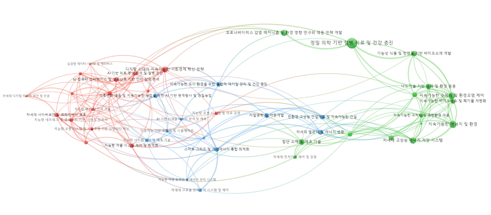

# Macro & Emerging Areas / 표준연구 지형도

Module 1 focuses on constructing a research landscape for standard science and extracting emerging
domains worth strategic investment.

## 세부 목차 / Section Outline

1. 연구지형도 구축 (Macro 레벨)
2. 유망연구영역 도출 (Meso/Micro 연결)
3. Analyst 체크포인트

## 연구지형도 구축 / Landscape Construction

- **Corpus Expansion**: Incorporate curated keywords, flagship journals, and citation links to avoid
  blind spots.
- **클러스터링**: Apply Leiden algorithm on citation graphs to derive coherent research areas.
- **Global ↔ Domain Views**: Build a global overlay map first, then filter to standard-research clusters
  to preserve context.
- **LLM 보조 설명**: Generate bilingual descriptions for each cluster to support analyst briefings.

## 유망연구영역 도출 / Emerging Area Detection

- **지표 묶음**: Growth, diffusion (파급성), influence, industrial linkage, novelty.
- **Scoring Mechanics**: Combine c‑TF‑IDF/LLR keyword signals with bibliometric metrics to prioritise.
- **LLM 리포팅**: Produce quick memos summarising why each area matters, including exemplar keywords,
  institutions, and potential applications.
- **Synthesis Artifacts**: 
  - Ranked tables by indicator weights.
  - Heatmaps comparing emerging vs. mature domains.
  - Narrative briefing decks for leadership reviews.

## Analyst Actions / 분석자 체크포인트

- Validate cluster coherence before trusting indicator outputs.
- Compare emerging-area lists with KRISS strategic themes; mark overlaps and gaps.
- Archive LLM prompts/responses to ensure auditability and reproducibility.

## KRISS 표준연구 맵 (업데이트 필요)

- 최신 표준연 코퍼스로 Meso 맵을 새로 계산해 삽입한다.
  - 데이터: 표준연 연구 코퍼스(제목·초록·인용), 클러스터 라벨, 연도별 문헌수.
  - 단계: (1) 인용 기반 코사인 유사도 계산 → (2) Leiden 군집화 → (3) Meso 명명 → (4) 맵 시각화.
  - 규칙: 노드 크기=문헌수, 링크는 상위 200개 정도로 제한, Macro 색상은 KRISS 정의에 맞게 재지정.
- 출력 위치 제안: `docs/assets/maps/kriss_meso_map.png` (정적), 필요시 iframe(예: `pyvis`, VOSviewer JSON).
- 현재 이미지는 레거시 예시이며, 표준연 데이터로 교체해야 한다.

::: {.callout-note collapse="true"}
## 참고: 4PN 레거시 맵 (예시)

- 아래 맵은 과거 4PN 데이터북의 예시이며, 표준연 분석 결과가 아님. 교체 전까지는 내부 참고용으로만 사용.

::: {.panel-tabset}

## 전체 맵 (캡처)

{fig-alt="4PN 전체 meso 맵 (참고용)"}

## 전체 맵 (온라인)

```{=html}
<div class="column-page-left"><iframe src="https://app.vosviewer.com/?json=https://raw.githubusercontent.com/road2you/global_open/main/kist4pn_meso/clu_meso_map.json&max_n_links=200&max_label_length=40&zoom_level=0.9" width="1200px" height="800px"></iframe>
</div>
```
:::
:::

## Macro 설명 템플릿 (KRISS 버전 작성 필요)

- Macro A: (예시) 계측·센서/측정 표준 영역 — 핵심 세부영역, 대표 기술/키워드, 주요 기관·적용 분야.
- Macro B: (예시) 소재·공정·장비 표준화 — 핵심 세부영역, 대표 기술/키워드, 주요 기관·적용 분야.
- Macro C: (예시) 에너지/환경/안전 연계 표준 — 핵심 세부영역, 대표 기술/키워드, 주요 기관·적용 분야.
- 위 템플릿을 최신 KRISS Macro 정의에 맞게 교체하고, 각 Meso와 연계하여 서술한다.

## 연결 자료 / Related Pages

- See **1.3 Algorithmic Scoring** for the detailed breakdown of c‑TF‑IDF, LLR, and z-score normalisation.
- See **1.4 Configuration Playbook** for thresholds and parameters that govern candidate selection.
- See **Diagnostics** for coverage, redundancy, and trend checks to confirm quality.
