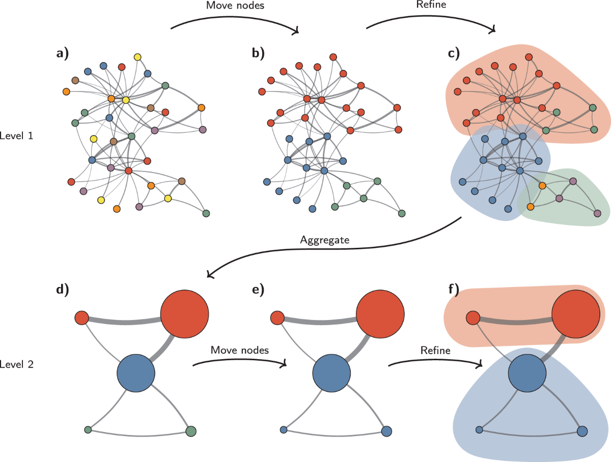
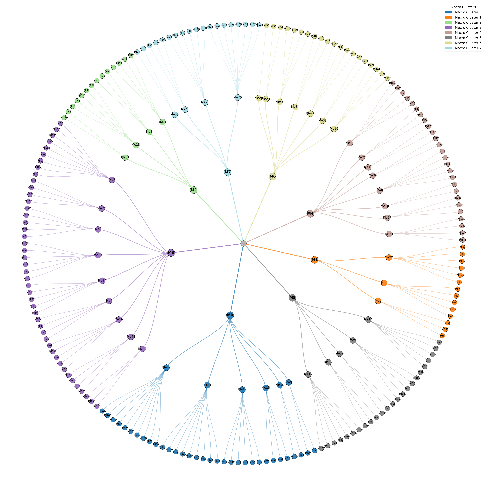
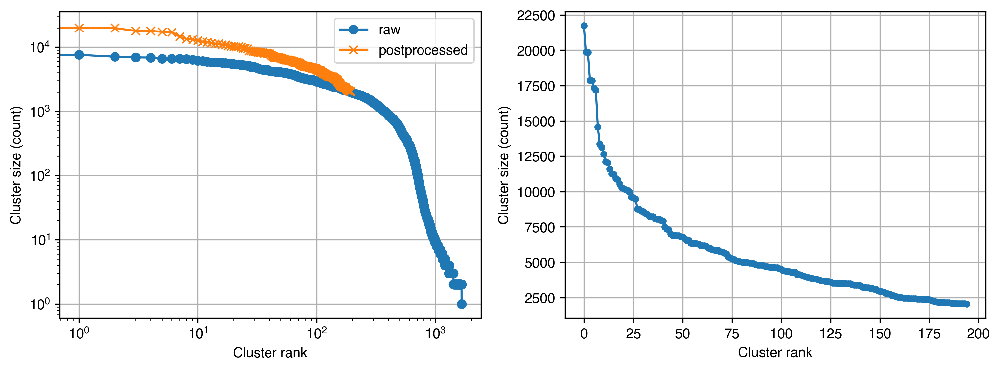

# 표준과학 연구 분야 문헌 집합 클러스터링

글로벌 분류는 비교·벤치마킹에 유리하지만, 표준과학 연구 영역 내부의 세부 주제 구조와 변화(연구전선의 미세한 분화·융합)를 충분히 설명하기에는 한계가 있다. 이에 본 사업에서는 표준과학 연구 영역 최종 문헌 집합(109만건)만을 대상으로 인용 기반 클러스터링을 수행하여, 표준과학 연구 분야의 내부 구조를 반영한 연구지형도를 별도로 구축하였다. 절차는 (1) 입력 네트워크 구성, (2) 하이브리드 인용 relatedness의 구성과 해석, (3) Leiden 기반 클러스터링과 후처리, (4) 산출물 구조의 순서로 정리하였다.

(1) 입력 데이터(문헌 네트워크) 정의

표준과학 연구 영역 최종 문헌 집합의 각 문헌을 노드(node)로 두고, 문헌 쌍(pair)의 인용 기반 연결/유사도를 엣지(edge)로 정의하였다. 엣지 가중치(weight)는 직접 인용(Direct Citation; DC), 서지결합(Bibliographic Coupling; BC), 동시인용(Co-Citation; CC)에서 얻어지는 세 가지 인용 신호를 통합한 relatedness로 구성하였다. 이는 직접 연결(DC)뿐 아니라 공통 참고문헌을 통한 연결(BC), 함께 인용되는 경향(CC)을 동시에 반영하여 단일 신호의 편향을 완화하려는 목적을 갖는다.

(2) DC·BC·CC 통합 사용의 학술적 배경

인용 기반 relatedness(DC, BC, CC)의 상대적 타당도는 대규모 비교 연구를 통해 축적되어 왔으며, 평가 기준에 따라 우열이 달라질 수 있음을 보여준다. 동시에 여러 연구는 각 신호가 포착하는 정보가 서로 다르므로 상호보완적(complementary)이며, 결합이 유리할 수 있음을 시사한다(Boyack & Klavans, 2010; Klavans & Boyack, 2017; Waltman et al. 2020; Boyack & Klavans, 2020; Kleminski et al. 2022). 예컨대 Boyack & Klavans (2010)는 BC가 특정 조건에서 높은 정확도를 보일 수 있음을 보고했고, Waltman & Van Eck (2012)은 DC 단독 기반 방법론의 투명성과 계산 효율성을 강조하면서도 다른 신호와의 결합 가능성을 인정하였다. 이러한 논의를 바탕으로 본 사업에서는 텍스트 유사도 계산의 추가 비용을 최소화하면서도 인용 기반 정보의 포착 범위를 넓히기 위해, DC·BC·CC를 통합한 하이브리드 relatedness를 사용하였다.

하이브리드 relatedness는 세 신호를 직접 합산하기 전에, 각 신호의 스케일을 맞추기 위해 문헌 $i$를 기준으로 정규화를 수행한다. 신호 유형 $X\in\{\mathrm{DC},\mathrm{BC},\mathrm{CC}\}$에 대해 문헌쌍 $(i,j)$의 원시 연관성 $\tilde r_{ij}^{X}$를 계산한 뒤,
$$
r_{ij}^{X}=\frac{\tilde r_{ij}^{X}}{\sum_{k}\tilde r_{ik}^{X}}
$$
와 같이 $i$에 연결된 후보 $k$들의 총합으로 나누어 비중으로 변환한다. 여기서 $\tilde r_{ij}^{\mathrm{DC}}$는 직접 인용 관계가 존재할 때 1로 두고, $\tilde r_{ij}^{\mathrm{BC}}$와 $\tilde r_{ij}^{\mathrm{CC}}$는 각각 공통 참고문헌 수, 공동 인용 문헌 수로 정의할 수 있다. 또한 계산 효율과 잡음 제거를 위해 BC/CC는 매우 약한 연결을 제거하거나, $i$ 기준으로 강한 연결(상위 $K$개)만 남긴 뒤 정규화를 수행하는 방식이 널리 사용된다.

이 정규화는 “$i$에서 본 $j$의 상대적 비중”이므로 일반적으로 $r_{ij}^{X}\neq r_{ji}^{X}$이며, 즉 $i,j$에 대해 대칭이 아니다. 따라서 최종 네트워크를 무방향 그래프로 구성하기 위해서는 대칭화(symmetric aggregation)가 필요하다. 본 사업에서는 두 방향 값 중 큰 값을 취해
$$
\hat r_{ij}^{X}=\max\left(r_{ij}^{X},r_{ji}^{X}\right)
$$
로 대칭 relatedness를 구성하였다.

마지막으로 세 신호의 대칭 relatedness를 단순 합산하고, 합이 1을 초과하면 1로 제한하여 최종 링크 가중치를 0~1 범위로 두었다.
$$
\hat r_{ij}=\min\left(1,\hat r_{ij}^{\mathrm{DC}}+\hat r_{ij}^{\mathrm{BC}}+\hat r_{ij}^{\mathrm{CC}}\right)
$$
이 구성은 BC/CC가 제공하는 “강한 주제 유사성”을 비교적 뚜렷하게 반영하면서도, DC가 제공하는 직접 연결을 통해 그래프의 연결성을 보완하는 효과가 있다. 특히 BC/CC를 상위 $K$개로 절단한 뒤 정규화하면, 남겨진 강한 연결의 단위 가중치가 상대적으로 커질 수 있는 반면, DC는 많은 링크로 분산되어 개별 링크 가중치가 작아지는 경향이 있다. 결과적으로 하이브리드 relatedness의 합산은 “강한 BC/CC 유사성”에 민감하게 반응하되, DC를 통해 전체 네트워크가 단절되지 않도록 설계된 것으로 해석할 수 있다.

(3) Leiden 기반 클러스터링 파이프라인(정제–탐지–후처리)

클러스터링은 하이브리드 인용 네트워크를 구축한 뒤, 연결성이 낮은 고립 노드/극소 컴포넌트가 결과를 불안정하게 만들 수 있다는 점을 고려하여 연결성이 높은 거대 컴포넌트를 중심으로 분석 대상을 정제한다. 다음으로 Leiden 알고리즘을 적용해 네트워크 커뮤니티 구조를 탐지하며(Traag et al. 2019), 군집의 세분성을 조절하는 해상도(γ)를 분석 목적(세분화 수준과 해석 가능성의 균형)에 맞추어 설정한다. 또한 재현 가능한 결과를 위해 난수 시드(seed)를 관리하고, 필요 시 해상도와 시드를 함께 변화시키며 NMI(Normalized Mutual Information) 등 일치도 지표로 민감도를 점검할 수 있다. 마지막으로 지나치게 작은 군집은 해석 가능성이 낮고 후속 분석(예: 대표 키워드)의 불안정을 초래할 수 있으므로, 군집 간 연결 가중치 합이 가장 큰 인접 군집으로 병합하는 후처리를 수행하였다.

{#fig-leiden-overview}

(4) 산출물: 거시–중시–미시 3수준 연구주제 클러스터(8–46–195)

상기 절차를 통해 표준과학 연구 영역 최종 문헌 집합을 인용 기반 연구주제 단위로 분할하였다. 최종 연구지형도는 마크로 수준 8개, 메소 수준 46개, 마이크로 수준 195개의 계층 구조로 정리되며, 이후의 후속 분석(측정 그룹 매핑, 키워드 추출, 시계열 분석)에서는 주로 마이크로 수준 연구주제 클러스터를 기본 분석 단위로 활용하였다. 

{#fig-cluster-hierarchy-3levels}

마이크로 클러스터에서 최소 클러스터 문헌 수는 2,000건으로, 이러한 병합과정을 거치지 않으면 너무 자잘한 미세클러스터가 빈번히 등장하여 분석단위의 상대적 크기를 맞추기 어려운 한계점이 존재하였다. 이러한 병합 이전 클러스터 수는 1,662개 였으며, 병합 이후 195로 줄어들었다.

{#fig-cluster-size-before-after}

※ Leiden 알고리즘의 상세 설명과 세부 파라미터 설정 기준은 데이터북 부록의 [클러스터링·키워드 방법론](appendix_methodology.html)에서 확인할 수 있다.
